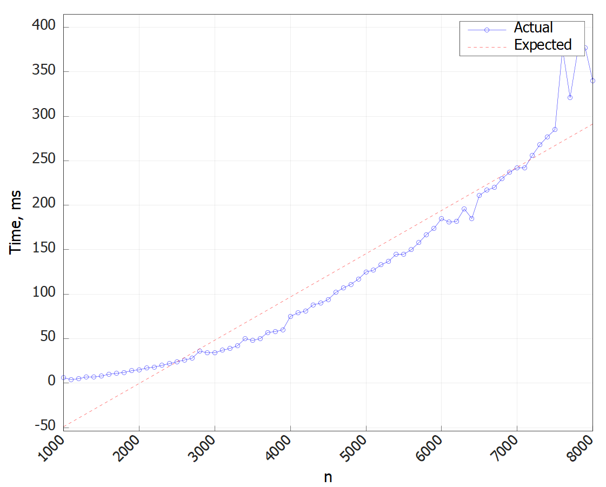
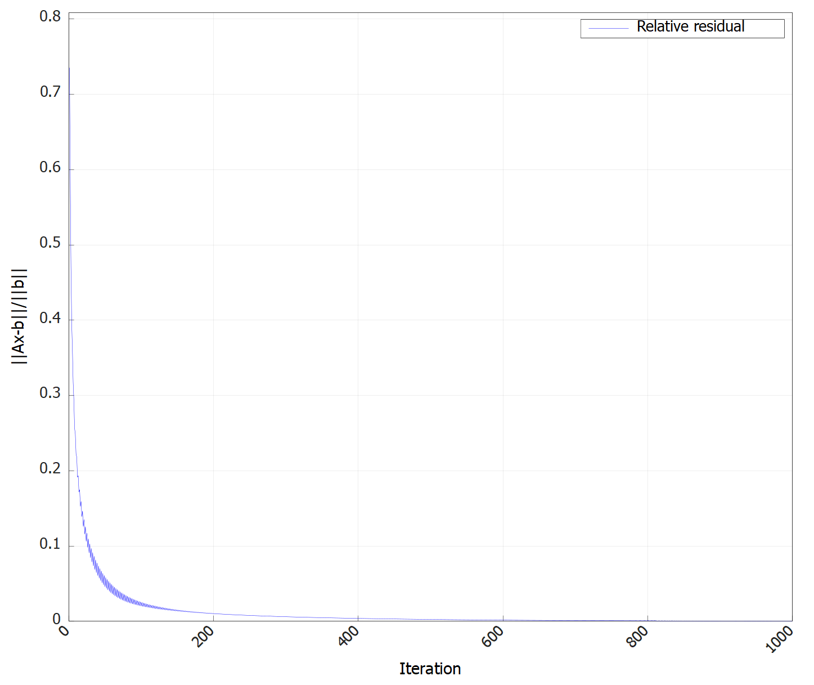
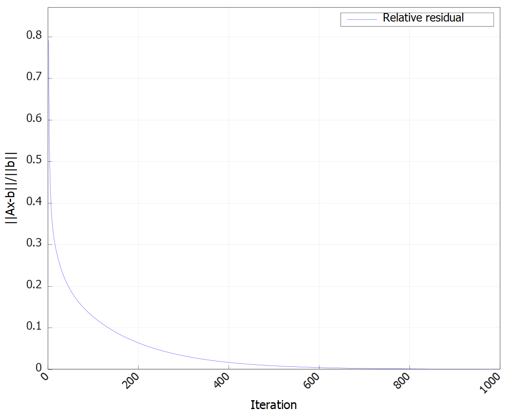
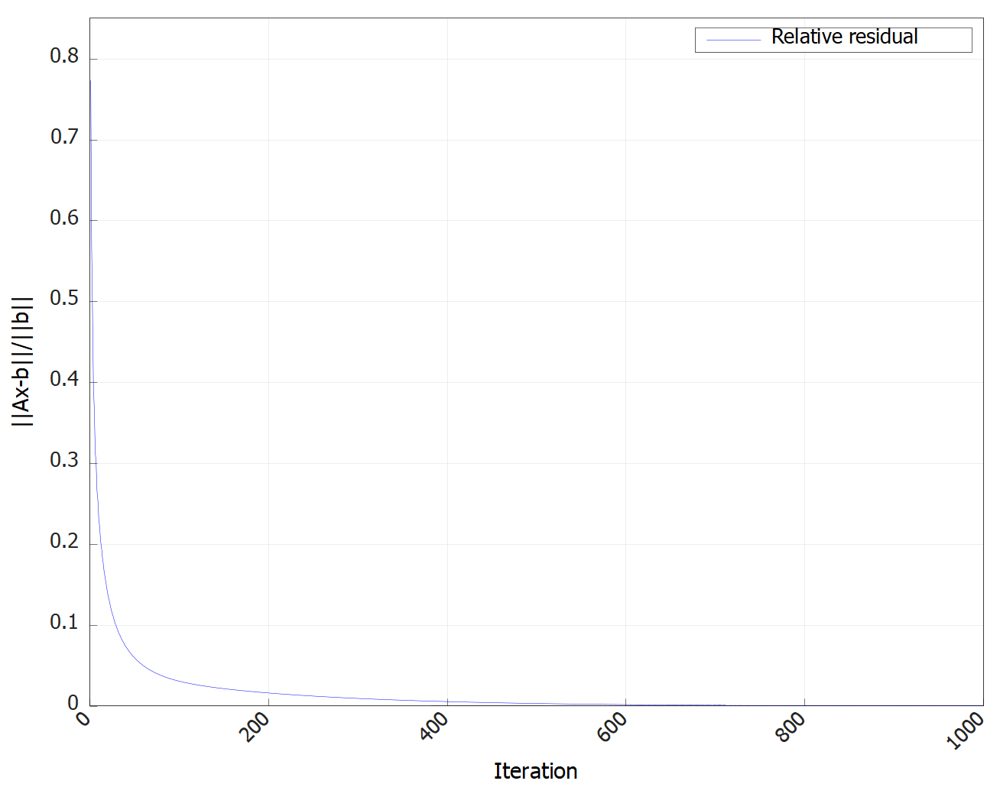
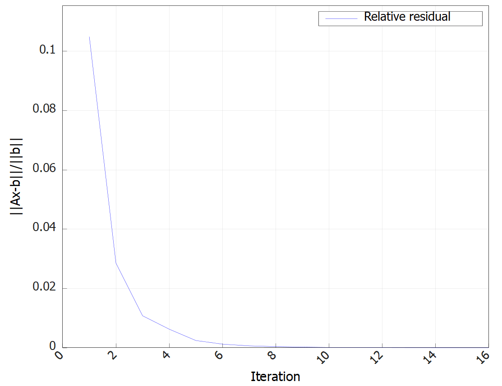
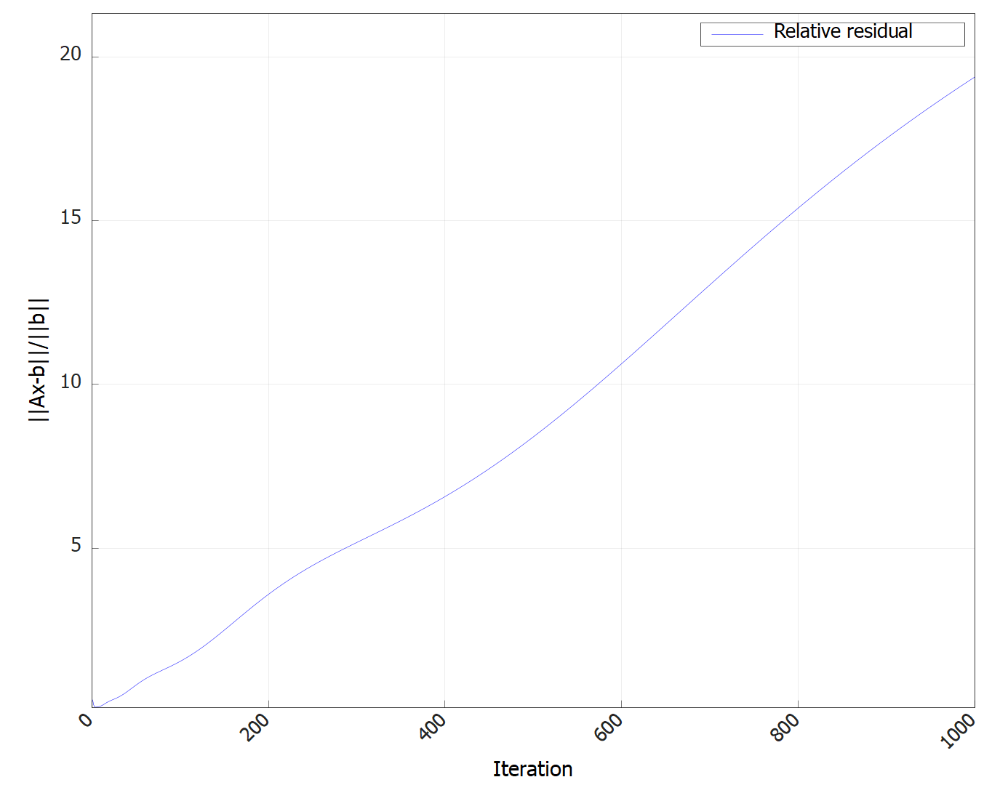
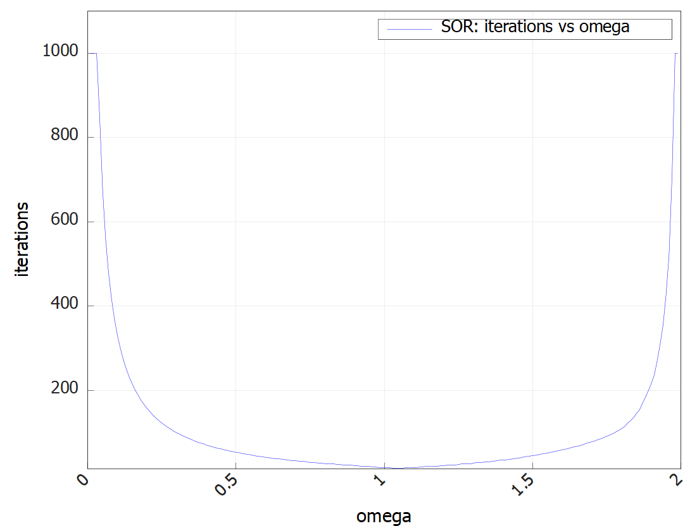
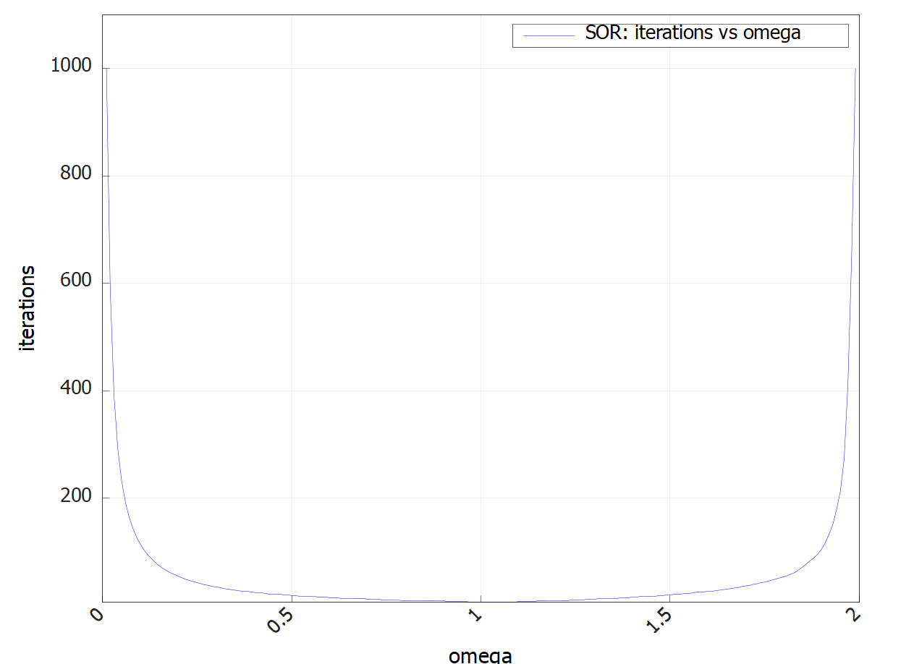
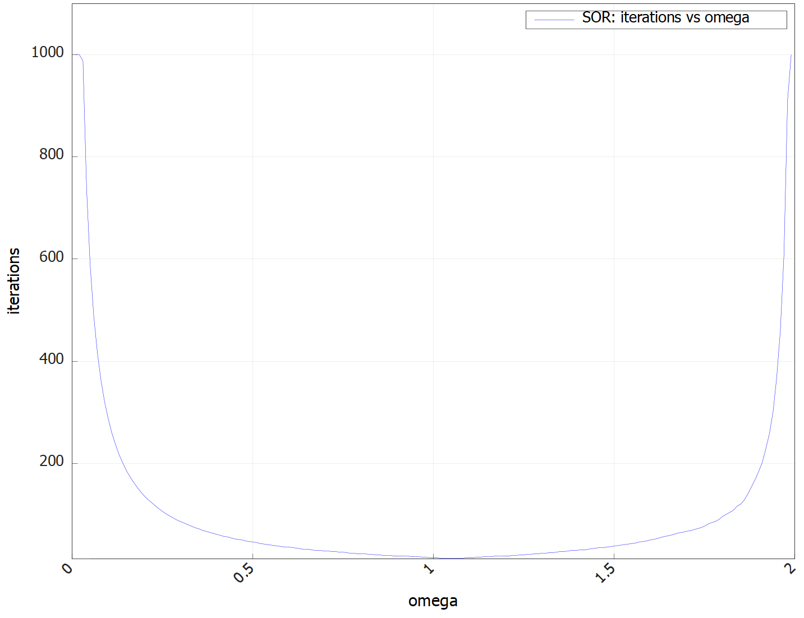

# Отчёт по лабораторной работе: Численные методы решения СЛАУ ⚡️📊

## Содержание 📖

1. [Введение и цели работы](#1-введение-и-цели-работы-)
2. [Структура проекта](#2-структура-проекта-)
3. [Ход выполнения работы](#3-ход-выполнения-работы-)
   1. [Метод прогонки](#метод-прогонки-)
   2. [Итерационные методы](#итерационные-методы-)
   3. [Численный эксперимент с параметром ω](#численный-эксперимент-с-параметром-ω-)
4. [Графики сходимости и анализа](#4-графики-сходимости-и-анализа-)
5. [Заключение и выводы](#5-заключение-и-выводы-)

## 1. Введение и цели работы 🎓

В работе реализованы и исследованы типовые численные методы решения систем линейных алгебраических уравнений (СЛАУ) с фокусом на сравнение прямых и итерационных методов, анализ скорости сходимости и асимптотики, а также на практическую работу с случайно сгенерированными системами большого размера.

**Цели: 🎯**

- Реализация метода прогонки для трёхдиагональных матриц
- Реализация базовых итерационных методов: Якоби, Зейделя, верхней релаксации (SOR), метод наискорейшего спуска, сопряжённых градиентов
- Применение генерации тестовых систем и анализ поведения метода на различных классах задач
- Численный эксперимент по выбору оптимального параметра ω для SOR

## 2. Структура проекта 🛠️

Вся работа выполнена в виде модульного C++-проекта со следующей структурой:
```
include/
├── Base/            # Базовые интерфейсы генераторов/решателей
├── Labs/            # Заголовки лабораторных заданий
src/
└── Labs/
    └── LabN/
        └── TaskK.cpp    # Основные реализации по заданиям
CMakeLists.txt          # Конфигурация сборки проекта
```
Реализация поддерживает автоматическое добавление новых заданий, централизованное подключение заголовков и простое масштабирование под разные лабораторные работы.

## 3. Ход выполнения работы 🔎

### Метод прогонки ➡️

- Сгенерирована трёхдиагональная матрица с диагональным преобладанием (см. код генерации)
- Решение $x = [0,1...n]$ задано явно, вычислена правая часть $b = Ax$
- Реализован алгоритм прогонки с прямым/обратным ходом (см. файл `ThomasSolver.h`)
- Проведена проверка точности: для $n=1000, 5000, 10000$. Разница между точным и численным решением составила менее $10^{-15}$
- Построен график зависимости времени выполнения от $n$ — видна линейная асимптотика

**Таблица 1 - Относительная ошибка и время решения для систем различного размера**

n     |  relerror        |  time (ms)
------|------------------|--------------
1000  |  1.16169509e-16  |  9.0         
1100  |  1.21742151e-16  |  5.0         
1200  |  1.18213010e-16  |  6.0         
1300  |  1.23595327e-16  |  6.0         
1400  |  1.09661817e-16  |  8.0         
1500  |  1.11847506e-16  |  9.0         
1600  |  1.08086984e-16  |  11.0        
1700  |  1.17862482e-16  |  16.0        
1800  |  1.19824799e-16  |  15.0        
1900  |  1.19029852e-16  |  14.0        
2000  |  1.18445066e-16  |  16.0   

---

### Итерационные методы 🔄

- Реализованы методы Якоби, Зейделя, SOR (верхней релаксации), градиентного спуска и сопряжённых градиентов
- Для тестирования использовались как искусственно диагонально-доминантные матрицы, так и полностью случайные для выявления проблем с сходимостью

**Сравнение скорости сходимости: 📉**

- Для простых диагонально-доминантных матриц (трёхдиагональных) все методы продемонстрировали экспоненциальную сходимость, Якоби и Зейдель — чуть медленнее, SOR — оптимально (при правильном ω)
- Для плохо обусловленных/“реальных” матриц метод Якоби зачастую расходится, Зейдель и SOR сходятся, но медленно, градиентные методы — сильно зависят от структуры!
- Для метода сопряжённых градиентов подтверждено требование SPD-матриц: на случайных матрицах с нарушением условий — наблюдается расходимость

---

### Численный эксперимент с параметром ω 🖥️

- Проведён перебор ω на диапазоне $0.01 < \omega < 2$ с шагом $0.01$, построен график зависимости числа итераций до сходимости от ω для фиксированного размера и типа матрицы (см.)
- Найдено оптимальное значение $\omega_{opt}$ — область, при которой число итераций минимально
- Проведены эксперименты для разных точностей и размеров: $\omega_{opt}$ зависит преимущественно от структуры (обусловленности/преобладания диагонали) и чуть-чуть от требуемой точности; в большинстве случаев меняется мало с увеличением $n$ при одинаковой структуре матрицы

## 4. Графики сходимости и анализа 📊


**График 1 - Проверка линейной асимптотики метода прогонки**



**График 2 - Сходимость метода Якоби**



**График 3 - Сходимость метода Зейделя**



**График 4 - Сходимость метода SOR**


**График 5 - Сходимость метода найскорейшего спуска**



**График 6 - Сходимость метода сопряжённых градиентов**



**График 7 - Расходимость метода сопряжённых градиентов для плохо обусловленной задачи**



**График 8 - Поиск оптимального значения параметра для метода SOR**



**График 9 - Проверка зависимости оптимального параметра от точности**



**График 10 - Проверка зависимости оптимального параметра от размера системы**

## 5. Заключение и выводы 📝

Метод прогонки подтвердил ожидаемую линейную асимптотику и высокую численную стабильность на трёхдиагональных задачах.

**Итерационные методы:**

- *Якоби* и *Зейделя* надёжно сходятся только для хорошо обусловленных диагонально-доминантных матриц. Для случайных или плохо обусловленных систем Якоби может расходиться
- *Метод SOR* при оптимальном выборе ω обеспечивает наилучшую скорость сходимости среди рассмотренных классических итерационных методов
- *Градиентные методы* применимы только для SPD-матриц: сопряжённые градиенты работают молниеносно при соблюдении условий, но при их нарушении быстро расходятся

**Зависимость оптимального ω:**

- Наиболее сильно оптимальный ω зависит от структуры (обусловленности) матрицы и лишь слабо — от требуемой точности/размерности

**Практические выводы:**

- Выбор метода следует ориентировать на структуру задачи: для трёхдиагональных систем — однозначно прогонка, для редких/случайных — строго проверять условия применимости метода и свойства матрицы
- Графики чётко иллюстрируют, где и как проявляются преимущества и ограничения каждого метода
