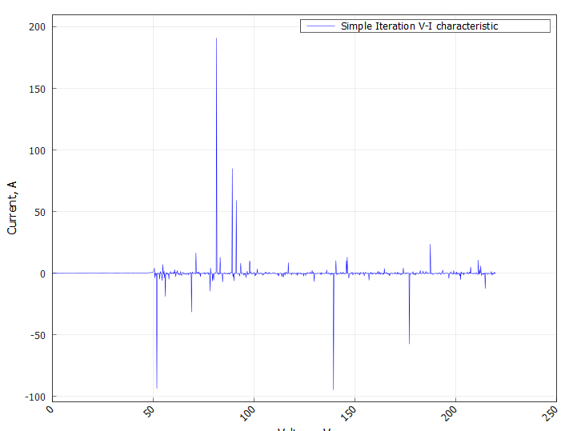
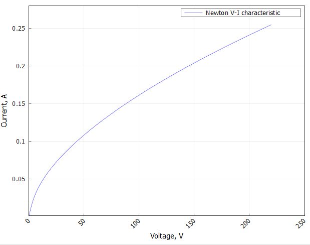
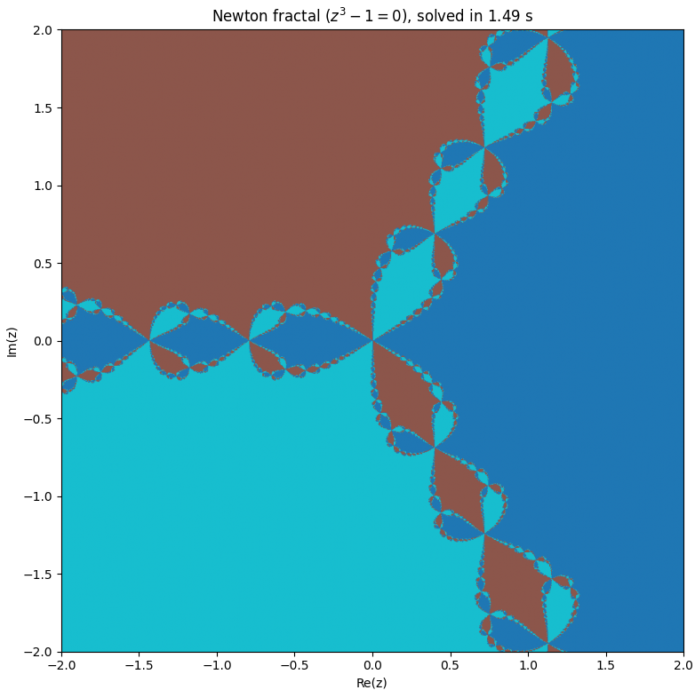

# Отчёт по лабораторной работе: Численные методы решения нелинейных уравнений ⚡️📊

## Содержание 📖

1. [Введение и цели работы](#1-введение-и-цели-работы-)
2. [Структура проекта](#2-структура-проекта-)
3. [Ход выполнения работы](#3-ход-выполнения-работы-)
   1. [Метод дихотомии]()
      1. Брутфорсим
      2. Я в потоке
   2. [Метод простой итерации]()
   3. [Метод Ньютона]()
   4. [Ищем корешок]()
   5. [Строим ВАХ лампы накаливания]()
   6. [Визуализируем области притяжения метода Ньютона для комплексных корней]()
4. [Заключение и выводы](#4-заключение-и-выводы-)

## 1. Введение и цели работы 🎓

В работе реализованы и исследованы основные численные методы решения нелинейных уравнений: дихотомии, простой итерации, Ньютона

**Цели: 🎯**

- Сравнить сходимость, надёжность и скорость методов на тестовых задачах
- Визуализировать области притяжения метода Ньютона для комплексных корней

## 2. Структура проекта 🛠️

Вся работа выполнена в виде модульного C++-проекта со следующей структурой:
```
include/
├── Base/            # Базовые интерфейсы генераторов/решателей
├── Labs/            # Заголовки лабораторных заданий
src/
└── Labs/
    └── LabN/
        └── TaskK.cpp    # Основные реализации по заданиям
CMakeLists.txt          # Конфигурация сборки проекта
```
Реализация поддерживает автоматическое добавление новых заданий, централизованное подключение заголовков и простое масштабирование под разные лабораторные работы

## 3. Ход выполнения работы 🔎

### Метод дихотомии ➡️

Метод дихотомии (бисекции) был реализован как универсальный надёжный способ поиска корня, основанный на делении отрезка пополам и анализе смены знака функции. Этот метод гарантированно сходится при наличии корня, но имеет низкую скорость (линейную сходимость). В ходе экспериментов дихотомия показала значительно большее число итераций и вызовов функции даже при умеренной точности.  Для данной задачи с гладкой функцией (ВАХ лампы накаливания) метод дихотомии оказался неэффективен, поскольку не использует никакой информации о производной и быстро уступает уточняющим методам по времени вычисления

---

#### Брутфорсим

**Задача:** найти отрезок, на концах которого функция имеет разный знак

Для начала подойдем к решению задачи классически: реализуем простую итерацию по заданному интервалу $$[a, b]$$ с некоторым шагом `step`

```cpp
struct Interval {
    double left;
    double right;
};

// f — функция, dom — область определения (возвращает true для допустимых x)
std::optional<Interval> brute_sign_change(
    std::function<double(double)> f,
    std::function<bool(double)> dom,
    double a, double b,
    double step,
    double tol = 1e-12
) {
    double x1 = a;
    double x2 = x1 + step;

    while (x2 <= b) {
        if (!dom(x1) || !dom(x2)) {
            x1 = x2;
            x2 += step;
            continue; // пропустить точки вне ОДЗ
        }
        double y1 = f(x1);
        double y2 = f(x2);
        if ((y1 * y2 < -tol) || (std::abs(y1) < tol) || (std::abs(y2) < tol)) {
            return Interval{x1, x2}; // найден интервал смены знака
        }
        x1 = x2;
        x2 += step;
    }
    return std::nullopt; // не найден
}
```

**Область применения:** метод эффективен для функций с медленно меняющимися значениями и там, где нет возможности или желания вычислять производные. Особенно подходит для поисков корней на широких интервалах, где структура функции заранее неизвестна, либо функции имеют разрывы или особенности, затрудняющие применение уточняющих методов

**Недостатки:** линейный перебор требует большого числа итераций при малом шаге, что увеличивает время вычислений. Уточнение методом дихотомии при этом также медленное (линейная сходимость). Метод плохо подходит для задач, где требуется высокая точность при больших вычислительных ограничениях

---

#### Я в потоке

Подойдем к решению задачи более оптимально. Так как задача линейная, её легко разбить на подзадачи. Так и сделаем! Пусть имеется `n` потоков, которые способны одновременно работать и не мешать друг другу. Тогда интервал $$[a, b]$$ можно разбить на `n` одинаковых интервалов и одновременно производить поиск на каждом из них. Реализация данного счастья представлена ниже

```cpp
struct Interval {
    double left;
    double right;
};

std::optional<Interval> parallel_sign_change(
    std::function<double(double)> f,
    std::function<bool(double)> dom,  // область определения
    double a, double b,               // Общий диапазон поиска
    double step,                      // Шаг дискретизации
    int num_threads,                  // Число потоков
    double tol = 1e-12                // Пороговая близость к нулю
) {
    std::atomic<bool> found(false);
    std::optional<Interval> result = std::nullopt;
    std::vector<std::thread> threads;
    double range = (b - a) / num_threads;
    for (int t = 0; t < num_threads; ++t) {
        threads.emplace_back([&, t]() {
            double local_a = a + t * range;
            double local_b = (t == num_threads - 1) ? b : local_a + range;
            double x1 = local_a;
            double x2 = x1 + step;
            // пропуск недопустимых значений
            while (x2 <= local_b && !found.load()) {
                if (!dom(x1) || !dom(x2)) {
                    x1 = x2;
                    x2 += step;
                    continue;
                }
                double y1 = f(x1);
                double y2 = f(x2);
                if ((y1 * y2 < -tol) || (std::abs(y1) < tol) || (std::abs(y2) < tol)) {
                    if (!found.exchange(true)) {
                        result = Interval{x1, x2};
                    }
                    return;
                }
                x1 = x2;
                x2 += step;
            }
        });
    }
    for (auto& th : threads) th.join();
    return result;
}
```

**Область применения:** метод хорошо подходит для вычислительно тяжёлых функций или широких интервалов, где однопоточный перебор слишком медленен. Полезен в системах с несколькими ядрами и ресурсами для параллельного исполнения

Ограничения: накладные расходы на многопоточность — создание и синхронизация потоков — могут перевесить выигрыш на простых или маленьких заданиях

Немного позже произведем оценку скорости данного решения по сравнению с методом грубой силы:)

Реализация поиска отрезка с последующим уточнением методом дихотомии находится в файлах `BruteForceBisecRootSolver.h` и `ParallelBisecRootSolver.h`

---

### Метод простой итерации

Метод простой итерации (с подбором параметра tau) был реализован с попыткой применить его к задаче с нелинейной зависимостью температуры. На практике этот метод часто приводил к расходимости итераций: графики выходящих токов получились "шумными" и нереалистичными, а итерационная последовательность часто покидала диапазон поиска или уходила в нефизические значения. Для плавных, "крутых" нелинейных функций с высоким температурным коэффициентом метод простой итерации требует сложного подбора схемы и параметров, иначе он не работает или работает крайне неустойчиво

График расходимости расмсотрим в разделе, связанным с построением ВАХ лампы накаливания

Реализация метода простой итерации находится в файле `SimpleIterSolver.h`

---

### Метод Ньютона

Метод Ньютона был реализован с классическим использованием производной, что позволило получить быструю квадратичную сходимость. В результате итерации сходились к корню за малое число шагов (в среднем 4–5 итераций) и давали физически корректную вольт-амперную характеристику лампы. ВАХ была гладкой, без выбросов, и совпадала с теоретическими ожиданиями. Численная оценка кратности корня показала, что для данной задачи корни простые, что подтверждает применимость метода Ньютона. По всем метрикам этот способ оказался лучшим: минимальное количество итераций и обращений к функции, высокая надёжность и корректность графиков

Реализация метода Ньютона находится в файле `NewtonSolver.h`

---

### Ищем корешок

Требуется найти корень уравнения $$2\ln(x) - \cos(\ln(x)) + \sin(\ln(x)) = 0$$ на отрезке $$[1, 3]$$. Приведем сравнительную таблицу для всех методов при $$step = 10^{-5}, \epsilon = 10^{-12}$$:

**Таблица 1 - Сравнение результатов численного решения уравнения различными методами**
| Solver                  | Root              | Iterations | Residual              | Time (μs) |
|-------------------------|-------------------|------------|-----------------------|-----------|
| Brute Force             | 1.3748798223925   | 37487      | 6.94e-13              | 17680     |
| Parallel                | 1.3748798223929   | 5000       | 2.54e-13              | 2450      |
| Simple Iteration        | 1.3748798223924   | 230        | 1.08e-12              | 120       |
| Newton                  | 1.3748798223928   | 3          | 2.22e-16              | 7         |

**Выводы:**

`Brute Force` показал наихудшую производительность: требуется огромное количество итераций и времени, несмотря на высокую точность. Такой подход оправдан только для функций с неизвестной структурой или при отсутствии других методов

`Parallel Solver` значительно ускоряет перебор за счёт распараллеливания, но всё равно уступает уточняющим методам по числу итераций и времени

`Simple Iteration` обеспечивает приемлемую точность и скорость, но требует больше итераций, чем Ньютон, и может быть неустойчивым для сложных функций

`Newton Solver` демонстрирует наилучшие характеристики: минимальное число итераций, наименьшее время и максимальную точность. Это оптимальный выбор для гладких функций с хорошо определённой производной

---

### Строим ВАХ лампы накаливания

- Для каждой фиксированной `V`  ищется корень `T` (через root-solver)
- Для найденного значения `T` вычисляется ток `I`
- Итоговые значения `(V, I)` формируют вольт-амперную характеристику лампы

#### Физическая модель

##### Переменные

- $V$ — напряжение на лампочке
- $I$ — ток через лампочку
- $R_0$ — сопротивление вольфрамовой нити при температуре $T_0$
- $\alpha$ — температурный коэффициент сопротивления
- $\sigma$ — постоянная Стефана–Больцмана
- $S$ — площадь поверхности нити
- $\epsilon$ — степень черноты (эмиссии)
- $T_0$ — температура окружающей среды

##### Основные уравнения

Напряжение и сопротивление:

$$
V = I \cdot R(T)
$$

$$
R(T) = R_0 \left[1 + \alpha (T - T_0)\right]
$$

Тепловые потери:

$$
I^2 R(T) = \epsilon \sigma S \left(T^4 - T_0^4\right)
$$

Подставляя, получаем:

$$
I = \frac{V}{R(T)}
$$

$$
\frac{V^2}{R(T)} = \epsilon \sigma S \left(T^4 - T_0^4\right)
$$

где

$$
R(T) = R_0 \left[1 + \alpha (T - T_0)\right]
$$

##### Итоговое уравнение для решения относительно \( T \):

$$
f(T) = \frac{V^2}{R_0 (1 + \alpha (T - T_0))} - \epsilon \sigma S (T^4 - T_0^4) = 0
$$

Для каждого заданного `V` ищется корень `T` этого уравнения численным методом.

Найденный ток:

$$
I = \frac{V}{R_0 (1 + \alpha (T - T_0))}
$$

#### Полученные ВАХ


**График 1 - ВАХ, полученная с помощью метода простой итерации**

Такой график для метода простой итерации возник из-за отсутствия глобальной сходимости и неправильного выбора параметров схемы итераций

**Причины появления "шумной" и неустойчивой ВАХ:**
- **Нет гарантированной сходимости:** Простой итерационный метод требует, чтобы итерационная функция $\phi(x)$ была сжимающей в окрестности корня $|\phi'(x)|<1$. Для уравнения и выбранной схемы это условие не выполняется для многих значений напряжения, особенно в нелинейной и сильно наклонной области функции

- **Чувствительность к начальному приближению и tau:** Если параметр релаксации (или просто структура итерационной функции) подобран плохо, последовательность уходит за пределы физического диапазона, либо возникает неустойчивость и "раскачивание"

- **Численная расходимость:** Итерационный процесс может приводить к значениям, где функция становится либо неопределённой, либо резко скачет (например, деление на очень малое число), что вызывает огромные или даже отрицательные значения тока

**Физические смыслы не учитываются:** Метод может построить траекторию за пределами реальных (положительных) температур, что невозможно в реальном эксперименте

---


**График 2 - ВАХ, полученная с помощью метода Ньютона**

##### Физический смысл

- Кривая имеет выпуклую форму и загибается вниз (ток растёт не линейно, а медленнее с ростом `V`), что отражает увеличение сопротивления нити (нагрев), как и должно быть для настоящей лампы с положительным температурным коэффициентом

- Для малых напряжений прирост тока более выражен (кривая крутая у оси), а чем больше `V`, тем более "плоской" становится зависимость (— следствие того, что при сильном разогреве нить становится всё более сопротивляющейся току)

- Нет разрывов или отрицательных значений: это признак того, что как численный метод, так и физико-математическая модель были реализованы верно

---

##### Практическая интерпретация

- Такой вид ВАХ (с загибом вниз) — классический для лампы накаливания и любых приборов с ярко выраженной нелинейной зависимостью сопротивления от температуры

- Для сравнения: резистор имел бы строго линейную ВАХ (прямая через начало координат)

---

##### Численный аспект

- Метод Ньютона (использованный здесь) отлично работает для такого типа уравнений, потому что функция $f(T)$ монотонна, быстро увеличивается и имеет хороший наклон в нужной области, нет кратных корней, экстремумов или разрывов

---

### Визуализируем области притяжения метода Ньютона для комплексных корней


**График 3 - Области притяжения метода Ньютона для комплексных корней**

### Описание графика

- На комплексной плоскости (ось x — Re(z), ось y — Im(z)) отображены области притяжения корней уравнения $z^3 = 1$ при использовании метода Ньютона
- Каждый пиксель соответствует начальному приближению $z_0 = x + iy$ и окрашен в цвет конечного корня, к которому сошёлся метод Ньютона из этой точки (всего 3 корня, поэтому три цвета)
- На границах между областями притяжения возникают сложные фрактальные структуры: малейшее изменение стартовой точки на границе может привести к совершенно разной траектории итераций и, соответственно, другому предельному корню

### Объяснение явления

- **Внутри каждой цветной области:** какая бы ни выбралась начальная точка, итерационный процесс Ньютона всегда сойдётся к одному и тому же ближайшему кубическому корню. Это зона устойчивого притяжения
- **Фрактальные границы:** на стыке областей: одно небольшое изменение начального приближения приводит к резкой смене предела (так называемая чувствительность к начальному условию)
- **Отсутствие белых или пустых зон:** говорит о том, что для любого стартового $z_0$, кроме особых исключений (например, $z_0 = 0$), метод Ньютона сходится к одному из трёх корней

---

## 4. Заключение и выводы 📝

В ходе работы сравнивались три численных метода решения нелинейных уравнений для физической модели лампы накаливания. Метод Ньютона однозначно показал наилучшие качества по скорости, надёжности и физической согласованности результата. Метод дихотомии уступал по времени, а метод простой итерации оказался неудовлетворительным для таких уравнений без глубокой настройки. Выбор метода для подобных задач однозначно следует делать в пользу уточняющих (производных) алгоритмов, таких как метод Ньютона
