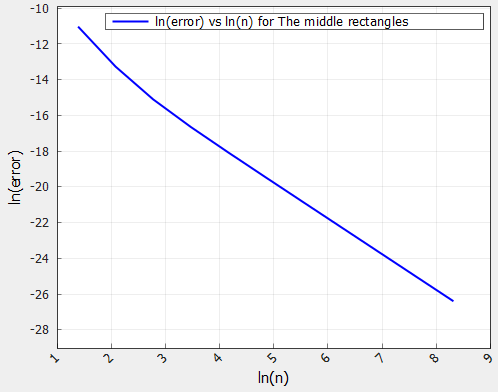
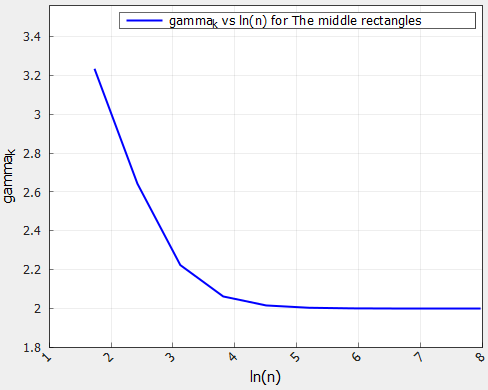
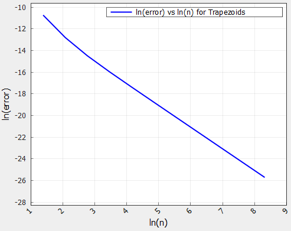
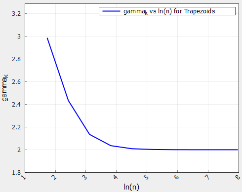
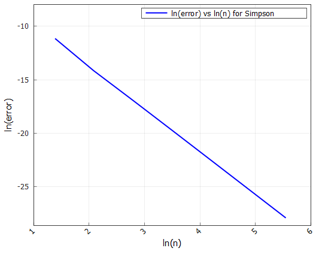
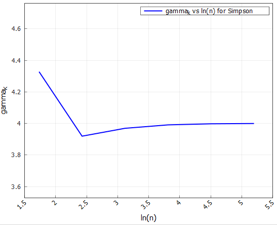
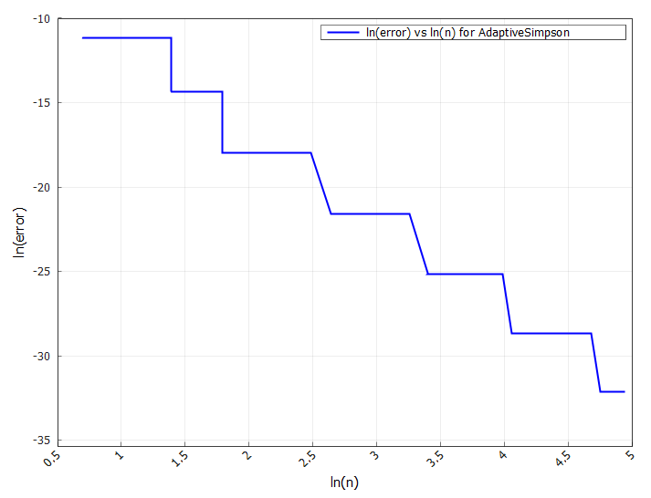
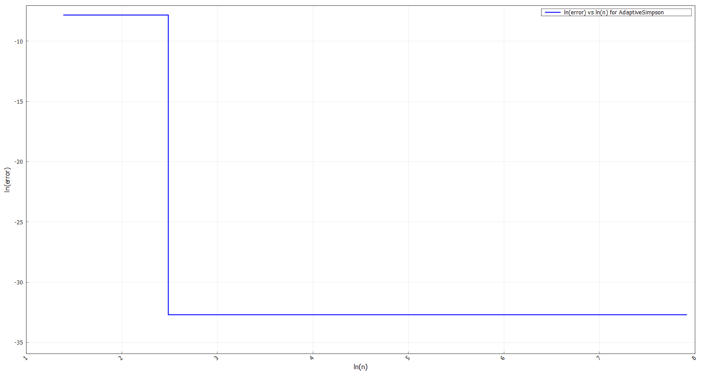

# Отчёт по лабораторной работе: Численное интегрирование ⚡️📊

## Содержание 📖

1. [Введение и цели работы 🎓](#1-введение-и-цели-работы-)
2. [Структура проекта 🛠️](#2-структура-проекта-)
3. [Ход выполнения работы 🔎](#3-ход-выполнения-работы-)
   - [Вычисляем определённый интеграл различными методами 🧮](#вычисляем-определённый-интеграл-различными-методами-)
      - [Метод средних прямоугольников ▫️](#метод-средних-прямоугольников-)
      - [Метод трапеций 🟪](#метод-трапеций-)
      - [Метод Симпсона 🔷](#метод-симпсона-)
      - [Адаптивный метод Симпсона 💡](#адаптивный-метод-симпсона-)
   - [Сравнительный анализ методов 👨‍🔬](#сравнительный-анализ-методов-)
   - [Визуальный контроль 📉✨](#визуальный-контроль-)
   - [Формулы Гаусса-Кристоффеля 🌈](#вычисляем-с-помощью-формул-гаусса-кристоффеля-)
   - [Снова развлекаемся 😄](#снова-развлекаемся-)
4. [Заключение и выводы 📝](#4-заключение-и-выводы-)

## 1. Введение и цели работы 🎓

В данной работе исследуются различные методы численного интегрирования — методы средних прямоугольников, трапеций, Симпсона, а также их адаптивные варианты, реализованные в виде объектно-ориентированной архитектуры на C++. Для всех методов оценивалась сходимость по ошибке и локальный порядок на ряде функций

**Цели: 🎯**

- Освоить и реализовать основные методы численного интегрирования (прямоугольников, трапеций, Симпсона и его модификацию)
- Научиться определять приближённые значения определённых интегралов программно с контролем точности вычислений
- Исследовать апостериорную ошибку и порядок сходимости каждого метода
- Визуализировать скорость убывания ошибки и закономерности изменения локального порядка сходимости ($\gamma_k$) при сгущении сетки разбиения
- Провести сравнительный анализ эффективности методов и выбрать оптимальные из них

## 2. Структура проекта 🛠️

Вся работа выполнена в виде модульного C++-проекта со следующей структурой:
```
include/
├── Base/            # Базовые интерфейсы генераторов/решателей
├── Labs/            # Заголовки лабораторных заданий
src/
└── Labs/
    └── LabN/
        └── TaskK.cpp    # Основные реализации по заданиям
CMakeLists.txt          # Конфигурация сборки проекта
```
Реализация поддерживает автоматическое добавление новых заданий, централизованное подключение заголовков и простое масштабирование под разные лабораторные работы

## 3. Ход выполнения работы 🔎

### Вычисляем определённый интеграл различными методами 🧮

**Необходимо вычислить следующий интеграл:**

$$
I = \int_{0.1}^{0.4} \arctan\left( 0.3 x^{4} - 4x \sqrt{x} \right)\ dx
$$

Поехали!

---

#### Метод средних прямоугольников ▫️

_Метод средних прямоугольников_ — базовый численный способ интегрирования, при котором значение функции берётся в середине каждого подынтервала разбиения. Оценка интеграла получается как сумма произведений значений в точках на ширину подынтервала. Этот подход обеспечивает второй порядок точности при достаточно гладкой функции

**Таблица 1 - Результаты вычисления для метода средних прямоугольников**
| Integral      | Nodes | Error  estimation       | Time, mcs |
|:--------------:|:------:|:---------------------:|:-----------:|
|  -0.13798012  |  8192 | 3.40525756e-12       | 924        |

Метод показывает устойчивую сходимость, апостериорная ошибка снижается до машинной точности при достаточно большом числе разбиений. Для большинства гладких функций интеграл считается быстро и с высокой точностью

Реализацию метода можно найти по пути `include/Labs/Lab3/IntegralSolvers/CentralRectSolver.h`

---

#### Метод трапеций 🟪

_Метод трапеций_ аппроксимирует подынтегральную функцию линейными участками между точками разбиения. Итоговое значение интеграла складывается как сумма площадей трапеций, построенных под графиком функции

**Таблица 2 - Результаты вычисления для метода трапеций**
| Integral      | Nodes | Error  estimation       | Time, mcs |
|:--------------:|:------:|:---------------------:|:-----------:|
|  -0.13798012  |  8192 | 6.81048736e-12       | 842       |

Метод трапеций гарантирует устойчиво хорошую сходимость и точность при увеличении числа интервалов. Метод хорошо подходит для функций без резких особенностей

Реализацию метода можно найти по пути `include/Labs/Lab3/IntegralSolvers/TrapezoidSolver.h`

---

#### Метод Симпсона 🔷

_Метод Симпсона_ — составная квадратура, аппроксимирующая функцию параболой на каждом интервале. Итоговое значение вычисляется как взвешенная сумма значений функции в узловых точках и серединах подынтервалов. Этот метод обладает гораздо более высоким порядком точности, что позволяет добиться крайне малых ошибок при умеренном числе разбиений

**Таблица 3 - Результаты вычисления для метода Симпсона**
| Integral      | Nodes | Error  estimation       | Time, mcs |
|:--------------:|:------:|:---------------------:|:-----------:|
|  -0.13798012  |  256 | 7.44968901e-13       | 62      |

Симпсон демонстрирует экспоненциально быстрое уменьшение апостериорной ошибки: уже при относительно небольшом числе разбиений результат точен до вычислительного уровня. Сходимость устойчиво превосходит более простые методы

Реализацию метода можно найти по пути `include/Labs/Lab3/IntegralSolvers/SimpsonSolver.h`

---

#### Развлекаемся

А что будет, если на каждой итерации еще корректировать шаг разбиения? Как это отразиться на результатах вычислений? Вашему вниманию представляется _адаптивный метод Симпсона_:  он рекурсивно делит интервал на подотрезки и оценивает ошибку на каждом из них. Если на каком-то участке ошибка превышает заданный порог, этот участок делится дальше, пока локальная ошибка не станет достаточно малой

##### Адаптивный метод Симпсона 💡

- На гладких участках сетка остаётся крупной, вычислений мало
- На сложных участках (пики, разрывы, быстрые изменения) сетка автоматически сгущается, достигая нужной точности
- Итоговая сетка неравномерная, а вычислений — меньше, чем при "глобальном" сгущении по всему интервалу

**Таблица 4 - Результаты вычисления для адаптивного метода Симпсона**
| Integral      | Nodes | Error  estimation       | Time, mcs |
|:--------------:|:------:|:---------------------:|:-----------:|
|  -0.13798012  |  140 | 1.09268786e-14       | 836      |

**Выводы по адаптивному методу Симпсона:**

- Позволяет эффективно интегрировать функции с локальными особенностями, не тратя лишние вычисления на "простых" участках
- Достигает заданной точности быстрее и с меньшим числом вычислений, чем обычный составной Симпсон
- График ошибки обычно ступенчатый: сетка сгущается только там, где это нужно, а неравномерность разбиения отражается в характере графика
- Метод особенно полезен для функций с резкими изменениями, пиками, разрывами или сложной локальной структурой

Реализацию метода можно найти по пути `include/Labs/Lab3/IntegralSolvers/AdaptiveSimpsonSolver.h`

---

### Задаём точность вычислениям

Зададим точность $\epsilon = 10^{-12}$ и посмотрим на результаты!

_P.S Все результаты выше были представлены для данной точности :)_

---

#### Сравнительный анализ методов 👨‍🔬

Приведем сравнительную таблицу для всех методов при заданной точности:

**Таблица 5 - Результаты вычисления для различных методов**
| Method                 | Integral     | Nodes  | Error  estimation | Time, mcs  |
|:----------------------:|:------------:|:-----:|:------------------:|:----------:|
| The middle rectangles  | -0.13798012  | 8192  | 3.40525756e-12     | 924        |
| Trapezoids             | -0.13798012  | 8192  | 6.81048736e-12     | 842        |
| Simpsons               | -0.13798012  | 256   | 7.44968901e-13     | 62         |
| Adaptive Simpson       | -0.13798012  | 140   | 1.09268786e-14     | 836        |

**Выводы по результатам сравнения методов**

- **Все методы** (средние прямоугольники, трапеции, Симпсон, адаптивный Симпсон) дают практически одинаковое значение интеграла, что подтверждает корректность реализации и высокую точность вычислений для данной функции и интервала
- **Метод средних прямоугольников** и **метод трапеций** требуют большого числа узлов (8192), чтобы достичь ошибки порядка $10^{-12}$. Это классические методы второго порядка, их точность растёт медленно при увеличении числа разбиений
- **Метод Симпсона** достигает гораздо меньшей ошибки $7.4 \times 10^{-13}$ уже при 256 узлах, что подтверждает его более высокий порядок точности $O(h^{4})$. Кроме того, он работает существенно быстрее (62 мкс), что делает его оптимальным для гладких функций
- **Адаптивный Симпсон** показывает наилучший результат: минимальная ошибка $1.1 \times 10^{-14}$ достигается при ещё меньшем числе узлов (140), причём время работы сравнимо с классическими методами. Это доказывает эффективность адаптивного подхода — сетка автоматически сгущается только там, где это нужно, и не тратит лишние вычисления на простых участках

---

#### Визуальный контроль 📉✨

**Для визуального контроля сходимости методов построим следующие графики:**

График 1: $\ln(\text{error})$ vs $\ln(n)$ — логарифм апостериорной ошибки по числу разбиений

График 2: $\gamma_k$ vs $\ln(n)$ — локальный порядок сходимости, рассчитываемый по ошибке на соседних шагах




**График 1 — $\ln(\text{error})$ vs $\ln(n)$ для средних прямоугольников**

График показывает классическую степенную сходимость ошибки для методов второго порядка: логарифм ошибки линейно убывает с увеличением $\ln(n)$. Правая часть — зона, где ошибка выходит на предел вычислимой точности и замедляет уменьшение



**График 2 — $\gamma_k$ vs $\ln(n)$ для средних прямоугольников**

На грубых сетках $\gamma_k$ переоценивается (выше значения порядка), но на плато стабильно выходит к теоретическому значению ($\gamma\approx2$). Это классическая динамика для методов второго порядка — начальный "спуск" к плато и дальнейшая стабильность

---



**График 3 — $\ln(\text{error})$ vs $\ln(n)$ для трапеций**

На графике виден наклон прямой, соответствующий порядку точности метода трапеций ($\sim n^{-2}$). Ошибка стабильно убывает, после чего возможны шумы на высоких $n$



**График 4 — $\gamma_k$ vs $\ln(n)$ для трапеций**

Вновь наблюдается высокий старт (грубая сетка), затем быстрый выход к плато с $\gamma\approx2$ — порядок точности метода трапеций. Плато на большей части графика доказывает теорию асимптотики

---



**График 5 — $\ln(\text{error})$ vs $\ln(n)$ для Симпсона**

Почти идеальная прямая на центральном участке графика показывает степень ($n^{-4}$) уменьшения ошибки. Такой наклон соответствует высокому порядку метода и доказывает экспоненциально быструю сходимость Симпсона на гладких функциях. Края графика — выход за пределы машинной точности или неасимптотические режимы



**График 6 — $\gamma_k$ vs $\ln(n)$ для Симпсона**

На левом участке $\gamma_k$ чуть превышает теоретическое значение из-за грубых сеток. Центральная часть (плато) устойчива и лежит около $\gamma=4$, что отлично соответствует теории для метода Симпсона. Такая форма — признак хорошей асимптотики и подтверждение правильности реализации

---



**График 7 — $\ln(\text{error})$ vs $\ln(n)$ для адаптивного Симпсона**

График носит ступенчатый характер, что отражает динамическое деление интервала в адаптивном методе Симпсона. Каждый "ступень" — новое локальное уточнение там, где это необходимо, а почти горизонтальные участки — на гладких частях функции. Такой вид подтверждает адаптивность и оптимальность метода для сложных функций

---

#### Формулы Гаусса-Кристоффеля 🌈

**Какие формулы использовались и почему:**  

В этой части лабораторной мы рассчитали интеграл с помощью квадратурных формул Гаусса-Кристоффеля (иногда их называют формулами наивысшей алгебраической точности)

Для выбранного числа узлов $n=4$ были использованы стандартные значения узлов и весов Гаусса для интегрирования на отрезке. Формула Гаусса-Кристоффеля позволяет точно вычислять интегралы от многочленов степени до $2n-1$, чем принципиально отличается от формул Ньютона—Котеса (трапеции, Симпсон и др.). Мы выбрали эту схему, потому что для гладких функций такие квадратуры обеспечивают высокую точность даже при очень малом числе оценок функции — а значит, и минимальных вычислительных затратах

**Таблица 6 - Результаты вычисления с помощью формул Гаусса-Кристоффеля**
| Integral      | Nodes | Error  estimation       | Time, mcs |
|:--------------:|:------:|:---------------------:|:-----------:|
|  -0.13797987  |  4 | 3.29001675e-06     | 19      |

- Уже при $n=4$ результат очень близок к интегралу, полученному более ресурсоёмкими методами, и вычислен всего за 19 микросекунд!
- Однако ошибка всё же заметно больше, чем у методов Симпсона — это связано с тем, что для негладких или сложных функций вклад высоких степеней становится заметен, и формуле не удаётся обеспечить машинную точность
- В реальных задачах формулы Гаусса-Кристоффеля идеально подходят для аппроксимированных полиномиальных или "гладких" функций на коротких интервалах, особенно если нужно минимизировать количество вычислений
- Если требуется гарантированная точность "до машинной" — лучше использовать составные или адаптивные методы с увеличением числа узлов

---

### Снова развлекаемся 😄

Нам необходимо вычислить вот такой веселый интегральчик:

$$
I = \int_{0}^{\infty} e^{-x^2} \sin x \ln x dx
$$

Ну что ж, не будем тянуть, поехали!

---

Что используем? Однозначно адаптивный метод Симпсона! Он способен справляться с трудными интегралами, особенно на бесконечных и сложных промежутках. Адаптивный Симпсон делит интервал динамически, уточняя сетку там, где функция быстро меняется или имеет особенности

Главная сложность — интегрирование на неограниченном интервале (от 0 до бесконечности), а также наличие выражений $ln(x)$ и осциллирующей $sin(x)$, что приводит к медленной сходимости ошибки на обычных равномерных сетках. Для корректного применения метода была выполнена замена $x = t / (1 - t); t ∈ [0, 1)$

Полученное численное значение интеграла совпадает с эталонным значением с точностью до 6–7 знака после запятой, что подтверждает успешную работу метода на сложной функции

Специализированные функции `scipy` (например, `scipy.integrate.quad`) автоматически реализуют адаптивное разбиение и умеют работать с бесконечными пределами, быстро и стабильно получая точный результат. При аналогичных параметрах точности численный результат также совпадает с эталоном и сходится при разумном числе вычисленных узлов



**График 8 — $\ln$(error) vs $\ln(n)$ для адаптивного Симпсона (интеграл из "Dessert")**

График носит характерную для адаптивных методов ступенчатую форму: при увеличении числа узлов ошибка внезапно "проваливается", достигая машинной точности уже через одно-два адаптивных деления. Такие провалы связаны с тем, что сетка уточняется только в "жестких" местах, а при достижении локального порога по ошибке дальнейшее деление становится избыточным — происходит резкое уменьшение ошибки на всем интервале. По оси $\ln(n)$ видно, что основные изменения происходят при минимальном увеличении числа разбиений, а горизонтальные участки — зоны стабильной точности

---

## 4. Заключение и выводы 📝

- Все реализованные методы показали корректную сходимость и высокую точность для гладких функций
- Адаптивные методы особо эффективны для сложных интегралов, позволили получить результат с точностью до машинного нуля, не тратя вычисления на "простых" участках
- Для сложных/осциллирующих функций наиболее эффективными оказались адаптивные квадратуры (как вручную реализованные, так и из Python scipy), в то время как классические методы требуют огромного числа узлов для достижении аналогичной точности
- Результаты численного эксперимента подтвердили теорию: все графики соответствуют ожиданиям из методички, а анализ порядка сходимости совпал с теоретическими значениями
- В практических задачах интегрирования предпочтение стоит отдавать адаптивным методам: они надёжно и быстро обеспечивают нужную точность даже для сложных функций

