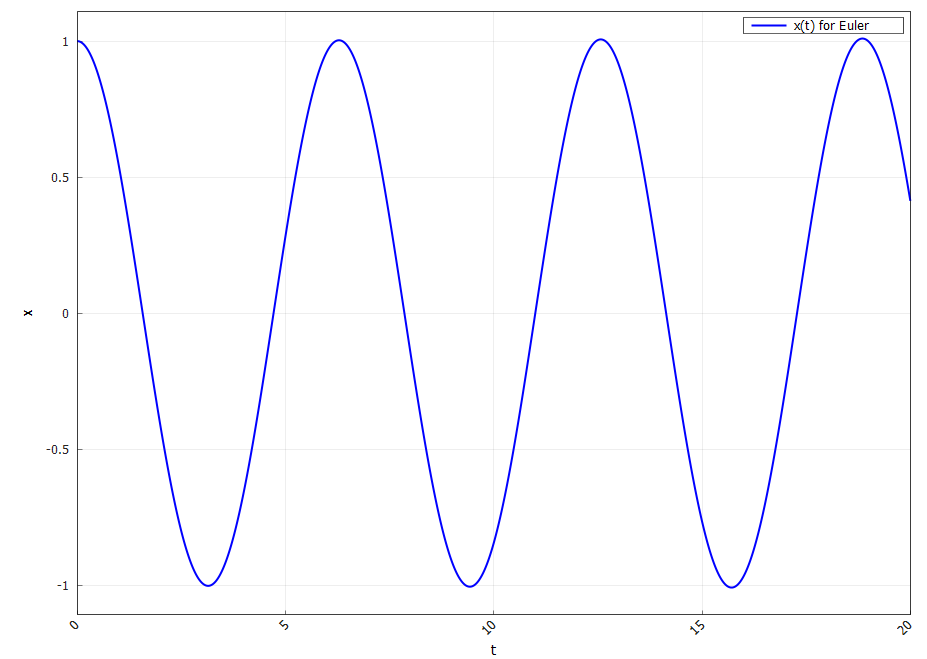
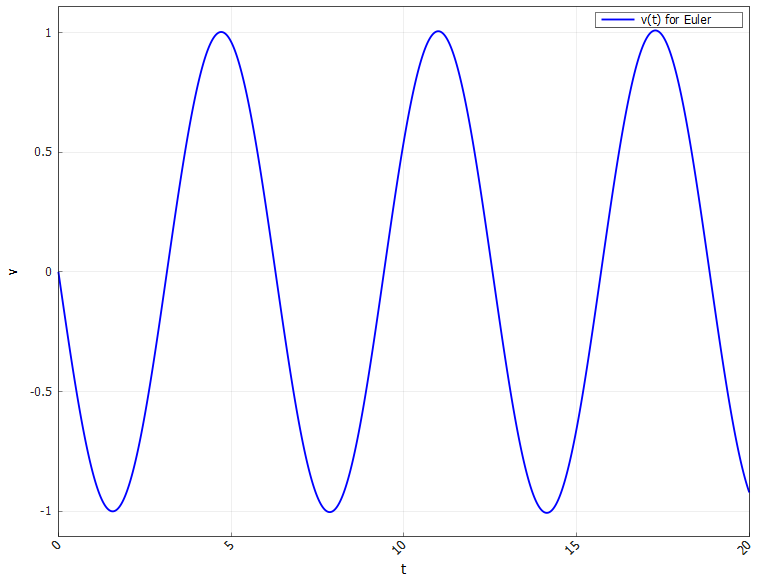
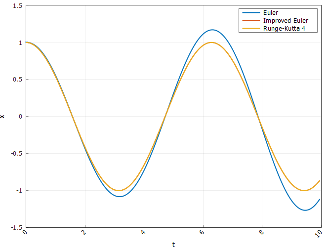
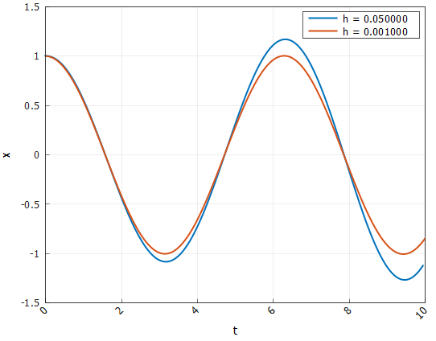
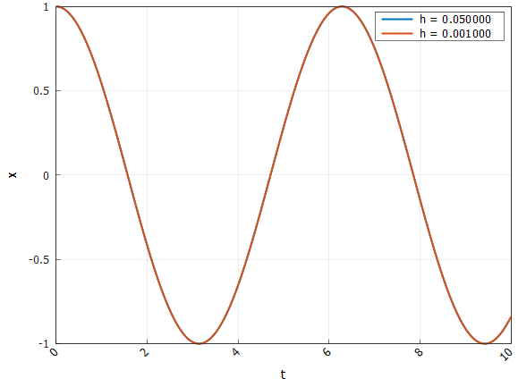
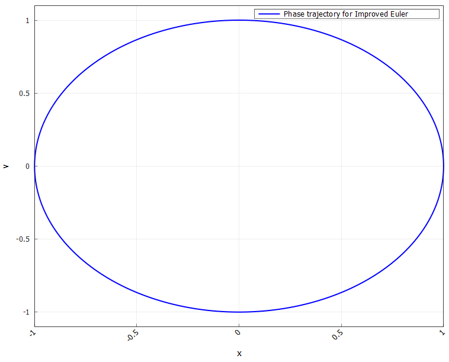
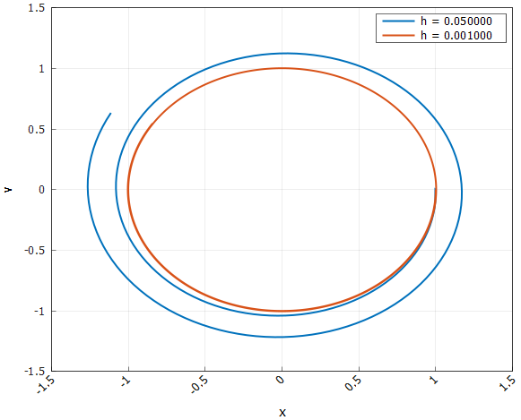

# Отчёт по лабораторной работе: Численные методы решения ОДУ ⚡️📊

## Содержание 📖

1. [Введение и цели работы 🎓](#1-введение-и-цели-работы-)
2. [Структура проекта 🛠️](#2-структура-проекта-)
3. [Ход выполнения работы 🔎](#3-ход-выполнения-работы-)
   - Реализация численных методов
     - Классический метод Эйлера
     - Улучшенный метод Эйлера
     - Метод Рунге-Кутты 4 порядка
    - Гармонический осциллятор как эталон корректности методов
    - Уравнение Эйлера
      - Исследование поведения решений при различных параметрах
4. [Заключение и выводы 📝](#4-заключение-и-выводы-)

## 1. Введение и цели работы 🎓

В современном вычислительном моделировании задачи численного решения обыкновенных дифференциальных уравнений (ОДУ) занимают ключевое место в физике, математике и инженерных науках. Эти методы незаменимы для анализа динамических систем, чье поведение не удаётся выразить в явной аналитической форме. Инструменты для численного решения ОДУ позволяют исследовать широкий спектр моделей — от простых гармонических осцилляторов до сложных многомерных и нелинейных систем. Современные архитектуры программирования, основанные на объектных и шаблонных подходах, обеспечивают гибкость, масштабируемость и универсальность интеграционных платформ.

Именно такая архитектура и реализована в данной работе на С++!

**Цели: 🎯**

- Реализовать универсальную программную архитектуру для численного решения ОДУ любого порядка на базе совокупности модульных классов (решатели, обработчики графиков, интерфейсы задач)
- Внедрить паттерн "Стратегия" для динамического выбора режимов вычислений: классический расчёт, исследование зависимости результата от шага, точности, метода, сравнение с аналитическим решением
- Оценить точность и сходимость различных методов, провести сравнение с аналитическим решением, реализовать визуализацию основных характеристик (x(t), v(t), ошибки, фазовые портреты)
- Проанализировать универсальность подхода архитектуры и возможные ограничения для применения на задачах любого типа, включая жёсткие, многомерные, высокопорядковые системы

## 2. Структура проекта 🛠️

Вся работа выполнена в виде модульного C++-проекта со следующей структурой:
```
include/
├── Base/            # Базовые интерфейсы генераторов/решателей
├── Labs/            # Заголовки лабораторных заданий
src/
└── Labs/
    └── LabN/
        └── TaskK.cpp    # Основные реализации по заданиям
CMakeLists.txt          # Конфигурация сборки проекта
```
Реализация поддерживает автоматическое добавление новых заданий, централизованное подключение заголовков и простое масштабирование под разные лабораторные работы

## 3. Ход выполнения работы 🔎

### Реализация численных методов

Ключевая цель нашей работы — реализовать и исследовать эффективность ряда классических и усовершенствованных методов, сравнить их точность и устойчивость на типовых задачах. Перейдем к реализации численных методов

---

#### Классический метод Эйлера

_Классический метод Эйлера_ — самый простой и популярный алгоритм первого порядка для численного интегрирования ОДУ в форме $y' = f(x, y)$. Для шага $h$ решение строится по схеме:

$$
    y_{i+1} = y_i + h \cdot f(x_i, y_i)
$$

Этот метод является **явным** — для вычисления следующего значения требуется только знание текущего состояния

**Плюсы метода:** простота, легкость программирования, малая вычислительная стоимость. **Главный недостаток** — низкая точность $\mathcal{O}(h)$ и недостаточная устойчивость на "жёстких" системах

---

#### Улучшенный метод Эйлера (Метод Эйлера-Коши, предиктор-корректор)

Для повышения точности используется _усовершенствованный метод Эйлера_, который также является явным, но реализует двухшаговый принцип _предиктора-корректора_:

1. **Предиктор (шаг Эйлера):**
   
$$
   y_{i+1} = y_i + h \cdot f(x_i, y_i)
$$

2. **Корректор (уточнение по средней производной):**
   
$$
   y_{i+1} = y_i + \frac{h}{2} \left[f(x_i, y_i) + f(x_{i+1}, \tilde{y}_{i+1})\right]
$$

Для систем ОДУ формула аналогична (векторная запись):

$$
    \mathbf{y}_{i+1} = \mathbf{y}_i + \frac{h}{2}\left[\mathbf{f}(x_i, \mathbf{y}_i) + \mathbf{f}(x_{i+1}, \tilde{\mathbf{y}}_{i+1})\right]
$$

**Явность метода:**  
Этот метод также является явным, так как обе стадии вычисляют всё выражениями через известные значения

**Плюсы по сравнению с обычным методом Эйлера:**
- Второй порядок точности: погрешность $\sim h^{2}$ вместо $\sim h$
- Более высокая устойчивость, возможность использовать большие шаги $h$ без резкой потери точности
- Всё ещё очень прост в реализации — требуется только два вычисления правой части на шаг

---

### Метод Рунге-Кутты 4 порядка

_Метод Рунге-Кутты четвёртого порядка (RK4)_ — это явная схема для ОДУ вида $y' = f(x, y)$, достигающая точности $\mathcal{O}(h^{4})$ даже при сравнительно крупных шагах. На каждом шаге для вычисления $y_{i+1}$ в разных точках интервала используются:

$$
\begin{align*}
    k_1 & = f(x_i, y_i) \\
    k_2 & = f\left(x_i + \frac{h}{2},\ y_i + \frac{h}{2}k_1\right) \\
    k_3 & = f\left(x_i + \frac{h}{2},\ y_i + \frac{h}{2}k_2\right) \\
    k_4 & = f(x_i + h,\ y_i + h k_3) \\
    y_{i+1} & = y_i + \frac{h}{6}(k_1 + 2k_2 + 2k_3 + k_4)
\end{align*}
$$

Метод обеспечивает отличную точность и устойчивость даже на длительных интервалах, что делает его отраслевым стандартом для расчётов динамики в научных и инженерных задачах

---

### Гармонический осциллятор как эталон корректности методов

В качестве эталонной задачи для тестирования численных методов рассмотрим классический гармонический осциллятор без затухания:

$$
\ddot{x} + \omega^2 x = 0
$$

**Начальные условия:**

$$
x(0) = x_0, \qquad \dot{x}(0) = v_0
$$

**Это уравнение сводится к системе первого порядка:**

$$
\begin{cases}
y_0 = x, \\
y_1 = \dot{x}, \\
y_0' = y_1, \\
y_1' = -\omega^2 y_0
\end{cases}
$$

**или в векторной форме:**

$$
\frac{d}{dt}
\begin{pmatrix}
y_0 \\
y_1
\end{pmatrix}
= \begin{pmatrix}
y_1 \\
-\omega^2 y_0
\end{pmatrix}
$$

**Аналитическое решение этой задачи имеет вид:**

$$
x(t) = x_0 \cos(\omega t) + \frac{v_0}{\omega} \sin(\omega t)
$$

Данная задача обладает точным решением и позволяет количественно сравнивать численные и аналитические значения $x(t)$ для оценки точности и устойчивости различных численных методов

Воспользуемся классическим методом Эйлера и получим зависимости $x(t)$, $\dot{x(t)}$:




**График 1 - Зависимость координаты маятника x от времени t**




**График 2 - Зависимость скорости маятника v от времени t**


Как видим, при достаточно малом шаге классический метод Эйлера отлично справляется с поставленной задачей. Теперь увеличим шаг и сравним решение метода Эйлера с решением более точного метода Рунге-Кутты 4 порядка:




**График 3 - Зависимость координаты маятника x от времени t для различных методов**


Здесь мы уже видим явное превосходство метода Рунге-Кутты 4 порядка над методом Эйлера! Посмотрим на решение методом Эйлера при различном шаге:




**График 4 - Зависимость координаты маятника x от времени t для разных шагов по методу Эйлера**


Следовательно, для метода Эйлера существенным является размер шага. Для достижения минимальной ошибки шаг следует брать довольно маленький. А как дела обстоят с методом Рунге-кутты? Сейчас узнаем:)




**График 5 - Зависимость координаты маятника x от времени t для разных шагов по методу Рунге-Кутты**


Видим явное подтверждение превосходства метода Рунге-Кутты 4 порядка: несмотря на небольшой шаг решение все равно получается достаточно точным

И, наконец, самое интересное! Изобразим фазовый портрет маятника, построенный на основе решений улучшенного метода Эйлера, а также метода Эйлера при разном шаге:





**График 6 - Фазовый портрет маятника по улучшенному методу Эйлера**





**График 7 - Фазовый портрет маятника по методу Эйлера при различном шаге**

**Выводы:**

**1. Влияние шага интегрирования на точность метода Эйлера**

Анализ графиков зависимости координаты и скорости от времени показывает, что классический метод Эйлера способен достаточно хорошо аппроксимировать решение только при малых шагах по времени. С увеличением шага интегрирования ошибка быстро накапливается, что видно по смещению и деформации графиков $x(t)$ и фазовых портретов. На фазовой траектории решение с крупным шагом отклоняется от идеальной эллиптической формы и "раскручивается" от центра, что означает неконтролируемое накопление погрешности

**2. Сравнение различных методов**

Сравнительный график решений $x(t)$, найденных методами Эйлера, улучшенным Эйлером и Рунге-Кутты 4-го порядка, демонстрирует явное превосходство методов повышенной точности. Улучшенный метод Эйлера и особенно метод Рунге-Кутты гораздо точнее передают фазу и амплитуду осциллятора на всем рассматриваемом интервале времени. Даже при относительно большом шаге $h$ метод Рунге-Кутты 4-го порядка сохраняет точность решения, в то время как метод Эйлера уже существенно отклоняется от истинного решения

**3. Стойкость и явность методов**

Улучшенный метод Эйлера — эффективный компромисс между простотой и качеством решения: он позволяет существенно уменьшить ошибку, оставаясь явным (т.е. не требует решения системы на каждом шаге). Метод Рунге-Кутты 4-го порядка — эталон по устойчивости и точности среди явных одношаговых методов: он практически не зависит от величины шага при достаточно гладких системах и позволяет моделировать динамику на длительных интервалах времени

**4. Фазовые портреты как показатель качества численного метода**

Анализ фазовых портретов демонстрирует, что качественный метод должен сохранять замкнутые эллиптические линии для гармонического осциллятора. Метод Рунге-Кутты и улучшенный Эйлер при должном выборе шага поддерживают это свойство, в то время как грубый метод Эйлера быстро теряет фазу и "размывает" цикл

---

### Уравнение Эйлера

Уравнение Эйлера описывает колебания в системе, где возвращающая сила и коэффициент вязкого трения убывают со временем:

$$
\ddot{x} + \frac{2b}{t} \dot{x} + \omega^2 x = 0
$$

**Начальные условия:**

$$
x(1) = 1, \qquad \dot{x}(1) = 1, \qquad t \in [1,100]
$$

**Для численного решения это уравнение представляется в виде системы первого порядка:**

$$
\begin{cases}
y_0 = x, \\
y_1 = \dot{x}, \\
y_0' = y_1, \\
y_1' = -\frac{2b}{t} y_1 - \omega^2 y_0
\end{cases}
$$

**или в векторной форме:**

$$
\frac{d}{dt}
\begin{pmatrix}
y_0 \\
y_1
\end{pmatrix}
= \begin{pmatrix}
y_1 \\
-\dfrac{2b}{t} y_1 - \omega^2 y_0
\end{pmatrix}
$$

**Аналитическое решение задачи Эйлера-Коши принимает вид:**

$$
x(t) = t^{-b} \left[ C_1 \cos(\omega t) + C_2 \sin(\omega t) \right]
$$

где $C_1$ и $C_2$ определяются из системы начальных условий:

$$
\begin{cases}
x(1) = 1 \\
\dot{x}(1) = 1
\end{cases}
$$

**Полная формула производной (для второго уравнения):**

$$
\dot{x}(t) = -b\ t^{-b-1} \left[ C_1 \cos(\omega t) + C_2 \sin(\omega t) \right]
            + t^{-b} \left[ -C_1 \omega \sin(\omega t) + C_2 \omega \cos(\omega t) \right]
$$

Коэффициенты $C_1$, $C_2$ вычисляются решением этой системы для конкретных значений $b$, $\omega$ и начальных условий

Такой вид постановки обеспечивает корректную работу всех реализованных численных методов вне зависимости от значений $b$ и $\omega$, а также позволяет исследовать динамику осциллятора с переменными по времени коэффициентами


