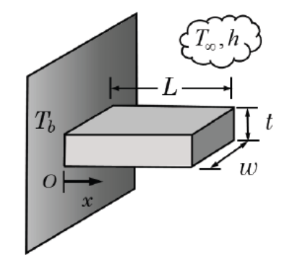
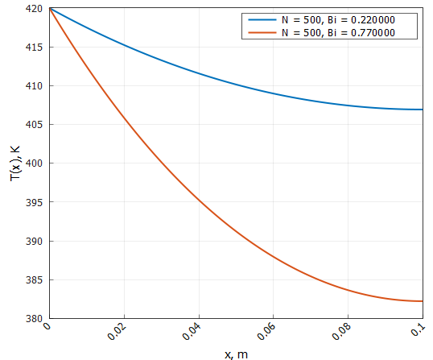
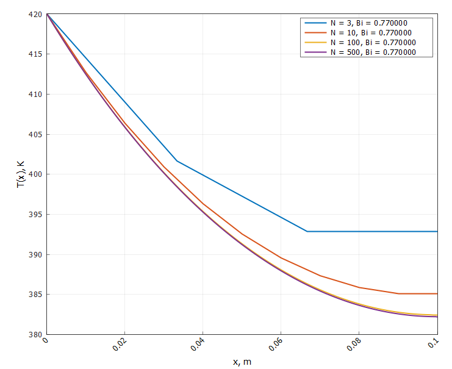

# Отчёт по лабораторной работе: Краевые задачи для ДУ ⚡️📊

## Содержание 📖

1. [Введение и цели работы 🎓](#1-введение-и-цели-работы-)
2. [Структура проекта 🛠️](#2-структура-проекта-)
3. [Ход выполнения работы 🔎](#3-ход-выполнения-работы-)
    - [Разрешение краевой задачи для уравнения Бесселя 🚀](#разрешение-краевой-задачи-для-уравнения-бесселя-)
        - [Приведение уравнения к дивергентному виду 🧮](#приведение-уравнения-к-дивергентному-виду-)
        - [Построение разностной схемы 📐](#построение-разностной-схемы-)
        - [Получение формул для элементов трёхдиагональной матрицы ✍️](#получение-формул-для-элементов-трёхдиагональной-матрицы-)
        - [Решение полученной системы методом прогонки ➡️](#решение-полученной-системы-методом-прогонки-)
        - [Особенности при x = 0 ⚠️](#особенности-при-x=0-)
    - [Горячая стенка и прямоугольная пластина 🔥🟦](#горячая-стенка-и-прямоугольная-пластина-)
        - [Постановка краевой задачи 🎯](#постановка-краевой-задачи-)
        - [Обезразмеривание задачи 🧩](#обезразмеривание-задачи-)
        - [Дискретизация задачи 🗂️](#дискретизация-задачи-)
        - [Получение формул для элементов матрицы 📑](#получение-формул-для-элементов-матрицы-)
        - [Построение графиков распределений температуры в пластине 📊](#построение-графиков-распределений-температуры-в-пластине-)
4. [Заключение и выводы 📝](#4-заключение-и-выводы-)

## 1. Введение и цели работы 🎓

В современном вычислительном эксперименте задачи численного решения краевых задач для обыкновенных дифференциальных уравнений второго порядка играют важную роль в теплофизике, механике сплошных сред, электротехнике и смежных областях. Такие задачи естественно возникают при моделировании установившихся распределений температуры, напряжений, потенциалов и других полей, когда состояние системы задаётся условиями на границах области, а не во времени.

Численные методы решения краевых задач позволяют получать приближённые решения в случаях, когда аналитическое представление либо отсутствует, либо оказывается слишком громоздким для практического использования. Разностные схемы и их реализации на компьютере дают возможность варьировать шаг сетки, исследовать поведение погрешности и адаптировать метод под конкретную постановку.

Модульная организация кода позволяет отделить математическую постановку задачи от её программной реализации и анализа результатов, что повышает гибкость и расширяемость программных средств.

Именно такой подход реализован в данной работе : построен программный комплекс на С++ для численного решения краевой задачи для ОДУ второго порядка с возможностью настройки параметров и наглядной визуализации полученных решений и погрешностей.

**Цели: 🎯**

- Реализовать универсальную программную архитектуру для численного решения краевых задач ДУ любого порядка на базе совокупности модульных классов (решатели, обработчики графиков, интерфейсы задач)
- Провести обезразмеривание задачи о распределении температуры в прямоугольной пластине
- Дискретизировать безразмерную задачу методом конечных разностей со вторым порядком аппроксимации
- Построить графики распределения температуры при различных параметрах прямоугольной пластины
- Исследовать влияние шага сетки на точность и устойчивость решения,
- Оценить применимость выбранного численного подхода к различным постановкам краевых задач (разные коэффициенты, граничные условия)

## 2. Структура проекта 🛠️

Вся работа выполнена в виде модульного C++-проекта со следующей структурой:
```
include/
├── Base/            # Базовые интерфейсы генераторов/решателей
├── Labs/            # Заголовки лабораторных заданий
src/
└── Labs/
    └── LabN/
        └── TaskK.cpp    # Основные реализации по заданиям
CMakeLists.txt          # Конфигурация сборки проекта
```
Реализация поддерживает автоматическое добавление новых заданий, централизованное подключение заголовков и простое масштабирование под разные лабораторные работы. Реализацию. всех заголовков заданий можно найти по пути `include/Labs/Lab5/Tasks`

## 3. Ход выполнения работы 🔎

### Разрешение краевой задачи для уравнения Бесселя 🚀

Рассмотрим краевую задачу:

$$
    x^2 u'' + x u' + (x^2 - \nu^2)u = 0,\quad x \in [a, b]
$$

$$
    u(a) = 1,\quad u(b) = 0.
$$

---

#### Приведение уравнения к дивергентному виду 🧮

Приведём данное уравнение к дивергентному виду:

$$
    \frac{d[x^2 u']}{dx} + (x^2 - \nu^2)u = xu'
$$

Данный вид не является строго дивергентным, так как справа присутствует $u'$. Это уравнение Бесселя порядка $\nu$.

---

#### Построение разностной схемы 📐

Построим равномерную сетку:

$$
    x_i = a + ih,
$$

$$
     i = 0, 1, ... N,
$$

$$
    h = \frac{b-a}{N}.
$$

---

Аппроксимируем:

$$
    u' \approx \frac{u_{i+1} - u_{i-1}}{2h}
$$

$$
    \frac{d[k(x) u']}{dx} \approx \frac{k_{i+0,5}(u_{i+1} - u_i) - k_{i-0,5}(u_i - u_{i-1})}{h^2}
$$

где для $k(x) = x^2$ имеем:

$$
    k_{i \pm 0,5} = \frac{(x_i + x_{i \pm 1})^2}{4}
$$

Таким образом получим итоговую разностную схему для уравнения Бесселя:

$$
    \frac{k_{i+0,5}(u_{i+1} - u_i) - k_{i-0,5}(u_i - u_{i-1})}{h^2} + (x_i^2 - \nu^2)u_i = x_i \frac{u_{i+1} - u_{i-1}}{2h}
$$

---

#### Получение формул для элементов трёхдиагональной матрицы ✍️

Общий вид: 

$$
    A_i u_{i-1} + B_i u_i + C_i u_{i+1} = 0
$$

Тогда согласно построенной нами разностной схемы имеем следующие формулы для элементов матрицы:

$$
    A_i = \frac{k_{i-0,5}}{h^2} + \frac{x_i}{2h},
$$

$$
    B_i = - \frac{k_{i-0,5} + k_{i+0,5}}{h^2} + x_i^2 - \nu^2,
$$

$$
    C_i = \frac{k_{i+0,5}}{h^2} - \frac{x_i}{2h}.
$$

Граничные условия заданы точно, а порядок аппроксимации основного уравнения - **второй**.

---

#### Решение полученной системы методом прогонки ➡️

Пусть:

$$
    u(1) = 1,\quad u(10) = 0
$$

Для разрешения полученной СЛАУ воспользуемся методом прогонки, реализацию которого можно найти по пути `include/Labs/Lab1/SLAESolvers/ThomasSolver.h`

Код реализации решения уравнения бесселя можно найти по пути `include/Labs/Lab5/Tasks/TaskBessel.h`

---

**Для $\nu = 1$:**

**Таблица 1 - Метрики решения уравнения Бесселя первого порядка**
| Кол-во узлов | Время, мкс | Невязка |
|:------------:|:----------:|:-------:|
| $100$          | $153$        | $4.0957e^{-12}$ |


**Рисунок 1 - График численного решения уравнения Бесселя первого порядка**

Теперь взглянем, что нам покажет `Wolfram`:


**Рисунок 2 - График решения уравнения Бесселя первого порядка, полученного с помощью Wolfram**

---

**Для $\nu = 3$:**

**Таблица 2 - Метрики решения уравнения Бесселя третьего порядка**
| Кол-во узлов | Время, мкс | Невязка |
|:------------:|:----------:|:-------:|
| $100$          | $172$        | $1.3691e^{-12}$ |


**Рисунок 3 - График численного решения уравнения Бесселя третьего порядка**

И снова обратимся к `Wolfram` для проверки:


**Рисунок 4 - График решения уравнения Бесселя третьего порядка, полученного с помощью Wolfram**

---

Результаты численного решения краевой задачи для уравнения Бесселя первого и третьего порядка демонстрируют высокую точность и стабильность используемого алгоритма прогонки. Для обоих случаев ($\nu = 1$ и $\nu = 3$) при числе узлов $100$ величина невязки составила $4.0957 \times 10^{-12}$ и $1.3691 \times 10^{-12}$ соответственно, что свидетельствует о практически полном совпадении численного решения с аналитическим эталоном.

Сравнение графиков численного решения и результата, полученного в системе `Wolfram`, подтверждает правильную реализацию алгоритма: на обоих рисунках поведение функции полностью совпадает, отклонения отсутствуют визуально и по метрике невязки. Это значит, что выбранный шаг сетки и реализованный алгоритм прогонки обеспечивают необходимую точность и воспроизводимость известных аналитических решений.

---

#### Особенности при $x = 0$ ⚠️

Если выбрать начало отрезка $x = 0$ для уравнения Бесселя, действительно могут возникнуть ошибки при численном решении. Причина в том, что $x = 0$ – это особая (сингулярная) точка для дифференциального уравнения Бесселя.
В результате при численном решении возникают крупные ошибки из-за неопределённости и потери устойчивости алгоритма.

Для данной точки в уравнении Бесселя можно использовать следующие подходы:

- Применять специальные аналитические выражения для решения уравнения вблизи сингулярности, например — явное задание значения функции Бесселя первого рода, для которой $J_\nu(0) = 0$ при $\nu > 0$, либо воспользоваться разложением в ряд.
- Исключать нулевую точку из расчетной сетки, начиная интегрирование на малом положительном значении $x$, чтобы избежать деления на ноль.

Эти меры позволяют избежать возникновения ошибок и корректно аппроксимировать решение рядом с точкой сингулярности.

---

### Горячая стенка и прямоугольная пластина 🔥🟦

Рассмотрим следующую задачу:

К горячей стенке присоединена прямоугольная пластина (параллелепипед) как показано на рисунке 5. Начало координат положено на стенке. Левый край пластины поддерживается при постоянной температуре, правый — теплоизолирован. На остальной поверхности происходит конвективный теплообмен с окружающей средой.



**Рисунок 5 - К постановке задачи о распределении температуры**

---

#### Постановка краевой задачи 🎯

Получим уравнение, описывающее процесс распределения температуры в данной системе.

Рассмотрим участок между $x$ и $x + dx$. Тогда входящий и выходящий поток имеют вид:

$$
    q_x = -kA \frac{dT}{dx} - входящий
$$

$$
    q_{x+dx} = -kA\left. \frac{dT}{dx} \right|_{x+dx} - выходящий 
$$

где $k$ - коэффициент теплопроводности, $A$ - площадь поперечного сечения пластины.

Зададим потери на конвекцию:

$$
    hPdx(T(x) - T_{\infty})
$$

где $h$ - коэффициент теплоотдачи, $Р$ - периметр поперечного сечения пластины, $T_{\infty}$ - температура окружающей среды.

Закон сохранения энергии:

$$
    q_x - q_{x+dx} - hPdx(T(x) - T_{\infty}) = 0
$$

Тогда, подставляя выражения для потоков, получим:

$$
    kA[\left. \frac{dT}{dx} \right|_{x+dx} - \left. \frac{dT}{dx} \right|_{x}] = hPdx(T(x) - T_{\infty})
$$

По определению производной функции в точке:

$$
    \left. \frac{dT}{dx} \right|_{x+dx} - \left. \frac{dT}{dx} \right|_{x} \approx \frac{d^2T}{dx^2}dx
$$

Таким образом, итоговое уравнение, описывающее распределение температуры в данной системе имеет вид:

$$
    \frac{d^2T}{dx^2} - \frac{hP}{kA}(T(x) - T_{\infty}) = 0,\quad x \in [0, L]
$$

Граничные условия:

$$
    T(0) = T_b
$$

$$
    T'(L) = 0
$$

---

#### Обезразмеривание задачи 🧩

Прежде чем решать колченную краевую задачу, с целью получения универсального решения, зависящего только от _числа Биота_, а не от конкретных физических параметров системы, приведём её к безразмерному виду.

_Число Биота_ отражает отношение интенсивности конвективного теплоотвода к теплопроводности пластины:

$$
Bi = \frac{h P L^2}{k A}
$$

Значение $Bi$ определяет характер распределения температуры и позволяет обобщать результаты для различных физических параметров.

Введем безразмерную температуру $\theta(x)$ и координату $\xi$:

$$
    \theta(x) = \frac{T(x) - T_{\infty}}{T_b - T_{\infty}}
$$

$$
    \xi = \frac{x}{L}
$$

Выразим производную по $x$ через производную по $\xi$:

$$
    \frac{d}{dx} = \frac{d\xi}{dx}\frac{d}{d\xi} = \frac{1}{L}\frac{d}{d\xi}
$$

Тогда:

$$
    \frac{d^2T}{dx^2} = \frac{1}{L^2}\frac{d^2T}{d\xi^2}
$$

Собирая все вместе, получим:

$$
    \frac{1}{L^2}\frac{d^2T}{d\xi^2} - \frac{hP}{kA}(T_b - T_{\infty})\theta(\xi) = 0
$$

$$
    \frac{d^2\theta}{d\xi^2} - \frac{hP}{kA}L^2\theta(\xi) = 0
$$

Итоговый вид обезразмеренной задачи:

$$
    \frac{d^2\theta}{d\xi^2} - Bi\theta(\xi) = 0
$$

$$
    \xi \in [0, 1]
$$

$$
    \theta(0) = 1 \quad \theta'(L) = 0
$$

---

#### Дискретизация задачи 🗂️

Дискретизируем полученную обезразмеренную задачу методом конечных разностей. Для этого строим равномерную сетку:

$$
    \xi_i = ih, \quad i = 0, 1, ... n
$$

$$
    h = \frac{1}{n}
$$

Аппроксимируем производную:

$$
    \frac{d^2\theta}{d\xi^2} \approx \frac{\theta_{i+1} - 2\theta_i + \theta_{i-1}}{h^2}, \quad i \in [1, n-1]
$$

В итоге имеем:

$$
    \frac{\theta_{i+1} - 2\theta_i + \theta_{i-1}}{h^2} - Bi\theta_i = 0
$$

$$
    \theta_0 = 1, \quad \theta_n = \theta_{n-1}
$$

Возврат к размерным величина:

$$
    T_i = T_{\infty} + (T_b - T_{\infty})\theta_i
$$

$$
    x_i = \xi_iL
$$

---

#### Получение формул для элементов матрицы 📑

Общий вид: 

$$
    A_i \theta_{i-1} + B_i \theta_i + C_i \theta_{i+1} = 0
$$

Тогда согласно построенной нами разностной схемы имеем следующие формулы для элементов матрицы:

$$
    A_i = \frac{1}{h^2},
$$

$$
    B_i = -\frac{2}{h^2} - Bi,
$$

$$
    C_i = \frac{1}{h^2}.
$$

---

#### Построение графиков распределений температуры в пластине 📊

Для

$$
    Bi = 0.22 \quad и \quad Bi = 0.77
$$

$$
    T_b = 420 K, \quad T_{\infty} = 290 K
$$

$$
    L = 0.1 м
$$

**имеем следующие распределения температуры:**



**Рисунок 6 - Распределение температуры в пластине при разном числе Биота**

Видно, что с увеличением числа Биота температурный профиль становится более крутым: температура на правом (теплоизолированном) краю снижается сильнее. Это связано с тем, что при больших $Bi$ интенсивность конвективного теплообмена возрастает относительно теплопроводности, и пластина теряет тепло более эффективно. При низких значениях $Bi$ температура вдоль пластины изменяется медленнее, профиль более пологий, так как доминирует теплопроводность.

---

**Исследуем, как меняется решение при изменении шага сетки:**



**Рисунок 7 - Распределение температуры при разном количестве узлов**

Линии, рассчитанные при малом числе узлов $N = 3$, $N = 10$, имеют видимую «ступенчатость» и заметно расходятся с более гладкими решениями для крупных сеток $N = 100$, $N = 500$. По мере роста числа узлов результаты постепенно «сходятся» и приближаются к аналитическому виду; при $N = 500$ дальнейшее увеличение N почти не изменяет форму профиля температуры.

Это свидетельствует о сходимости численного метода: при уменьшении шага сетки (увеличении $N$) погрешности аппроксимации убывают, и решение становится достоверным. График наглядно демонстрирует, что для получения точного результата необходимо использовать достаточно мелкую сетку, а дальнейшее повышение $N$ становится избыточным с точки зрения качества решения.

---

## 4. Заключение и выводы 📝

В ходе лабораторной работы были успешно реализованы и протестированы численные алгоритмы для решения краевых задач второго порядка, включая уравнение Бесселя и задачу о распределении температуры в прямоугольной пластине. Проведённое обезразмеривание тепловой задачи позволило выделить ключевой безразмерный параметр — число Биота, что существенно упростило анализ и сравнение результатов для различных физических конфигураций.

В результате дискретизации и решения задачи на разных сетках подтверждена сходимость численного метода: при увеличении числа узлов распределения температуры становятся гладкими и близкими к аналитическому решению, а погрешность заметно падает. Графики наглядно показывают, как количество шагов сетки влияет на точность и качество численных решений.

Обобщённая структура кода и универсальный подход к постановке и дискретизации задачи доказали свою гибкость и пригодность для решения широкого класса краевых задач в теплотехнике и смежных областях. Реализованные визуализации позволили провести качественный анализ поведения решений и погрешностей, подтвердив корректность и точность выбранного численного подхода.


