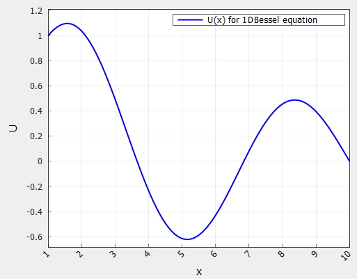
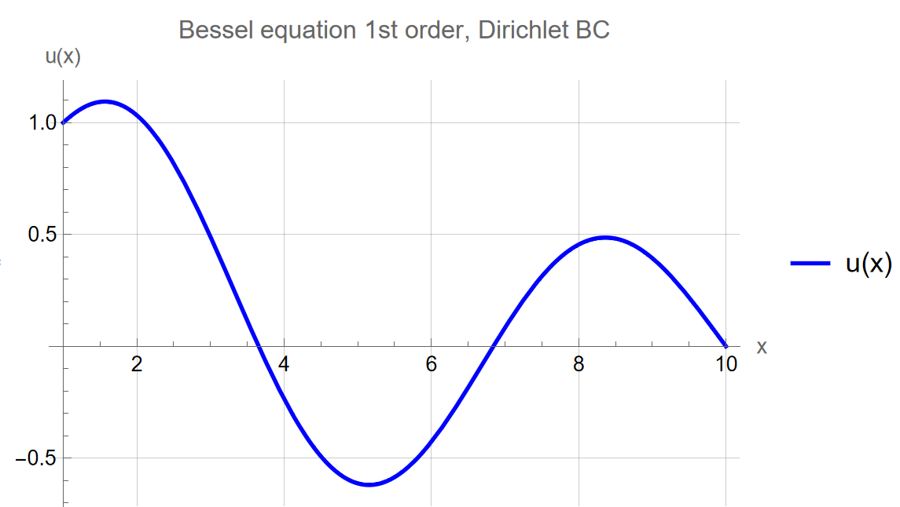
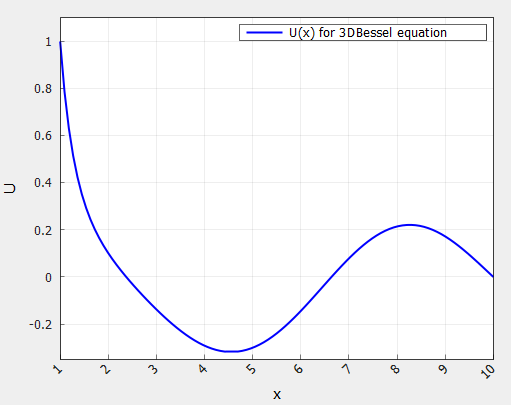
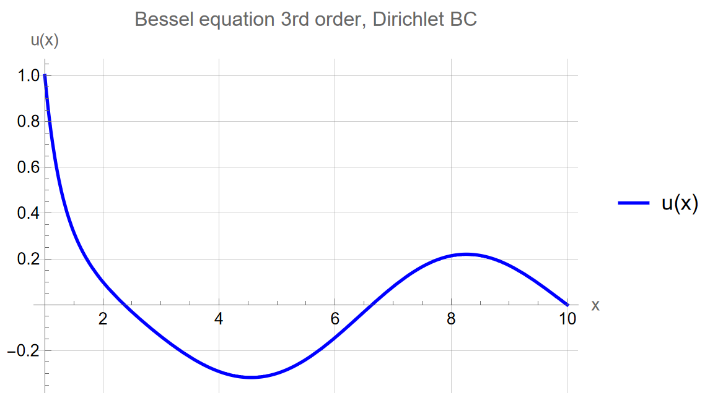

# Отчёт по лабораторной работе: Краевые задачи для ДУ ⚡️📊

## Содержание 📖

1. [Введение и цели работы 🎓](#1-введение-и-цели-работы-)
2. [Структура проекта 🛠️](#2-структура-проекта-)
3. [Ход выполнения работы 🔎](#3-ход-выполнения-работы-)
    - [Разрешение краевой задачи для уравнения Бесселя 🚀](#разрешение-краевой-задачи-для-уравнения-бесселя-)
        - [Приведение уравнения к дивергентному виду](#приведение-уравнения-к-дивергентному-виду)
        - [Построение разностной схемы](#построение-разностной-схемы)
        - [Решение полученной системы методом прогонки](#решение-полученной-системы-методом-прогонки)
        - [Что будет если положить начало отрезка равным нулю?](#что-будет-если-положить-начало-отрезка-равным-нулю)
    - [Горячая стенка и прямоугольная пластина](#горячая-стенка-и-прямоугольная-пластина)
4. [Заключение и выводы 📝](#4-заключение-и-выводы-)

## 1. Введение и цели работы 🎓

В современном вычислительном эксперименте задачи численного решения краевых задач для обыкновенных дифференциальных уравнений второго порядка играют важную роль в теплофизике, механике сплошных сред, электротехнике и смежных областях. Такие задачи естественно возникают при моделировании установившихся распределений температуры, напряжений, потенциалов и других полей, когда состояние системы задаётся условиями на границах области, а не во времени.

Численные методы решения краевых задач позволяют получать приближённые решения в случаях, когда аналитическое представление либо отсутствует, либо оказывается слишком громоздким для практического использования. Разностные схемы и их реализации на компьютере дают возможность варьировать шаг сетки, исследовать поведение погрешности и адаптировать метод под конкретную постановку.

Модульная организация кода позволяет отделить математическую постановку задачи от её программной реализации и анализа результатов, что повышает гибкость и расширяемость программных средств.

Именно такой подход реализован в данной работе : построен программный комплекс на С++ для численного решения краевой задачи для ОДУ второго порядка с возможностью настройки параметров и наглядной визуализации полученных решений и погрешностей.

**Цели: 🎯**

- Реализовать универсальную программную архитектуру для численного решения краевых задач ДУ любого порядка на базе совокупности модульных классов (решатели, обработчики графиков, интерфейсы задач)
- Провести обезразмеривание задачи о распределении тепла в прямоугольной пластине
- Дискретизировать безразмерную задачу методом конечных разностей со вторым порядком аппроксимации
- Построить графики распределения температуры при различных параметрах прямоугольной пластины
- Исследовать влияние шага сетки и параметров разностной аппроксимации на точность и устойчивость решения, провести сравнение численного решения с известным аналитическим
- Оценить применимость выбранного численного подхода к различным постановкам краевых задач (разные коэффициенты, граничные условия)

## 2. Структура проекта 🛠️

Вся работа выполнена в виде модульного C++-проекта со следующей структурой:
```
include/
├── Base/            # Базовые интерфейсы генераторов/решателей
├── Labs/            # Заголовки лабораторных заданий
src/
└── Labs/
    └── LabN/
        └── TaskK.cpp    # Основные реализации по заданиям
CMakeLists.txt          # Конфигурация сборки проекта
```
Реализация поддерживает автоматическое добавление новых заданий, централизованное подключение заголовков и простое масштабирование под разные лабораторные работы. Реализацию. всех заголовков заданий можно найти по пути `include/Labs/Lab5/Tasks`

## 3. Ход выполнения работы 🔎

### Разрешение краевой задачи для уравнения Бесселя 🚀

Рассмотрим краевую задачу:

$$
    x^2 u'' + x u' + (x^2 - \nu^2)u = 0,\quad x \in [a, b]
$$

$$
    u(a) = 1,\quad u(b) = 0.
$$

---

#### Приведение уравнения к дивергентному виду

Приведём данное уравнение к дивергентному виду:

$$
    \frac{d[x^2 u']}{dx} + (x^2 - \nu^2)u = xu'
$$

Данный вид не является строго дивергентным, так как справа присутствует $u'$. Это уравнение Бесселя порядка $\nu$.

---

#### Построение разностной схемы

Построим равномерную сетку:

$$
    x_i = a + ih,
$$

$$
     i = 0, 1, ... N,
$$

$$
    h = \frac{b-a}{N}.
$$

---

Аппроксимируем:

$$
    u' \approx \frac{u_{i+1} - u_{i-1}}{2h}
$$

$$
    \frac{d[k(x) u']}{dx} \approx \frac{k_{i+0,5}(u_{i+1} - u_i) - k_{i-0,5}(u_i - u_{i-1})}{h^2}
$$

где для $k(x) = x^2$ имеем:

$$
    k_{i \pm 0,5} = \frac{(x_i + x_{i \pm 1})^2}{4}
$$

Таким образом получим итоговую разностную схему для уравнения Бесселя:

$$
    \frac{k_{i+0,5}(u_{i+1} - u_i) - k_{i-0,5}(u_i - u_{i-1})}{h^2} + (x_i^2 - \nu^2)u_i = x_i \frac{u_{i+1} - u_{i-1}}{2h}
$$

---

#### Получение формул для элементов трёхдиагональной матрицы

Общий вид: 

$$
    A_i u_{i-1} + B_i u_i + C_i u_{i+1} = 0
$$

Тогда согласно построенной нами разностной схемы имеем следующие формулы для элементов матрицы:

$$
    A_i = \frac{k_{i-0,5}}{h^2} + \frac{x_i}{2h},
$$

$$
    B_i = - \frac{k_{i-0,5} + k_{i+0,5}}{h^2} + x_i^2 - \nu^2,
$$

$$
    C_i = \frac{k_{i+0,5}}{h^2} - \frac{x_i}{2h}.
$$

Граничные условия заданы точно, а порядок аппроксимации основного уравнения - **второй**.

---

#### Решение полученной системы методом прогонки

Пусть:

$$
    u(1) = 1,\quad u(10) = 0
$$

Для разрешения полученной СЛАУ воспользуемся методом прогонки, реализацию которого можно найти по пути `include/Labs/Lab1/SLAESolvers/ThomasSolver.h`

Код реализации решения уравнения бесселя можно найти по пути `include/Labs/Lab5/Tasks/TaskBessel.h`

---

**Для $\nu = 1$:**

**Таблица 1 - Метрики решения уравнения Бесселя первого порядка**
| Кол-во узлов | Время, мкс | Невязка |
|:------------:|:----------:|:-------:|
| $100$          | $153$        | $4.0957e^{-12}$ |



**Рисунок 1 - График численного решения уравнения Бесселя первого порядка**

Теперь взглянем, что нам покажет `Wolfram`:



**Рисунок 2 - График решения уравнения Бесселя первого порядка, полученного с помощью Wolfram**

---

**Для $\nu = 3$:**

**Таблица 2 - Метрики решения уравнения Бесселя третьего порядка**
| Кол-во узлов | Время, мкс | Невязка |
|:------------:|:----------:|:-------:|
| $100$          | $172$        | $1.3691e^{-12}$ |



**Рисунок 3 - График численного решения уравнения Бесселя третьего порядка**

И снова обратимся к `Wolfram` для проверки:



---

Результаты численного решения краевой задачи для уравнения Бесселя первого и третьего порядка демонстрируют высокую точность и стабильность используемого алгоритма прогонки. Для обоих случаев ($\nu = 1$ и $\nu = 3$) при числе узлов $100$ величина невязки составила $4.0957 \times 10^{-12}$ и $1.3691 \times 10^{-12}$ соответственно, что свидетельствует о практически полном совпадении численного решения с аналитическим эталоном.

Сравнение графиков численного решения и результата, полученного в системе `Wolfram`, подтверждает правильную реализацию алгоритма: на обоих рисунках поведение функции полностью совпадает, отклонения отсутствуют визуально и по метрике невязки. Это значит, что выбранный шаг сетки и реализованный алгоритм прогонки обеспечивают необходимую точность и воспроизводимость известных аналитических решений.

---

#### Что будет если положить начало отрезка равным нулю?

Если выбрать начало отрезка $x = 0$ для уравнения Бесселя, действительно могут возникнуть ошибки при численном решении. Причина в том, что $x = 0$ – это особая (сингулярная) точка для дифференциального уравнения Бесселя.
В результате при численном решении возникают крупные ошибки из-за неопределённости и потери устойчивости алгоритма.

Для данной точки в уравнении Бесселя можно использовать следующие подходы:

- Применять специальные аналитические выражения для решения уравнения вблизи сингулярности, например — явное задание значения функции Бесселя первого рода, для которой $J_\nu(0) = 0$ при $\nu > 0$, либо воспользоваться разложением в ряд.
- Исключать нулевую точку из расчетной сетки, начиная интегрирование на малом положительном значении $x$, чтобы избежать деления на ноль.

Эти меры позволяют избежать возникновения ошибок и корректно аппроксимировать решение рядом с точкой сингулярности.

---

### Горячая стенка и прямоугольная пластина

Рассмотрим следующую задачу:

К горячей стенке присоединена прямоугольная пластина (параллелепипед) как показано на рисунке 4. Начало координат положено на стенке. Левый край пластины поддерживается при постоянной температуре, правый — теплоизолирован. На остальной поверхности происходит конвективный теплообмен с окружающей средой.


Получим уравнение, описывающее процесс распределения температуры в данной системе.


