# Отчёт по лабораторной работе:  Краевые задачи для ДУ параболического типа ⚡️📊

## Содержание 📖

1. [Введение и цели работы 🎓](#1-введение-и-цели-работы-)
2. [Структура проекта 🛠️](#2-структура-проекта-)
3. [Ход выполнения работы 🔎](#3-ход-выполнения-работы-)
    - [Разминка: одномерное уравнение теплопроводности как тест устойчивости схемы 🌡️](#разминка-одномерное-уравнение-теплопроводности-как-тест-устойчивости-схемы-)
    - [Основное блюдо: схема с весами для уравнения теплопроводности 🍲](#основное-блюдо-схема-с-весами-для-уравнения-теплопроводности-)
    - [Десерт: нагрев стержня лазерным импульсом ☄️](#десерт-нагрев-стержня-лазерным-импульсом-)
5. [Заключение и выводы 📝](#4-заключение-и-выводы-)

## 1. Введение и цели работы 🎓

Задачи численного решения уравнений теплопроводности занимают центральное место в вычислительной теплофизике, моделировании диффузионных процессов и эволюции температурных полей в инженерных конструкциях и технологических устройствах. В таких задачах требуется описать изменение температуры во времени с учётом теплопроводности материала и граничных воздействий, что приводит к краевым задачам для параболических уравнений второго порядка.

Аналитические решения подобных задач известны лишь для ограниченного класса простых геометрий и условий, причём они часто представляются в виде сложных рядов, неудобных для практического вычисления. Поэтому на практике широко применяются конечно-разностные методы, позволяющие строить приближённые решения на вычислительной сетке и явно контролировать влияние шага по времени и пространству на точность и устойчивость. В работе рассматриваются классические явная, неявная и симметричная (Кранка–Николсона) схемы для одномерного уравнения теплопроводности, которые и реализованы в работе.

В рамках лабораторной работы разработана модульная С++‑архитектура, отделяющая математическую постановку от численной реализации и анализа результатов: отдельные классы отвечают за формирование сетки и разностных схем, решение трёхдиагональных систем (метод прогонки), построение графиков и сравнение с точным решением. Такая организация кода позволяет легко переключаться между схемами, изменять параметры сетки и автоматически оценивать погрешность в различных режимах.

**Цели: 🎯**

- Выполнить обезразмеривание одномерной задачи теплопроводности и привести её к безразмерному виду, удобному для численного решения
- Дискретизировать безразмерную задачу, реализовав явную, неявную и симметричную схемы второго порядка по пространственной переменной
- Реализовать на C++ универсальный класс решения задачи теплопроводности (TaskHeatEquation) с возможностью выбора схемы, шага сетки и параметров задачи, а также с автоматическим вычислением нормы погрешности относительно аналитического решения
- Провести вычислительный эксперимент по исследованию устойчивости явной схемы (проверка ограничения на отношение шага по времени к квадрату шага по пространству) и подтвердить безусловную устойчивость неявной и симметричной схем
- Сравнить точность явной и неявных схем при одинаковых шагах сетки по максимальной норме ошибки и по графикам распределения температуры во времени, выявив преимущества и недостатки каждого подхода

## 2.Структура проекта 🛠️

Вся работа выполнена в виде модульного C++-проекта со следующей структурой:
```
include/
├── Base/            # Базовые интерфейсы генераторов/решателей
├── Labs/            # Заголовки лабораторных заданий
src/
└── Labs/
    └── LabN/
        └── TaskK.cpp    # Основные реализации по заданиям
CMakeLists.txt          # Конфигурация сборки проекта
```
Реализация поддерживает автоматическое добавление новых заданий, централизованное подключение заголовков и простое масштабирование под разные лабораторные работы. Реализацию. всех заголовков заданий можно найти по пути `include/Labs/Lab6/Tasks`

## 3. Ход выполнения работы 🔎

### Разминка: одномерное уравнение теплопроводности как тест устойчивости схемы 🌡️

В качестве тестовой задачи для анализа устойчивости и точности явной схемы теплопроводности рассматривается начально‑краевая задача вида:

$$
\frac{\partial u}{\partial t} = \frac{\partial}{\partial x} \left( \varkappa(x)\,\frac{\partial u}{\partial x} \right) + f(x,t),\quad 0 < x < l,\ 0 < t < t_{\max},
$$

$$
u(0,t)=\nu_1(t),\quad
u(l,t)=\nu_2(t),\quad
u(x,0)=u_0(x).
$$

Для “разминки” предлагается выбрать простейший однородный случай:

- $\varkappa(x) = 1$;  
- $f(x,t) = 0$;  
- $\nu_1(t) = 0,\ \nu_2(t) = 0$ (граничные условия Дирихле);  
- начальное распределение температуры
  $u_0(x) = \sin(\pi x);$
- длина стержня $l = 1$, конечный момент времени $t_{\max}=1$.

В такой постановке точное решение известно в виде:

$$
U(x,t) = e^{-\pi^2 t}\sin(\pi x)
$$

что позволяет напрямую сравнивать численное и аналитическое решения и оценивать погрешность.

Для дискретизации уравнения используется явная разностная схема второго порядка по пространству, полученная из аппроксимации $u_{xx}$ центральной разностью. При равномерной сетке с шагами $h$ по $x$ и $\tau$ по времени вводится безразмерный параметр:

$$
\mu = \frac{\tau}{h^2},
$$

для которого классический анализ устойчивости даёт ограничение

$$
\mu \le \frac{1}{2}
\quad\Leftrightarrow\quad
\tau \le \frac{h^2}{2}.
$$

В реализованном классе `TaskHeatEquation` эта задача решается явной схемой ($\sigma=0$), а затем решение сравнивается с точной формулой $U(x,t)$ по максимальной норме ошибки и по графикам $u(x,t)$ для разных моментов времени.

**Построим графики распределения температуры в различные моменты времени:**

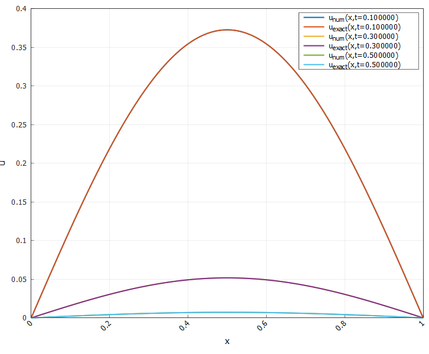

**Рисунок 1 - Распределение температуры в различные моменты времени при $\mu = 0.5$**

---

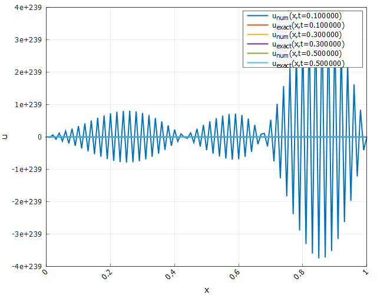

**Рисунок 2 - Распределение температуры в различные моменты времени при $\mu = 5.0$**

На рисунках приведены два режима:

- **случай $\mu = 0.5$** (условие устойчивости строго выполняется): численное решение $u_{\text{num}}(x,t)$ хорошо совпадает с точным $u_{\text{exact}}(x,t)$, профили по $x$ плавные и остаются ограниченными на всем интервале времени;  
- **случай $\mu = 5$** (грубое нарушение условия $\mu \le 0.5$): амплитуда численного решения критически быстро расёт, на графике появляются высокочастотные колебания и значения порядка $10^{239}$, тогда как точное решение остаётся гладким и быстро убывающим по времени.

Такая картина наглядно подтверждает теоретический критерий устойчивости для явной схемы: при $\mu \le 0.5$ схема устойчива и хорошо аппроксимирует аналитическое решение, а при превышении порогового значения возникает численный “разнос” даже для простой задачи с известным точным решением.

---

### Основное блюдо: схема с весами для уравнения теплопроводности 🍲

Для основной части работы к той же задаче теплопроводности при $\varkappa(x)=1$ и $f(x,t)=0$ используется семейство разностных схем с весами, вводимое формулой:

$$
\frac{y_i^{s+1}-y_i^{s}}{\tau} = \sigma\,\Lambda y_i^{s+1} + (1-\sigma)\,\Lambda y_i^{s} + \varphi_i^{s},\qquad s\ge 0,\ i=1,\dots,n-1,
$$

где $\tau$ и $h$ — шаги по времени и пространству, $\Lambda$ — центральная аппроксимация оператора

$$
\frac{\partial}{\partial x}\left(\varkappa(x)\frac{\partial u}{\partial x}\right),
$$

а параметр $\sigma\in[0,1]$ задаёт тип схемы: $\sigma=0$ — явная схема, $\sigma=1$ — полностью неявная, $\sigma=0.5$ — симметричная схема Кранка–Николсон. В рассматриваемом однородном случае $\varkappa\equiv 1,\ f\equiv 0$ и граничных условиях Дирихле точное решение имеет вид

$$
U(x,t) = e^{-\pi^2 t}\sin(\pi x),
$$

что позволяет использовать его как эталон при оценке точности разностных решений.

Численная реализация выполняется в классе `TaskHeatEquation`, который строит равномерную сетку, формирует матрицу трёхдиагональной СЛАУ для левого слоя $y^{s+1}$ (когда $\sigma>0$) и решает её методом прогонки. Для каждого набора параметров $(h,\tau,\sigma)$ вычисляется сеточная функция $y_i^s$ и максимальная погрешность

$$
\mathrm{err}(h,\sigma) = \max_{i,s}\bigl|U(x_i,t_s)-y_i^{s}\bigr|.
$$

**Проведем численный эксперимент, исследовав зависимость максимальной погрешности от пространственного шага и веса:**

Для $\sigma = 0.5$ и $\mu \approx 0.66$ имеем следующее распределение температуры:

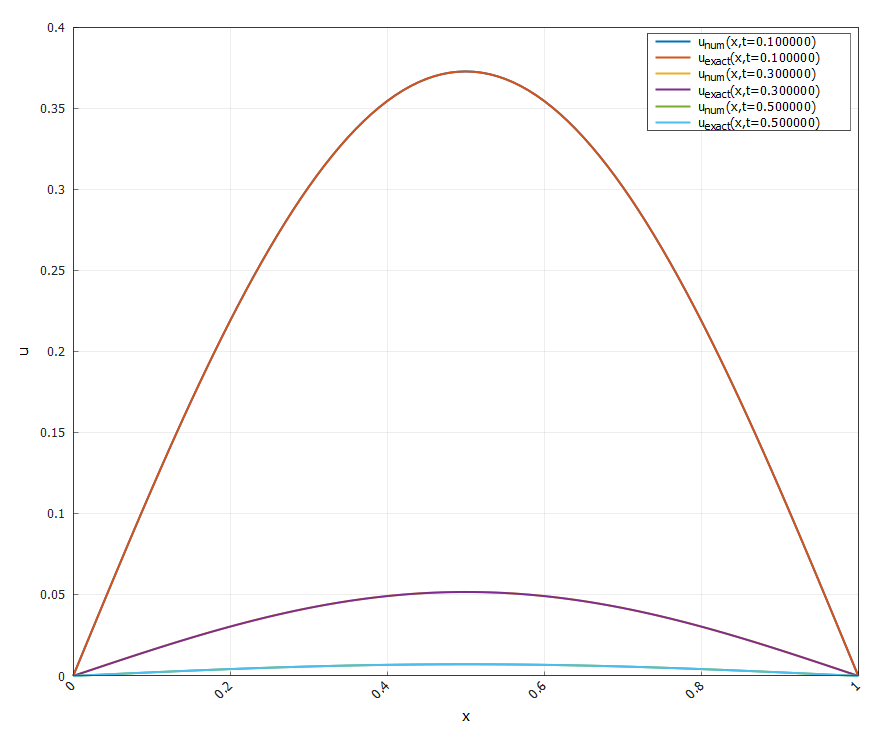

**Рисунок 3 - Распределение температуры в различные моменты времени при $\sigma = 0.5$, $\mu = 0.66$**

Для аналогичного $\mu$, но $\sigma = 1.0$:

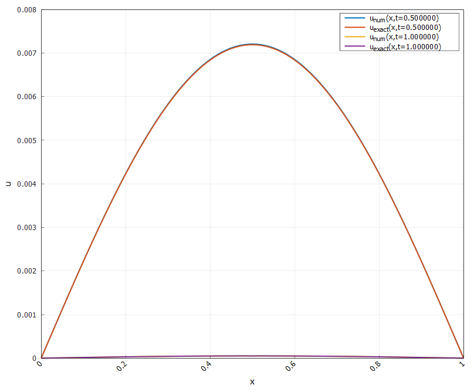

**Рисунок 4 - Распределение температуры в различные моменты времени при $\sigma = 1.0$, $\mu = 0.66$**

На графиках распределения температуры в моменты времени $t=0.5$ и $t=1$ показано, что для симметричной схемы с $\sigma=0.5$ численное решение практически совпадает с точным: кривые $u_{\text{num}}(x,t)$ и $u_{\text{exact}}(x,t)$ визуально не различимы, что указывает на высокую точность при выбранных шагах. Для полностью неявной схемы ($\sigma=1$) профили также остаются гладкими и устойчивыми, но заметно отклонение от точного решения.

---

**Исследуем зависимость максимальной погрешности от пространственного шага при $\tau = 0.05$ и расзличных $\sigma$:**

Для $\sigma = 0.0$:

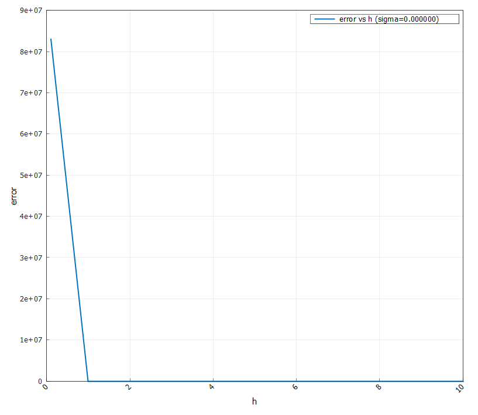

**Рисунок 5 - Зависимость максимальной ошибки от пространственного шага для схемы с $\sigma = 0.0$**

---

Для $\sigma = 0.1$:

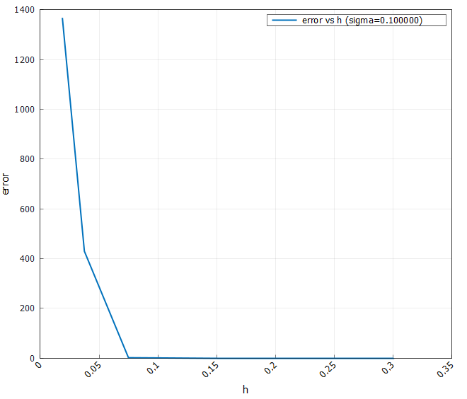

**Рисунок 6 - Зависимость максимальной ошибки от пространственного шага для схемы с $\sigma = 0.1$**

---

Для $\sigma = 0.5$:

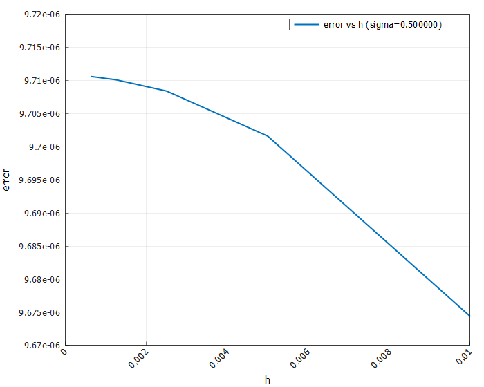

**Рисунок 7 - Зависимость максимальной ошибки от пространственного шага для схемы с $\sigma = 0.5$**

---

Для $\sigma = 1.0$:

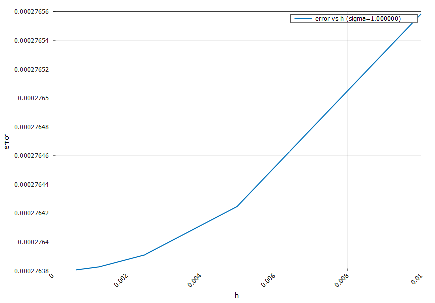

**Рисунок 8 - Зависимость максимальной ошибки от пространственного шага для схемы с $\sigma = 1.0$**

Графики зависимости ошибки от шага $h$ при фиксированном значении $\sigma$ демонстрируют ожидаемую сходимость. Для симметричной схемы ($\sigma=0.5$) уменьшение шага $h$ приводит к монотонному уменьшению $\mathrm{err}$, что согласуется со вторым порядком аппроксимации по пространству: при более плотной сетке численное решение быстрее приближается к точному. Для полностью неявной схемы ($\sigma=1$) погрешность также убывает при уменьшении $h$, но остаётся несколько большей, чем у схемы с $\sigma=0.5$, вследствие меньшего порядка точности по времени. В случае малых значений параметра $\sigma$ (например, $\sigma=0$ или $\sigma=0.1$) графики показывают резкий рост ошибки при достаточно малых шагах, что связано с нарушением условия устойчивости явной части схемы, выражающегося ограничением на безразмерный параметр $\mu=\tau/h^2$.

---

**Напоследок, исследуем зависимость максимальной ошибки от веса при фиксированном шаге:**

Для $h = 0.3$ и $\sigma \in [0.1, 1.0]$ имеем следующую зависимость:

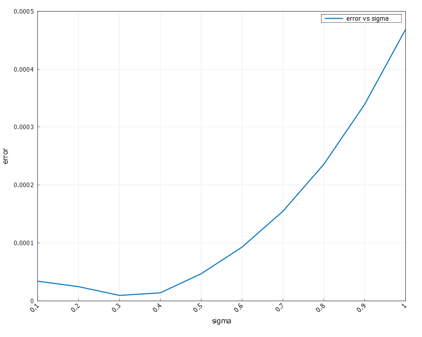

**Рисунок 9 - Зависимость максимальной ошибки от $\sigma$ для шага $h = 0.3$**

---

Также рассмотрим $\sigma \in [0.5, 1.0]$ при $h = 0.01$:


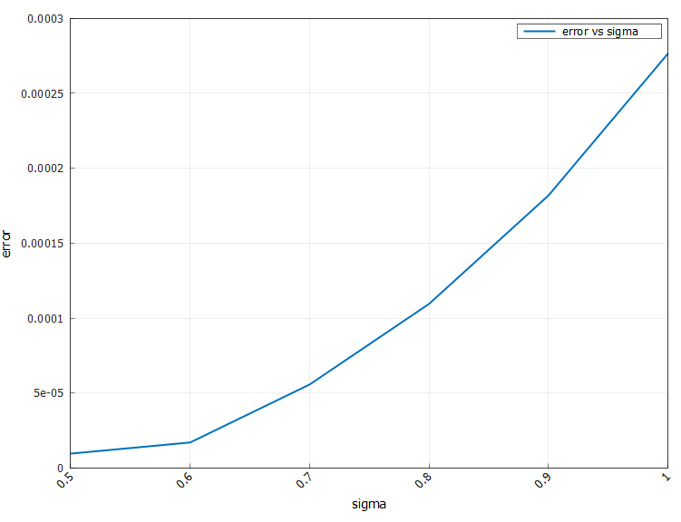

**Рисунок 10 - Зависимость максимальной ошибки от $\sigma$ для шага $h = 0.01$**

Полученные кривые $\mathrm{err}(\sigma)$ показывают, что минимальная погрешность достигается в окрестности $\sigma\approx 0.3\text{–}0.5$: симметричная схема Кранка–Николсон обеспечивает наилучший баланс между устойчивостью и точностью. При дальнейшем увеличении $\sigma$ к единице ошибка возрастает, а при уменьшении $\sigma$ к нулю точность сначала почти не ухудшается, но при слишком малых $\sigma$ начинает доминировать ограничение по устойчивости, что приводит к росту ошибки или к разносу решения. 

Таким образом, вычислительный эксперимент подтверждает теоретические выводы: схемы с весами при $\sigma\ge 0.5$ являются безусловно устойчивыми, а симметричная схема ($\sigma=0.5$) в рассматриваемой задаче обеспечивает наименьшую абсолютную погрешность среди устойчивых вариантов.

---

### Десерт: нагрев стержня лазерным импульсом ☄️

В заключительной части работы рассмотрим модель нагрева однородного стержня лазерным импульсом. Задача формулируется в виде одномерного уравнения теплопроводности с источником тепла, перенесённым в граничное условие на левом конце:

$$
\rho c\frac{\partial T}{\partial t} = k\frac{\partial^2 T}{\partial x^2},\quad 0 < x < l, \quad t>0,
$$

$$
-k\frac{\partial T}{\partial x}(0,t) = I_0tt_p^{-1}\exp(-t/t_p),\qquad \frac{\partial T}{\partial x}(l,t)=0,\qquad T(x,0)=T_0.
$$

Здесь $\rho$ — плотность материала, $c$ — удельная теплоёмкость, $k$ — коэффициент теплопроводности, $I_0$ характеризует интенсивность падающего лазерного излучения, $t_p$ — характерная длительность импульса, $T_0$ — начальная температура стержня.

#### Обезразмеривание задачи

Введём безразмерные переменные

$$
\xi = \frac{x}{l},\qquad
\tau = \frac{t}{t_p},\qquad
\theta(\xi,\tau) = \frac{T(x,t)-T_0}{\Delta T},
$$

где в качестве характерного перепада температуры возьмём величину

$$
\Delta T = \frac{I_0 t_p}{л}
$$

Подстановка даёт безразмерное уравнение

$$
\frac{\partial \theta}{\partial \tau} = \mathrm{Fo}\frac{\partial^2 \theta}{\partial \xi^2}, \quad 0 < \xi < 1,\quad \tau>0,
$$

где

$$
\mathrm{Fo} = \frac{k t_p}{\rho c l^2}
$$

— безразмерный коэффициент, задающий скорость теплопроводности по отношению к длительности импульса.

Граничные условия переписываются как:

$$
-\frac{\partial \theta}{\partial \xi}(0,\tau) = \beta\tau e^{-\tau},\qquad \beta = \frac{I_0 l}{k \Delta T}
$$

$$
\frac{\partial \theta}{\partial \xi}(1,\tau)=0,\qquad \theta(\xi,0)=0
$$

Таким образом, динамика нагрева описывается двумя безразмерными параметрами: числом Фурье $\mathrm{Fo}$ и коэффициентом $\beta$, связанным с выбором масштаба температуры $\Delta T$.

---

#### Аппроксимация граничных условий

##### Левый Нейман (1‑й порядок)

На левом конце $\xi = 0$ используем одностороннюю аппроксимацию производной первого порядка:

$$
\Theta_{\xi}(0,\tau_{s+1}) \approx \frac{\Theta_1^{s+1} - \Theta_0^{s+1}}{h} = -\beta \tau_{s+1} e^{-\tau_{s+1}}
$$

в коде это реализовано как:

```cpp
double tau_sp1 = (s + 1) * tau_eff;
double g_sp1 = beta * tau_sp1 * std::exp(-tau_sp1);

int rowL = 0;
A(rowL, 0) = -1.0;
A(rowL, 1) = 1.0;
B[rowL] = -h_eff * g_sp1;
```

##### Правый Нейман (2‑й порядок)

На правом конце $\xi = 1$ условие теплоизоляции аппроксимируется односторонней разностью второго порядка:

$$
\Theta_{\xi}(1,\tau_{s+1}) \approx \frac{3\Theta_N^{s+1} - 4\Theta_{N-1}^{s+1} + \Theta_{N-2}^{s+1}}{2h} = 0
$$

Отсюда получаем разностное граничное условие

$$
3\Theta_N^{s+1} - 4\Theta_{N-1}^{s+1} + \Theta_{N-2}^{s+1} = 0
$$

В матричной форме в коде:

```cpp
int rowR = N;
A(rowR, N ) = 3.0;
A(rowR, N - 1) = -4.0;
A(rowR, N - 2) = 1.0;
B[rowR] = 0.0;
```

---

#### Анализ полученного решения

В расчётах использовались следующие параметры материала и внешнего воздействия:

- $\rho = 8000 \text{кг/м}^3$ — плотность стержня
- $c = 500 \text{Дж/(кг·К)}$ — удельная теплоёмкость
- $k = 30 \text{Вт/(м·К)}$ — коэффициент теплопроводности
- $l = 0.01 \text{м}$ — длина стержня
- $t_p = 0.015 \text{с}$ — характерное время лазерного импульса
- $I_0 = 3.0 \cdot 10^{5}\ \text{Вт/м}^2$ — интенсивность лазерного потока на левом конце
- $T_0 = 300 \text{К}$ — начальная температура стержня

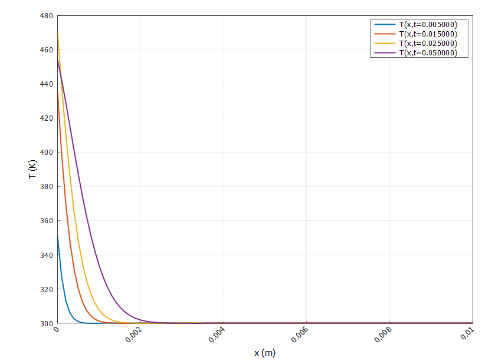

**Рисунок 11 - Распределение температуры в стержне в различные моменты времени**

Посмотрим на зависимость температуры от времени в точке $x = 0$:

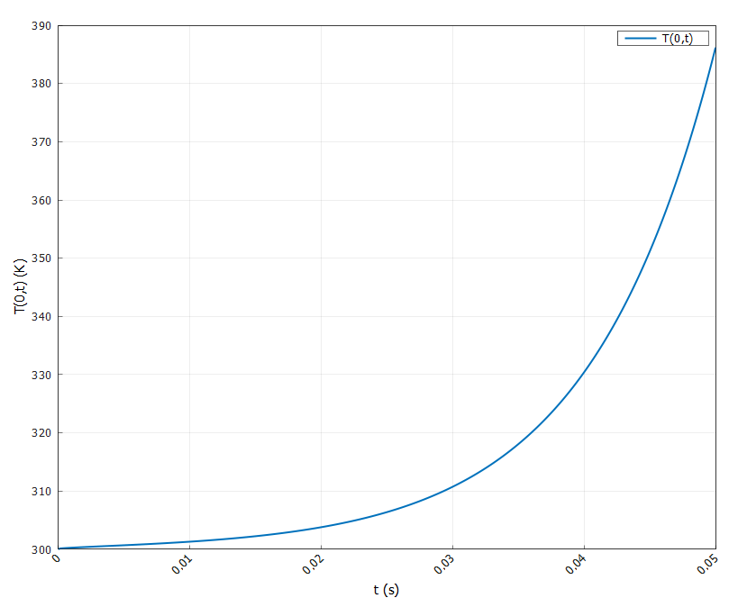

**Рисунок 11 - Распределение температуры в стержне в различные моменты времени в начале координат**

На графике зависимости температуры в точке $x = 0$ от времени видно типичное «нагрев–охлаждение»: температура на освещённом конце стержня быстро растёт от $T_0 = 300\,\text{K}$ до максимума порядка $470\,\text{K}$ примерно к моменту $t \approx 0,03\,\text{с}$. На ранних временах рост почти линейный за счёт нарастающего теплового потока, далее, по мере затухания экспоненциального лазерного импульса и усиления теплоотвода в глубину стержня, прирост температуры замедляется и после достижения пика начинается плавное охлаждение границы.

Распределения температуры вдоль стержня для нескольких фиксированных моментов времени показывают формирование тонкого сильно нагретого слоя вблизи $x = 0$, причём максимальная температура всегда достигается именно на освещённой границе. С увеличением времени фронт нагрева постепенно продвигается вглубь, но даже к $t = 0,05\,\text{с}$ существенное превышение температуры над $T_0$ наблюдается лишь на расстояниях порядка нескольких $10^{-3}\,\text{м}$, дальше стержень остаётся практически на начальной температуре, что соответствует малой глубине проникновения тепла за рассматриваемое время.

---

#### Безразмерные параметры, определяющие скорость нагрева и глубину прогрева

Из обезразмеривания видно, что поведение решения задаётся в первую очередь двумя безразмерными параметрами:

- **число Фурье**
 
$$
  \mathrm{Fo} = \frac{kt_p}{\rho cl^2},
$$

которое определяет отношение характерного времени теплопроводности $\frac{l^2}{\kappa}$ к длительности импульса $t_p$ (здесь $\kappa = \frac{k}{\rho c}$ — температуропроводность). При больших $\mathrm{Fo}$ тепло быстро распространяется вглубь, прогретый слой становится толще, а максимум температуры у границы ниже; при малых $\mathrm{Fo}$ теплопроводность “не успевает” и нагрев остаётся сильно локализованным возле $\xi=0$.

- **безразмерная интенсивность нагрева**  

через масштаб $\Delta T$, показывающий, насколько сильно одноразовый импульс способен поднять температуру относительно начального значения. Увеличение $I_0$ при прочих равных линейно увеличивает амплитуду температурного отклика, но глубина прогрева по-прежнему в основном контролируется числом Фурье.

Таким образом, скорость нагрева на границе определяется сочетанием $\Delta T$ и $\mathrm{Fo}$, а глубина прогрева — в первую очередь величиной $\mathrm{Fo}$ и длиной стержня в безразмерных переменных.

---

#### Обсуждение постановки при температурозависимых параметрах

Если считать, что материальные параметры зависят от температуры (например, $k=k(T)$), исходная постановка переходит из линейной в квазилинейную или даже нелинейную. В этом случае оператор теплопроводности уже нельзя вынести за знак производной в простом виде, и разностная схема станет нелинейной по сеточным значениям температуры. Численное решение можно организовать, например, так:

- на каждом временном шаге использовать неявную схему по $T$, но коэффициенты $k(T)$ и $\kappa(T)$ считать известными из предыдущей итерации или предыдущего временного слоя;  
- для повышения точности и устойчивости применять итерационный процесс (метод простой итерации или Ньютона) на каждом шаге по времени, пока изменения температуры на сетке не станут меньше заданного порога;  
- при этом граничные условия по потоку сохраняют прежний вид, но сам поток становится функцией температуры поверхности через $k(T)$.

Таким образом, в случае температурозависимых свойств задача решается последовательностью линейных или квазилинейных СЛАУ с регулярным обновлением коэффициентов, а используемая в данной работе неявная схема и метод прогонки остаются основой для каждой итерации.

---

## 4. Заключение и выводы 📝

В ходе работы была реализована численная модель одномерного нагрева металлического стержня лазерным импульсом на основе нестационарного уравнения теплопроводности с неоднородным граничным условием Неймана на левом конце и теплоизоляцией на правом. Обезразмеривание задачи позволило свести множество исходных параметров к набору безразмерных величин, среди которых ключевую роль играют масштаб температуры $\Delta T$ и параметр $\alpha = \frac{k t_p}{\rho c l^2}$, определяющие, соответственно, уровень нагрева и интенсивность теплопереноса вдоль стержня.

Для решения задачи была использована неявная схема (с возможностью выбора между неявным Эйлером и схемой Кранка–Николсон) со вторым порядком аппроксимации по пространственной координате и смешанными граничными аппроксимациями: левое условие Неймана реализовано с точностью второго порядка, правое — первого порядка. Такая дискретизация приводит к трёхдиагональной системе линейных алгебраических уравнений на каждом шаге по времени, что обеспечивает устойчивость метода и позволяет эффективно вычислять эволюцию температурного поля даже на достаточно мелких сетках.

Численные эксперименты демонстрируют физически ожидаемое поведение: экспоненциально затухающий по времени лазерный поток вызывает быстрый рост температуры у нагреваемого торца с формированием сильно неравномерного поля, после чего теплопроводность постепенно выравнивает распределение, распространяя тепло вглубь стержня. Полученные профили $T(x,t)$ и зависимость $T(0,t)$ иллюстрируют влияние выбора шага по времени и пространству на гладкость и точность решения и подтверждают корректность реализованного алгоритма.

В базовой части работы были реализованы явная схема и одношаговые неявные схемы с параметром $\sigma$, включая схему Кранка–Николсон, что дало возможность сравнить устойчивость и точность методов при разных значениях безразмерного параметра $\mu = \frac{\kappa \tau}{h^2}$. Численные эксперименты показали, что при уменьшении шага по пространству и времени решения стремятся к аналитическому, а максимальная ошибка убывает, что подтверждает теоретический порядок аппроксимации схем и корректность реализации алгоритмов решения как в режиме построения решения, так и в режиме исследования погрешности.


