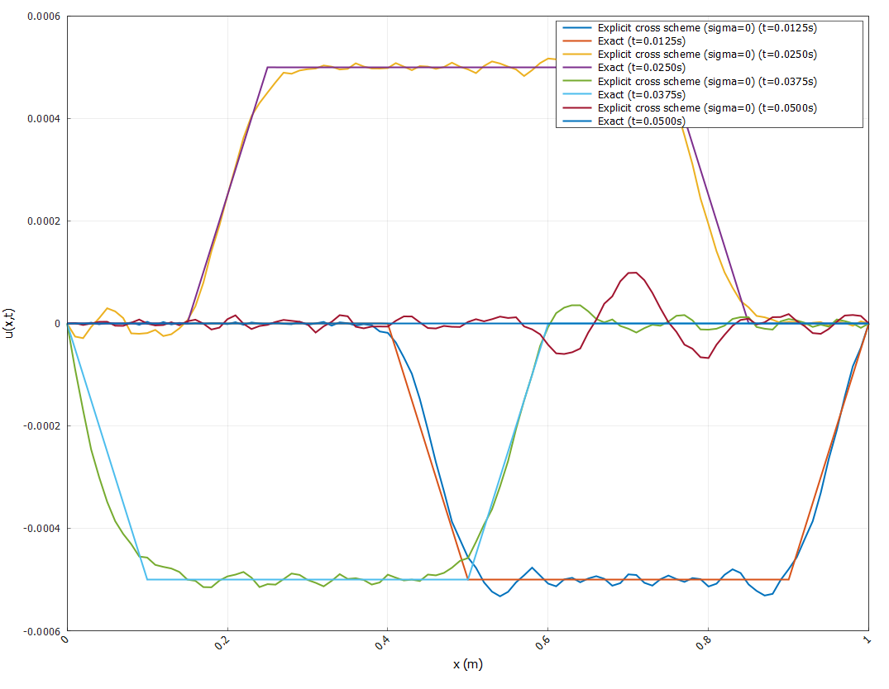
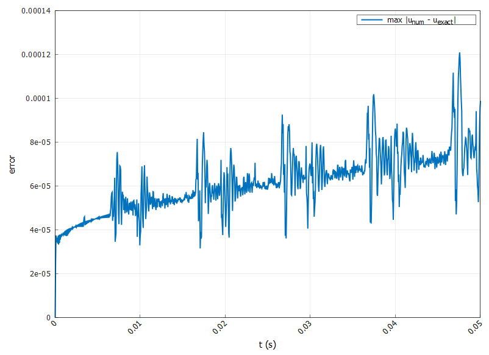
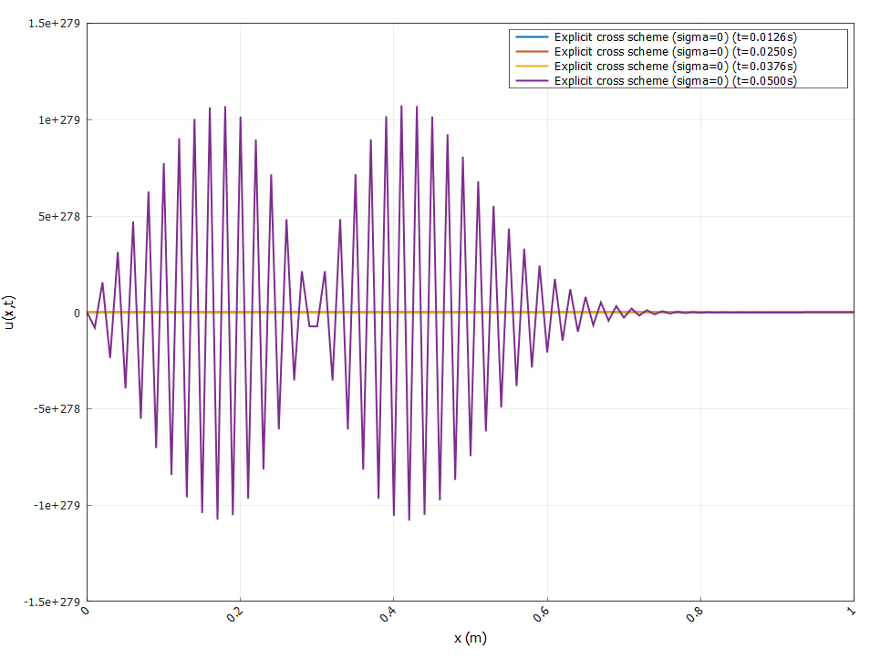

# Отчёт по лабораторной работе:  Краевые задачи для ДУ параболического типа ⚡️📊

## Содержание 📖

1. [Введение и цели работы 🎓](#1-введение-и-цели-работы-)
2. [Структура проекта 🛠️](#2-структура-проекта-)
3. [Ход выполнения работы 🔎](#3-ход-выполнения-работы-)
    - [Решение волнового уравнения при помощи явной разностной схемы крест](#решение-волнового-уравнения-при-помощи-явной-разностной-схемы-крест)
    - [Решение волнового уравнения при помощи схемы с весами](#решение-волнового-уравнения-при-помощи-схемы-с-весами)
    - [Построение спектров отклонения струны, скорости и энергии](#построение-спектров-отклонения-струны-скорости-и-энергии)
5. [Заключение и выводы 📝](#4-заключение-и-выводы-)

## 1. Введение и цели работы 🎓

Волновые процессы в натянутой струне являются классическим примером гиперболических задач математической физики и одновременно удобной моделью для исследования распространения возмущений с конечной скоростью, отражений от границ и суперпозиции нормальных мод колебаний. Такие задачи приводят к одномерному волновому уравнению с граничными условиями Дирихле, описывающему поперечные колебания струны при заданных начальных отклонениях и скоростях. Аналитическое решение в общем случае выражается через разложение по собственным формам и представляет собой бесконечные ряды, что затрудняет как практические вычисления, так и анализ влияния параметров задачи.

В численной практике для решения волнового уравнения широко применяются конечно‑разностные схемы второго порядка по пространству и времени. Явные схемы типа «крест» просты в реализации, но подчинены жёсткому условию устойчивости Куранта. Схемы с весами (в частности, при параметре σ = 1/4) позволяют ослабить или снять ограничения на шаг по времени за счёт решения трёхдиагональной системы на каждом шаге и обладают лучшими устойчивостными свойствами. Важно не только построить численное решение, но и сравнить его с точным рядом Фурье, а также исследовать спектральное распределение энергии по нормальным модам струны, что даёт более глубокое понимание влияния формы и ширины начального возмущения.

В ходе лабораторной работы реализована модульная C++‑архитектура для одномерного волнового уравнения: базовый класс `TaskWaveBase` отвечает за работу в физических переменных, хранение сеточного решения и сравнение с точным рядом; производные классы реализуют явную схему и схему с весами с использованием метода прогонки для решения трёхдиагональных систем. Дополнительно реализован спектральный анализ полученных решений с помощью быстрого преобразования Фурье: вычисляются спектры отклонения струны, скорости и локальной энергии, а также исследуется их зависимость от ширины начального импульса.

**Цели: 🎯**

- Выполнить обезразмеривание одномерной задачи для струны и связь между безразмерной постановкой и вычислениями в физических переменных (метры, секунды), чтобы корректно интерпретировать результаты и сравнивать их с аналитическим решением
- Дискретизировать волновое уравнение по пространству и времени, реализовав на C++ явную схему «крест» и схему с весами второго порядка точности, с контролем условия Куранта и параметра $\sigma$
- Разработать универсальный базовый класс задачи `TaskWaveBase` и производные классы для разных схем, обеспечив построение графиков решения, вычисление максимальной невязки относительно точного решения (ряд Фурье для прямоугольного импульса скорости) и автоматическую оценку ошибки во времени
- Реализовать спектральный анализ численного решения: с помощью БПФ построить спектры отклонения, скорости и энергии струны по модам, исследовать их форму и провести численный эксперимент по зависимости энергетического спектра от ширины начального импульса
- Сравнить поведение явной схемы и схемы с весами по устойчивости, точности и спектральным характеристикам, выявив влияние шага по времени, параметра $\sigma$ и $\delta$ на распределение энергии по нормальным модам и качество аппроксимации точного решения

## 2.Структура проекта 🛠️

Вся работа выполнена в виде модульного C++-проекта со следующей структурой:
```
include/
├── Base/            # Базовые интерфейсы генераторов/решателей
├── Labs/            # Заголовки лабораторных заданий
src/
└── Labs/
    └── LabN/
        └── TaskK.cpp    # Основные реализации по заданиям
CMakeLists.txt          # Конфигурация сборки проекта
```
Реализация поддерживает автоматическое добавление новых заданий, централизованное подключение заголовков и простое масштабирование под разные лабораторные работы. Реализацию. всех заголовков заданий можно найти по пути `include/Labs/Lab7/Tasks`

## 3. Ход выполнения работы 🔎

### Решение волнового уравнения при помощи явной разностной схемы крест

Решим следующую задачу: струна с жестко закрепленными концами возбуждается ударом жесткого выпуклого молоточка, сообщающего ей начальное распределение скоростей

$$
u_{tt} = a^2 u_{xx},
$$

$$
u(0,t) = 0,\quad u(l,t) = 0, \quad
u(x,0) = u_0(x),
$$

$$
u_t(x,0) =
\begin{cases}
0, & 0 \le x \le x_0 - \delta, \\
v_0, & x_0 - \delta \le x \le x_0 + \delta, \\
0, & x_0 + \delta \le x \le l.
\end{cases}
$$

Её точное решение представимо в виде:

$$
u(x,t) = \sum_{n=1}^{\infty} B_n \sin\left(\frac{n\pi x}{L}\right)\sin\left(\frac{n\pi c t}{L}\right)
$$

где коэффициенты ряда задаются интегралом по начальному прямоугольному импульсу скорости:

$$
B_n = \frac{2}{c L k_n}I_n, \qquad k_n = \frac{n\pi}{L},
$$

$$
I_n = \int_a^b v_0 \sin(k_n \xi)d\xi = \frac{v_0}{k_n} \bigl(\cos(k_n a) - \cos(k_n b)\bigr),
$$

$$
a = \max(0,x_0 - \delta),\qquad
b = \min(L,x_0 + \delta).
$$

---

#### Обезразмеривание

Введём безразмерные переменные:

$$
\xi = \frac{x}{l}, \qquad \tau = \frac{c t}{l}, \qquad W(\xi,\tau) = \frac{u(x,t)}{u_0},
$$

тогда

$$
u_t = \frac{\partial u}{\partial t}
    = u_0 \frac{\partial W}{\partial t}
    = u_0 \frac{\partial W}{\partial \tau} \frac{\partial \tau}{\partial t}
    = u_0 \frac{c}{l} W_\tau,
$$

$$
u_{tt}
= \frac{\partial^2 u}{\partial t^2}
= u_0 \left(\frac{c}{l}\right)^2 W_{\tau\tau},
$$

$$
u_x = \frac{\partial u}{\partial x}
    = u_0 \frac{\partial W}{\partial x}
    = u_0 \frac{\partial W}{\partial \xi} \frac{\partial \xi}{\partial x}
    = u_0 \frac{1}{l} W_\xi,
$$

$$
u_{xx}
= \frac{\partial^2 u}{\partial x^2}
= u_0 \frac{1}{l^2} W_{\xi\xi}.
$$

Подставляя это в исходное волновое уравнение, получаем обезразмеренную задачу:

$$
W_{\tau\tau} = W_{\xi\xi},
$$

$$
W(0,\tau) = 0, \qquad W(1,\tau) = 0,
$$

$$
W(\xi,0) = 0,
$$

$$
W_\tau(\xi,0) =
\begin{cases}
0,   & 0 \le \xi \le \xi_0 - \delta, \\
V_0, & \xi_0 - \delta \le \xi \le \xi_0 + \delta, \\
0,   & \xi_0 + \delta \le \xi \le 1,
\end{cases}
$$
где
$$
V_0 = \frac{l}{cu_0}.
$$

---

#### Визуализация колебаний струны во времени

Зададим следующие параметры:

$$
\begin{cases}
с = 100.0 \quad \frac{m}{c}, \\
L = 1.0 \quad m, \\
x_0 = 0.3 \quad m, \\
\delta = 0.05 \quad m, \\
v_0 = 1.0 \quad \frac{m}{c}.
\end{cases}
$$

Тогда решение с такими параметрами для случая, когда $\tau с = 0.5h$ (стабильный случай), имеет вид:



**Рисунок 1 - Решение волнового уравнения явной схемой для стабильного случая**

Численное решение практически совпадает с аналитическим на всём отрезке, в том числе корректно воспроизводит форму прямоугольного импульса и его отражения от концов струны; заметные отклонения наблюдаются лишь вблизи фронтов, где функция имеет излом и спектр содержит много высоких мод. Небольшие осцилляции в окрестности крутых границ импульса соответствуют дисперсионным эффектам схемы и остаются по амплитуде на уровне $10^{-4}$, что согласуется с порядком точности метода.|

Взглянем на график зависимости ошибки $|x_{num} - x_{exact}|$ от времени t:



**Рисунок 2 - Зависимость ошибки численного решения явной схемой от времени для стабильного случая**

Ошибка остаётся малой (порядка $10^{-5} - 10^{-4}$ ) и медленно растёт со временем, что связано с накоплением дискретизационных погрешностей и неоднократными отражениями волны от границ. Характерные «иголки» на кривой соответствуют моментам, когда фронты импульса проходят через узлы сетки или накладываются друг на друга, временно увеличивая локальную разницу между численным и точным решениями; при этом никаких признаков неустойчивости (взрыва ошибки) не наблюдается.

---

А теперь убедимся, что в случае нарушения условия Куранта, устойчивость будет потеряна. Возьмем $\tau с = 2.0h$:



**Рисунок 3 - Решение волнового уравнения явной схемой для нестабильного случая**

Как видим, действительно, схема абсолютно неустойчива при таком выборе $\tau$.

---

### Решение волнового уравнения при помощи схемы с весами


