# Введение в вычислительную электродинамику: FDTD метод ⚡️📊

## Содержание 📖

1. [Введение и цели работы 🎓](#1-введение-и-цели-работы-)
2. [Структура проекта 🛠️](#2-структура-проекта-)
3. [Ход выполнения работы 🔎](#3-ход-выполнения-работы-)
   - [Уравнения Максвелла](#уравнения-максвелла)
   - [Сетка Yee](#сетка-yee)
   - [FDTD алгоритм решения](#fdtd-алгоритм-решения)
   - [Виды источников поля и способы их задания](#виды-источников-поля-и-способы-их-задания)
   - [Поглощающие граничные условия PML](#поглощающие-граничные-условия-pml)
   - [Реализация алгоритма](#реализация-алгоритма)
   - [Численный эксперимент](#численный-эксперимент)
     - [Задача 0. Реализация 1D FDTD-алгоритма](#задача-0-реализация-1d-fdtd-алгоритма)
     - [Задача 1. Исследование отражения от PML](#задача-1-исследование-отражения-от-pml)
     - [Задача 2. Отражение от бесконечного диэлектрика](#задача-2-отражение-от-бесконечного-диэлектрика)
     - [Задача 3. Отражение от диэлектрической пластины](#задача-3-отражение-от-диэлектрической-пластины)
     - [Задача 4. Отражение и пропускание фотонного кристалла](#задача-4-отражение-и-пропускание-фотонного-кристалла)
     - [Задача 5. Брэгговская микрополость](#задача-5-брэгговская-микрополость)
4. [Заключение и выводы 📝](#4-заключение-и-выводы-)

---

## 1. Введение и цели работы 🎓

Вычислительная электродинамика представляет собой совокупность численных методов, предназначенных для моделирования распространения, отражения, преломления и локализации электромагнитных волн в средах со сложной геометрией и неоднородными материальными параметрами.
В задачах, где аналитическое решение уравнений Максвелла либо отсутствует, либо становится слишком громоздким, численные методы позволяют исследовать как временную эволюцию поля, так и его спектральные характеристики.

Одним из наиболее распространённых методов вычислительной электродинамики является метод конечных разностей во временной области — _FDTD (Finite-Difference Time-Domain)_.
Его основная идея состоит в прямой дискретизации уравнений Максвелла по пространству и времени на сетке _Yee_, в которой компоненты электрического и магнитного полей располагаются в сдвинутых друг относительно друга узлах и вычисляются поочерёдно на каждом временном шаге.
Преимуществом _FDTD_-метода является наглядность физической интерпретации, относительная простота реализации и возможность моделирования широкого круга задач: распространения импульсов в свободном пространстве, взаимодействия волн с диэлектрическими границами, прохождения через многослойные структуры,
отражения от фотонных кристаллов и локализации поля в микрополостях. Особенно удобно, что при использовании широкополосного импульсного источника можно получить спектры отражения и пропускания сразу в широком диапазоне частот из одного численного расчёта.

В настоящей работе рассматривается одномерная реализация FDTD-алгоритма для электромагнитной волны при нормальном падении на языке программирования С++.
В ходе работы исследуются распространение поля в свободном пространстве, эффективность поглощающих граничных слоёв _PML_, отражение от диэлектрических интерфейсов и пластин, спектры фотонных кристаллов, а также свойства брэгговской микрополости.
Особое внимание уделяется сопоставлению численных результатов с известными теоретическими зависимостями и анализу влияния параметров структуры на спектры отражения, пропускания и пространственное распределение поля.

**Цели: 🎯**

Целью работы является освоение базовых принципов вычислительной электродинамики и метода FDTD, а также получение практических навыков численного моделирования электромагнитных процессов в одномерных неоднородных средах.

---

## 2. Структура проекта 🛠️

Вся работа выполнена в виде модульного C++-проекта со следующей структурой:

```
include/
├── Base/               # Заголовки вспомогательных модулей
├── Simulation/         # Высокоуровневый инструмент управления симуляцией
├── Solver/             # Реализация FDTD 1D решателя
src/
└── Labs/
    └── LabN/
        └── TaskK.cpp   # Основные реализации по заданиям
CMakeLists.txt          # Конфигурация сборки проекта
```

Более подробно с реализацией всех заголовков можно ознакомиться [здесь](https://github.com/Krasnovvvvv/numerical-methods-in-physics/tree/main/include/Labs/Special/Lab6).
Некоторые тонкости реализации будут разобраны ниже по ходу изложения материала :)

---

## 3. Ход выполнения работы 🔎

### Уравнения Максвелла

В основе метода _FDTD_ лежит прямое численное решение нестационарных уравнений Максвелла во временной области.
Такой подход позволяет описывать эволюцию электромагнитного поля во времени, учитывать отражение и прохождение волн на границах раздела сред, а также исследовать отклик многослойных и периодических структур без перехода сразу к частотному представлению.
В общем случае распространение электромагнитного поля определяется системой уравнений Максвелла, связывающей электрическое поле, магнитное поле, индукцию и плотность тока.
Для рассматриваемых в работе задач используются линейные недиспергирующие среды, в которых материальные соотношения записываются через относительные диэлектрическую и магнитную проницаемости, а проводимость может быть учтена отдельно через ток проводимости.

В одномерной постановке, используемой в данной работе, рассматривается распространение волны вдоль оси
_x_, при котором ненулевыми остаются компоненты $E_y$ и $H_z$. Тогда полная векторная система уравнений Максвелла сводится к двум связанным уравнениям первого порядка по времени и пространству, которые и дискретизуются на сетке _Yee_ в методе _FDTD_.
Именно такая форма особенно удобна для численного моделирования отражения от диэлектрических границ, прохождения через слоистые структуры и исследования фотонных кристаллов и микрополостей.

Ниже приведены основные уравнения, лежащие в основе моделирования:

**Уравнения Максвелла в системе СИ:**

$$
\nabla \times \mathbf{E}(\mathbf{r},t) = - \frac{\partial \mathbf{B}(\mathbf{r},t)}{\partial t}
$$

$$
\nabla \times \mathbf{H}(\mathbf{r},t) = \frac{\partial \mathbf{D}(\mathbf{r},t)}{\partial t} + \mathbf{J}(\mathbf{r},t)
$$

$$
\nabla \cdot \mathbf{D}(\mathbf{r},t) = \rho(\mathbf{r},t)
$$

$$
\nabla \cdot \mathbf{B}(\mathbf{r},t) = 0
$$

**Материальные соотношения:**

$$
\mathbf{D}(\mathbf{r},t) = \varepsilon_0 \mathbf{E}(\mathbf{r},t) + \mathbf{P}(\mathbf{r},t)
$$

$$
\mathbf{B}(\mathbf{r},t) = \mu_0 \mathbf{H}(\mathbf{r},t) + \mathbf{M}(\mathbf{r},t)
$$

Для линейной недиспергирующей среды:

$$
\mathbf{D}(\mathbf{r},t) = \varepsilon_0 \varepsilon(\mathbf{r}) \mathbf{E}(\mathbf{r},t)
$$

$$
\mathbf{B}(\mathbf{r},t) = \mu_0 \mu(\mathbf{r}) \mathbf{H}(\mathbf{r},t)
$$

$$
\mathbf{J}(\mathbf{r},t) = \sigma(\mathbf{r}) \mathbf{E}(\mathbf{r},t)
$$

Для удобства численной реализации далее используются обезразмеренные переменные. Нормировка выполняется по характерному пространственному масштабу задачи, а также по скорости света в вакууме, после чего уравнения записываются в безразмерной форме.

**В работе рассматривается одномерная задача, которая в общем случае описывается следующей системой уравнений:**

$$
\frac{\partial E_y}{\partial t} = - \frac{1}{\varepsilon} \frac{\partial H_z}{\partial x} - \frac{1}{\varepsilon} \left( \sigma E_y + J_y \right)
$$

$$
\frac{\partial H_z}{\partial t} = - \frac{1}{\mu} \frac{\partial E_y}{\partial x} - \frac{1}{\mu} \left( \sigma^{*} H_z + M_z \right)
$$

---

### Сетка Yee

Для численного решения рассмотренной одномерной системы используется схема _Yee_, лежащая в основе метода _FDTD_.
Её ключевая идея заключается в разнесении электрического и магнитного полей как по пространству, так и по времени: значения электрического поля вычисляются в целых узлах пространственной сетки и на полуцелых шагах по времени,
а значения магнитного поля — в полуцелых узлах по координате и на целых временных шагах.

Такое разнесение обеспечивает естественную аппроксимацию уравнений Максвелла и позволяет строить явную разностную схему, в которой электрическое и магнитное поля пересчитываются поочерёдно.
В одномерной постановке это означает, что компоненте $E_y$ сопоставляются точки ($x_i$, $t_{n+0.5}$),
а компоненте $H_z$ — точки ($x_{i+0.5}$, $t_n$).

Введём равномерную пространственную сетку с шагом $Δx$ и временную сетку с шагом $Δt$:

$$
x_i = iΔx, \quad x_{i+0.5} = (i+0.5)Δx
$$

$$
t_n = nΔt, \quad t_{n+0.5} = (n+0.5)Δt
$$

<p align="center">
  
</p>

<p align="center">
  <em>Рисунок 1 — Схема расположения компонент поля на сетке Yee</em>
</p>

Аппроксимируя производные центральными конечными разностями на сетке _Yee_, получаем:

$$
\frac{E_i^{n+1/2} - E_i^{n-1/2}}{\Delta t} = - \frac{1}{\varepsilon_i} \frac{H_{i+1/2}^{n} - H_{i-1/2}^{n}}{\Delta x} - \frac{1}{\varepsilon_i}\left(\sigma_i E_i^n + J_i^n\right)
$$

$$
\frac{H_{i+1/2}^{n+1} - H_{i+1/2}^{n}}{\Delta t} = - \frac{1}{\mu_{i+1/2}} \frac{E_{i+1}^{n+1/2} - E_i^{n+1/2}}{\Delta x} - \frac{1}{\mu_{i+1/2}} \left(\sigma_{i+1/2}^{*} H_{i+1/2}^{n+1/2} + M_{i+1/2}^{n+1/2} \right)
$$

---

### FDTD алгоритм решения

Аппроксимация временных и пространственных производных центральными конечными разностями на сетке _Yee_ позволяет перейти от дифференциальной формы уравнений Максвелла к их конечно-разностной записи.
В результате получаем явную схему второго порядка точности по времени и пространству, в которой значения электрического и магнитного полей на новом временном слое выражаются через значения на предыдущих слоях.
Для одномерной задачи эти соотношения имеют вид:

$$
\frac{E_i^{n+1/2} - E_i^{n-1/2}}{\Delta t} = - \frac{1}{\varepsilon_i} \frac{H_{i+1/2}^{n} - H_{i-1/2}^{n}}{\Delta x} - \frac{1}{\varepsilon_i}\left(\sigma_i E_i^n + J_i^n\right)
$$

$$
\frac{H_{i+1/2}^{n+1} - H_{i+1/2}^{n}}{\Delta t} = - \frac{1}{\mu_{i+1/2}} \frac{E_{i+1}^{n+1/2} - E_i^{n+1/2}}{\Delta x} - \frac{1}{\mu_{i+1/2}} \left(\sigma_{i+1/2}^{*} H_{i+1/2}^{n+1/2} + M_{i+1/2}^{n+1/2} \right)
$$

Для повышения удобства программной реализации эти выражения далее приводятся к рекуррентной форме.
Для этого используются приближённые соотношения для значений полей на промежуточных временных слоях:

$$
E_i^n = \frac{E_i^{n+1/2} + E_i^{n-1/2}}{2} + O(\Delta t^2)
$$

$$
H_{i+1/2}^{n+1/2} = \frac{H_{i+1/2}^{n+1} + H_{i+1/2}^{n}}{2} + O(\Delta t^2)
$$

После подстановки этих выражений конечно-разностная схема записывается в рекуррентном виде:

$$
E_i^{n+1/2} = C_{a,i} E_i^{n-1/2}+C_{b,i} \left(H_{i-1/2}^{n} - H_{i+1/2}^{n} - \Delta x J_i^n \right)
$$

$$
H_{i+1/2}^{n+1} = D_{a,i+1/2} H_{i+1/2}^{n}+D_{b,i+1/2} \left(E_i^{n+1/2} - E_{i+1}^{n+1/2} - \Delta x M_{i+1/2}^{n+1/2} \right)
$$

где коэффициенты схемы определяются выражениями

$$
C_{a,i} = \frac{2\varepsilon_i - \sigma_i \Delta t} {2\varepsilon_i + \sigma_i \Delta t}
$$

$$
C_{b,i} = \frac{2\Delta t} {\Delta x \left(2\varepsilon_i + \sigma_i \Delta t\right)}
$$

$$
D_{a,i+1/2}=\frac{2\mu_{i+1/2}-\sigma^{* }_{i+1/2}\Delta t}{2\mu_{i+1/2}+\sigma^{*}_{i+1/2}\Delta t}
$$

$$
D_{b,i+1/2} = \frac{2\Delta t} {\Delta x \left(2\mu_{i+1/2} + \sigma_{i+1/2}^{*}\Delta t\right)}
$$

Полученные рекуррентные соотношения лежат в основе численного алгоритма FDTD и
используются при последовательном пересчёте электрического и магнитного полей на каждом временном шаге.

---

### Виды источников поля и способы их задания

Для возбуждения электромагнитного поля в FDTD-расчёте необходимо задать внешний источник, который инициирует распространение волны в расчётной области.
В рассматриваемой реализации источник вводится в одной пространственной точке сетки Yee и действует на электрическое поле $E_y$, что соответствует заданию внешнего электрического возбуждения.

В общем виде источник в одномерных уравнениях Максвелла может быть учтён через плотность электрического тока $J_y$:

$$
\frac{\partial E_y}{\partial t} = - \frac{1}{\varepsilon(x)} \frac{\partial H_z}{\partial x} - \frac{1}{\varepsilon(x)}\left(\sigma(x) E_y + J_y\right)
$$
 
В дискретной форме это соответствует добавлению источникового члена в уравнение обновления электрического поля.

В программе источник задаётся не напрямую как массив значений $J_y$, а через временную функцию $f(t)$, которая вычисляется в выбранной точке сетки и затем инжектируется в поле после шага обновления $E_y$.
Такой подход эквивалентен внешнему возбуждению системы и удобен для программной реализации.

В выполненной работе использовались два основных типа временных зависимостей источника: **гармонический непрерывный источник** и **гауссов импульс**.

**Гармонический источник, или CW-источник** (_continuous wave_), применяется в задачах, где необходимо получить установившееся квазимонохроматическое поле. Его временная зависимость имеет вид

$$
f(t) = A \sin(2\pi f_0 t)
$$

где $A$ — амплитуда, а $f_0$ — частота источника.

В реализации для уменьшения начальных численных переходных процессов гармонический источник вводится с плавным нарастанием амплитуды:

$$
f(t) = \frac{1}{2}\left(1+\tanh\left(\frac{t}{w}-s\right)\right)\sin(2\pi f_0 t)
$$

где $w$ задаёт характерное время включения, а $s$ определяет сдвиг начала нарастания.

**Гауссов импульс** используется в задачах спектрального анализа, поскольку широкий спектр такого сигнала позволяет получить коэффициенты отражения и пропускания сразу в широком диапазоне частот в рамках одного расчёта. Временная форма гауссова источника задаётся выражением

$$
f(t) = \exp\left(-\frac{(t-t_0)^2}{2\tau^2} \right)\sin(2\pi f_c t)
$$

где $f_c$ — центральная частота, $\tau$ — характерная временная ширина импульса, а $t_0$ — момент достижения максимума.

В коде ширина импульса задаётся через параметр `freq_width`, связанный с временной шириной соотношением

$$
\tau = \frac{1}{{freq_{width}}}
$$

а положение максимума выбирается как

$$
t_0 = \text{cutoff}\cdot \tau
$$

Такая форма используется в функции `makeGaussianPulse(...)`, а для покрытия заданного диапазона длин волн применяется вспомогательная функция `makeGaussianPulseForRange(...)`.

Гауссов источник в программе задаётся без явного множителя Хевисайда. Хотя такая функция формально имеет ненулевой хвост при $t<0$, в численной реализации это не приводит к противоречию, поскольку расчёт начинается с $t\ge 0$, а при выбранных значениях `cutoff` начальная амплитуда импульса экспоненциально мала.
Поэтому источник к началу моделирования практически равен нулю и может использоваться без дополнительного множителя Хевисайда.

С точки зрения способа задания источника в FDTD-алгоритме часто различают **жёсткий**, **мягкий** и **токовый** режимы возбуждения. В рамках общей классификации **жёсткий источник** (_hard source_) означает принудительное присвоение значения поля в узле источника:

$$
E_i^{n+1/2} = f(t_{n+1/2})
$$

В этом случае значение поля в узле полностью заменяется источником, поэтому такой способ может вносить дополнительное численное рассеяние и нарушать естественное прохождение отражённых волн через точку возбуждения.

**Мягкий источник** (_soft source_) задаётся аддитивно:

$$
E_i^{n+1/2} \leftarrow E_i^{n+1/2} + f(t_{n+1/2})
$$

При таком подходе поле, уже существующее в узле, не уничтожается, а к нему лишь добавляется вклад источника, поэтому отражённые и прошедшие волны свободно проходят через точку возбуждения.

**Токовый источник** (_current source_) формально соответствует включению плотности тока $J_y$ непосредственно в конечно-разностное уравнение:

$$
E_i^{n+1/2} = C_{a,i} E_i^{n-1/2}+ C_{b,i} \left(H_{i-1/2}^{n} - H_{i+1/2}^{n} - \Delta x\, J_i^n \right)
$$

Именно эта форма непосредственно следует из разностной записи уравнения Максвелла с электрическим током.
В реализованной программе предусмотрены все три режима `Soft`, `Hard`  и `Current`.

Таким образом, в дальнейших расчётах использовались два вида временных сигналов — CW-источник и гауссов импульс, а в качестве основного способа задания применялась мягкая инжекция в электрическое поле.
Такой выбор обеспечивает простую реализацию, устойчивую работу алгоритма и корректное прохождение отражённых волн через узел источника.

---

### Поглощающие граничные условия PML

При численном моделировании распространения электромагнитных волн на конечной расчётной области возникает проблема отражения от её искусственных границ. Если не использовать специальные граничные условия, волна, достигнув края области, отражается обратно и искажает результаты расчёта. Для устранения этого эффекта в работе использовались идеально согласованные поглощающие слои PML (_Perfectly Matched Layer_).

Основная идея PML заключается в том, чтобы окружить физическую область специальными поглощающими слоями, в которых поле затухает по мере распространения, практически не испытывая отражения на границе раздела между основной областью и PML. Благодаря этому волна покидает расчётную область так, как если бы она распространялась в бесконечном пространстве.

В реализованной одномерной схеме PML задаётся через введение в приграничных областях электрической и магнитной проводимостей, которые обозначены в коде как `sigma_e` и `sigma_m`. Эти величины входят в коэффициенты обновления электрического и магнитного полей и обеспечивают постепенное затухание волны внутри поглощающего слоя.

С учётом потерь уравнения обновления на сетке Yee имеют вид

$$
E_i^{n+1/2} = C_{a,i} E_i^{n-1/2}+ C_{b,i} \left(H_{i-1/2}^{n} - H_{i+1/2}^{n} \right)
$$

$$
H_{i+1/2}^{n+1} = D_{a,i+1/2} H_{i+1/2}^{n}+ D_{b,i+1/2} \left(E_i^{n+1/2} - E_{i+1}^{n+1/2} \right)
$$

где коэффициенты определяются выражениями

$$
C_{a,i} = \frac{2\varepsilon_i - \sigma_{e,i}\Delta t} {2\varepsilon_i + \sigma_{e,i}\Delta t}
$$

$$
C_{b,i} = \frac{2\Delta t} {\Delta x \left(2\varepsilon_i + \sigma_{e,i}\Delta t\right)}
$$

$$
D_{a,i+1/2} = \frac{2\mu_{i+1/2} - \sigma_{m,i+1/2}\Delta t} {2\mu_{i+1/2} + \sigma_{m,i+1/2}\Delta t}
$$

$$
D_{b,i+1/2} = \frac{2\Delta t} {\Delta x \left(2\mu_{i+1/2} + \sigma_{m,i+1/2}\Delta t\right)}
$$

Таким образом, PML в данной реализации не требует отдельного изменения основной схемы FDTD: достаточно задать ненулевые профили проводимостей в приграничных областях, после чего коэффициенты обновления автоматически начинают описывать затухание поля.

Для обеспечения согласования между электрическим и магнитным затуханием в PML используется стандартное условие

$$
\frac{\sigma_m}{\mu} = \frac{\sigma_e}{\varepsilon}
$$

откуда следует

$$
\sigma_m = \sigma_e \frac{\mu}{\varepsilon}
$$

Именно это соотношение реализовано в коде при вычислении `sigma_m` по локальным значениям `mu` и `eps`. В свободном пространстве, где

$$
\varepsilon = 1, \qquad \mu = 1
$$

получаем

$$
\sigma_m = \sigma_e
$$

Внутри PML проводимость изменяется не скачком, а плавно, по полиномиальному закону. Это необходимо для уменьшения паразитных отражений на входе в поглощающий слой. В программе используется профиль вида

$$
\sigma(d) = \sigma_{\max}\left(\frac{d}{L}\right)^m
$$

где $d$ — расстояние от границы между физической областью и PML, $L$ — толщина PML, а $m$ — порядок полиномиального профиля.

Максимальное значение проводимости выбирается из условия требуемого затухания поля в слое и вычисляется по формуле

$$
\sigma_{\max} = -\frac{(m+1)\ln(\delta)}{\eta_1 L}
$$

где $\delta$ — заданный уровень ослабления амплитуды, а $\eta_1$ — волновое сопротивление среды на границе с PML. В реализованной программе для простоты принимается

$$
\eta_1 = 1
$$

что соответствует нормированным единицам и свободному пространству на границе PML.

В коде PML может быть наложен как на обе границы расчётной области, так и только на одну из них. Для этого реализованы функции `applyPML(...)`, `applyPMLRight(...)` и `applyPMLLeft(...)`, которые заполняют массивы `sigma_e` и `sigma_m` в соответствующих приграничных зонах и затем пересчитывают коэффициенты схемы.

Использование PML особенно важно во всех рассматриваемых задачах, поскольку позволяет отделить физические отражения от структуры от нефизических отражений от края расчётной области.

Таким образом, применение PML позволяет корректно моделировать открытые области в рамках конечной вычислительной сетки. Благодаря плавному профилю проводимости и согласованию электрических и магнитных потерь волна эффективно поглощается на границах, не внося существенных искажений в результаты численного эксперимента.

---

### Реализация алгоритма

После задания одномерной системы уравнений Максвелла, конечно-разностной схемы Yee, способов возбуждения поля и поглощающих граничных условий PML можно перейти к описанию программной реализации алгоритма. Основная цель данного раздела состоит в том, чтобы показать, каким образом полученные ранее конечно-разностные соотношения были перенесены в структуру программы и как организован полный цикл численного расчёта.

Численный пересчёт полей на каждом временном шаге выполняется по явной схеме leap-frog. В программе это означает, что сначала вычисляется новое значение электрического поля по известному магнитному полю, затем в электрическое поле инжектируется источник, после чего при необходимости накапливаются значения полей в диагностических точках, и только затем обновляется магнитное поле. Именно такой порядок шагов реализован в основном цикле расчёта.

Архитектура программы построена модульно. Отдельные части кода отвечают за хранение сетки и полей, задание материальных параметров, описание источников, формирование PML, выполнение одного шага FDTD-алгоритма, накопление спектральной информации на мониторах и организацию полного вычислительного эксперимента. Такое разбиение позволяет отделить математическую логику метода от конкретных сценариев задач и делает реализацию более прозрачной и расширяемой.

_P.S. Несколько позже здесь появятся фрагменты кода с пояснениями :)_

---

### Численный эксперимент

После построения математической модели, вывода конечно-разностной схемы, описания источников возбуждения и поглощающих граничных условий можно перейти к анализу результатов численного моделирования. В данной главе приводятся результаты вычислительных экспериментов, выполненных для задач 0–5, и даётся их физическая интерпретация.

Цель численного эксперимента заключалась в проверке корректности реализованного 1D FDTD-алгоритма, исследовании распространения и отражения электромагнитных волн в различных средах, а также в анализе спектральных характеристик диэлектрических и периодических структур. Для этого последовательно рассматривались свободное пространство, поглощающие слои PML, граница раздела вакуума и диэлектрика, диэлектрическая пластина, фотонный кристалл и брэгговская микрополость.

Во всех задачах использовалась одна и та же вычислительная схема, однако изменялись распределение материальных параметров, тип источника, число временных шагов, параметры PML и конфигурация диагностических точек. Такой подход позволяет проследить, как одна и та же FDTD-реализация воспроизводит различные физические режимы распространения, отражения и пропускания электромагнитных волн.

В задачах, связанных со спектральным анализом, расчёт коэффициентов отражения и пропускания выполнялся по данным мониторов, размещённых до и после исследуемой структуры, с использованием дополнительного нормировочного прогона. Это позволило выделить падающую, отражённую и прошедшую составляющие поля и построить зависимости спектральных коэффициентов от частоты или длины волны.

Далее результаты представлены отдельно для каждой задачи. Для каждого вычислительного эксперимента приводятся постановка, используемые параметры, основные графики и краткая оценка полученных зависимостей с точки зрения физического смысла и корректности работы алгоритма.

---

#### Задача 0. Реализация 1D FDTD-алгоритма

Первая задача была посвящена проверке корректности реализованного одномерного FDTD-алгоритма в свободном пространстве. В рамках этой задачи исследовалось распространение электромагнитной волны при возбуждении гауссовым и гармоническим источниками, анализировалось влияние поглощающих граничных условий PML, а также сравнивались два способа задания источника в программе.

В расчётах использовалась одномерная область длиной 500 ячеек при шаге сетки

$$
\Delta x = 1
$$

и числе Куранта

$$
Q = 0.5
$$

Для экспериментов с поглощением на границах применялись PML-слои толщиной 40 ячеек, а характерная частота источника задавалась как

$$
f = 0.05
$$

---

<p align="center">
  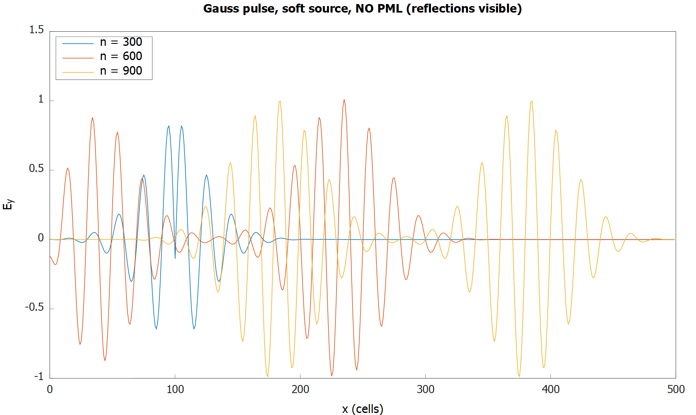
</p>

<p align="center">
  <em>Рисунок 2 — Распространение гауссова импульса при отсутствии PML</em>
</p>

На первом этапе рассматривалось распространение гауссова импульса при отсутствии PML. Источник задавался в режиме мягкой инжекции, а распределение электрического поля $E_y(x)$ анализировалось в несколько последовательных моментов времени.
На соответствующем графике наблюдается формирование бегущего импульса, его распространение от точки возбуждения к границам расчётной области и последующее отражение от этих границ.
Такое поведение является ожидаемым для конечной области без специальных поглощающих граничных условий.

<p align="center">
  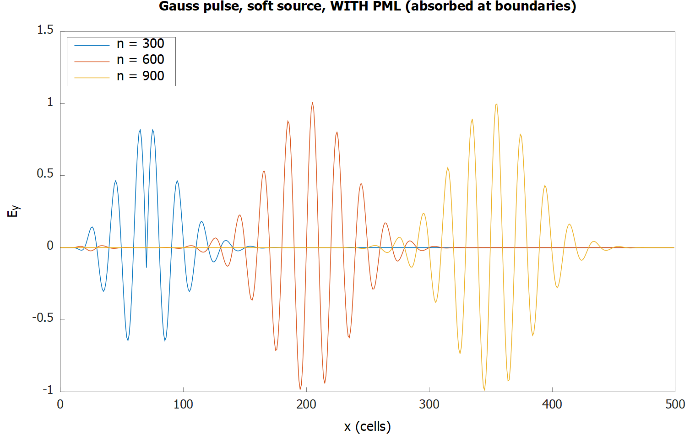
</p>

<p align="center">
  <em>Рисунок 3 — Распространение гауссова импульса в присутствии PML</em>
</p>

На втором этапе аналогичный гауссов импульс исследовался при наличии PML-слоёв на обеих границах расчётной области.
В этом случае на графиках видно, что волна, достигая края области, не отражается обратно в основную часть расчёта, а затухает внутри поглощающего слоя.
Отсутствие выраженной отражённой волны подтверждает корректность реализации PML и показывает, что такие граничные условия эффективно имитируют открытую область.

<p align="center">
  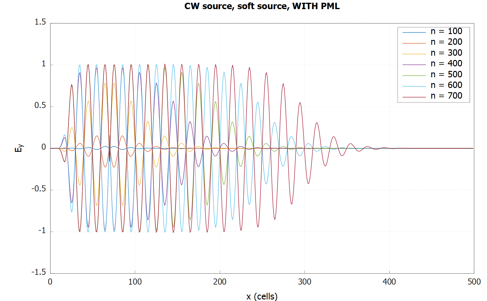
</p>

<p align="center">
  <em>Рисунок 4 — Распространение CW импульса в присутствии PML</em>
</p>

Третий эксперимент был посвящён возбуждению поля гармоническим CW-источником в присутствии PML.
В отличие от импульсного режима, здесь после начальной стадии нарастания формируется квазистационарная синусоидальная волна, распространяющаяся по расчётной области.
Использование PML при этом позволяет устранить паразитные отражения от краёв области и наблюдать именно поле, создаваемое источником.

Отдельно в задаче 0 проводилось сравнение различных способов возбуждения поля. Согласно постановке задания, требовалось установить, возникает ли различие между мягким, жёстким и токовым способами задания источника при численном моделировании распространения волны.

<p align="center">
  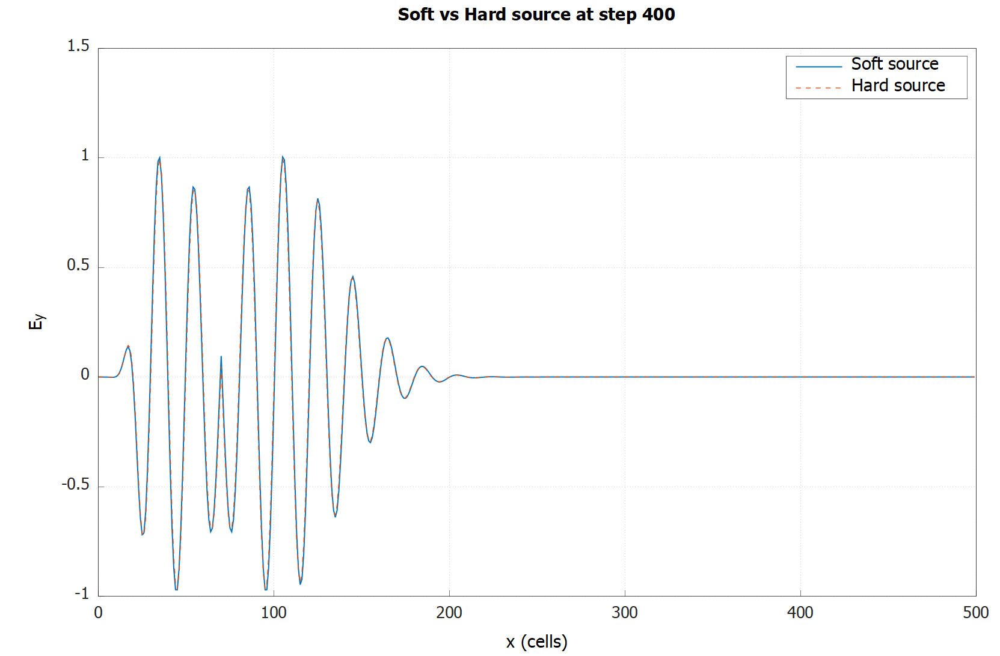
</p>

<p align="center">
  <em>Рисунок 5 — Сравнение Soft и Hard источников</em>
</p>

Сравнение мягкого и жёсткого источников показало, что в рассматриваемой постановке заметных различий в распределении поля не наблюдается. Это означает, что для выбранных параметров расчёта и при анализе рассматриваемых пространственно-временных зависимостей оба способа возбуждения приводят к практически одинаковому результату.

<p align="center">
  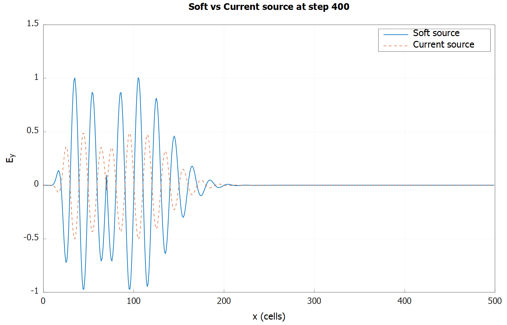
</p>

<p align="center">
  <em>Рисунок 6 — Сравнение Soft и Current источников</em>
</p>

В то же время сравнение мягкого и токового способов задания источника выявило различие в амплитуде и форме возбуждаемого сигнала. На графике видно, что при использовании `Current source` максимум амплитуды оказывается ниже, чем в случае `Soft source`, а сама кривая несколько отличается по профилю. Следовательно, в данной реализации токовый источник уже не является полностью эквивалентным мягкой инжекции и приводит к иному количественному результату.

Физически это означает, что разные способы задания источника могут по-разному влиять на локальное возбуждение поля даже в рамках одной и той же конечно-разностной схемы. При этом мягкий источник в данной работе оказался наиболее удобным для интерпретации результатов, поскольку он обеспечивает наглядное формирование падающей волны и используется далее во всех основных расчётах.

По итогам задачи можно сделать несколько выводов. Во-первых, реализованный FDTD-алгоритм корректно воспроизводит распространение электромагнитной волны в свободном пространстве. Во-вторых, без PML на границах возникают нефизические отражения, тогда как использование PML практически устраняет их. В-третьих, гармонический источник формирует ожидаемый установившийся волновой режим. Наконец, сравнение различных способов возбуждения показывает, что мягкий и жёсткий источники в рассматриваемом случае дают близкие результаты, тогда как токовый источник приводит к заметному изменению амплитуды и формы сигнала.

Таким образом, задача 0 подтверждает работоспособность базовой реализации 1D FDTD-алгоритма и одновременно показывает, что выбор способа задания источника может влиять на количественные характеристики получаемого решения. По этой причине в дальнейших численных экспериментах в качестве основного способа возбуждения использовался мягкий источник.

---

#### Задача 1. Исследование отражения от PML

Во второй задаче исследовались отражательные свойства идеально согласованного поглощающего слоя PML. Целью эксперимента было определить, насколько эффективно PML подавляет отражение электромагнитной волны на границе расчётной области, и как это подавление зависит от формы профиля проводимости и толщины поглощающего слоя.

<p align="center">
  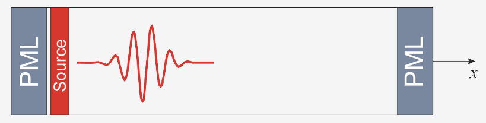
</p>

<p align="center">
  <em>Конфигурация задачи 1</em>
</p>

В расчётах использовалась одномерная область длиной 800 ячеек при шаге сетки

$$
\Delta x = 1
$$

и числе Куранта

$$
Q = 0.5
$$

Источник задавался в виде гауссова импульса с центральной частотой

$$
f_c = 0.22
$$

и параметром ширины

$$
f_{\text{width}} = 1.5
$$

что обеспечивало достаточно широкий спектр возбуждения. Коэффициент отражения вычислялся в диапазоне частот

$$
f \in [0.01,\;0.5]
$$

на основе сравнения основного расчёта с тестируемым PML и нормировочного расчёта с очень толстым эталонным PML, для которого отражение считалось пренебрежимо малым.

В качестве исследуемых профилей проводимости рассматривались три варианта: постоянный профиль

$$
m=0
$$

квадратичный профиль

$$
m=2
$$

и кубический профиль

$$
m=3
$$

Для каждого случая проводился расчёт спектра коэффициента отражения

$$
R(f)
$$

а затем дополнительно анализировалась зависимость максимального отражения

$$
R_{\max}
$$

от толщины PML.

---

<p align="center">
  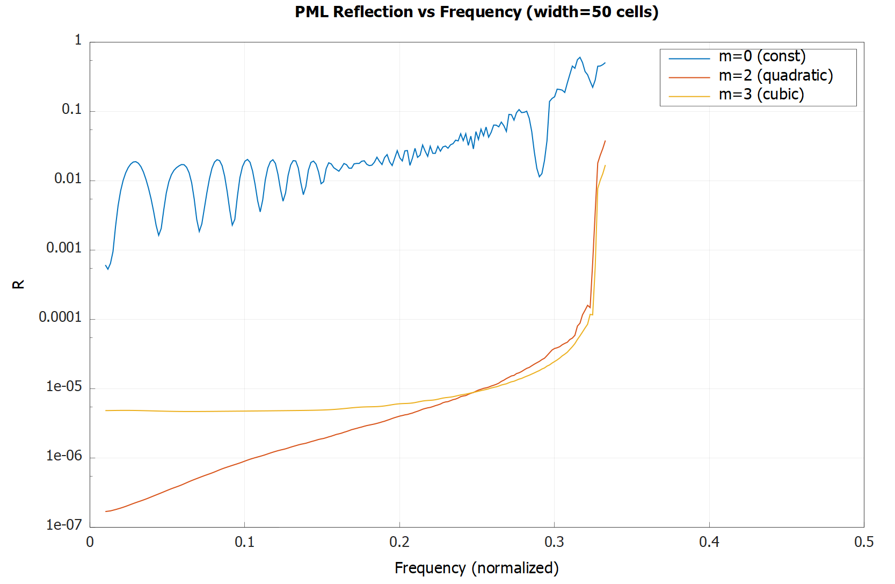
</p>

<p align="center">
  <em>Рисунок 7 — Зависимость коэффициента отражения от частоты и профиля PML</em>
</p>

На рисунке 7 представлена зависимость коэффициента отражения от частоты для фиксированной толщины PML, равной 50 ячейкам. По оси ординат использована логарифмическая шкала, поскольку значения отражения для разных профилей различаются на несколько порядков: от величин порядка единицы для постоянного профиля до уровней порядка

$$
10^{-7}-10^{-5}
$$

для квадратичного и кубического профилей. Без логарифмической шкалы малые значения отражения оказались бы практически неразличимы на одном рисунке, и сравнение эффективности различных профилей стало бы затруднительным.

Из первого графика видно, что постоянный профиль

$$
m=0
$$

является наихудшим из рассмотренных вариантов. Для него коэффициент отражения остаётся сравнительно большим во всём рабочем диапазоне частот и особенно заметно возрастает при приближении к верхней части диапазона. Это связано с тем, что резкое включение потерь на входе в PML создаёт дополнительное несогласование и приводит к более сильному отражению волны от начала поглощающего слоя.

Квадратичный и кубический профили показывают существенно лучшие результаты. Для них отражение в значительной части спектра оказывается на много порядков меньше, чем для постоянного профиля, что подтверждает важность плавного нарастания проводимости внутри PML. Наиболее низкий уровень отражения в среднем демонстрирует кубический профиль, хотя в отдельных участках диапазона различие между квадратичным и кубическим случаями становится небольшим.

Следует отметить, что при приближении к верхней границе рабочего диапазона частот отражение для всех профилей возрастает. Это связано как с уменьшением эффективности поглощения для более коротких волн при фиксированной толщине слоя, так и с общими численными ограничениями дискретной схемы при приближении к высоким нормированным частотам. Поэтому при анализе максимального отражения далее использовалась не вся полоса частот, а рабочий диапазон

$$
f \in [0.03,\;0.30]
$$

что также соответствует реализации в программе.

---

<p align="center">
  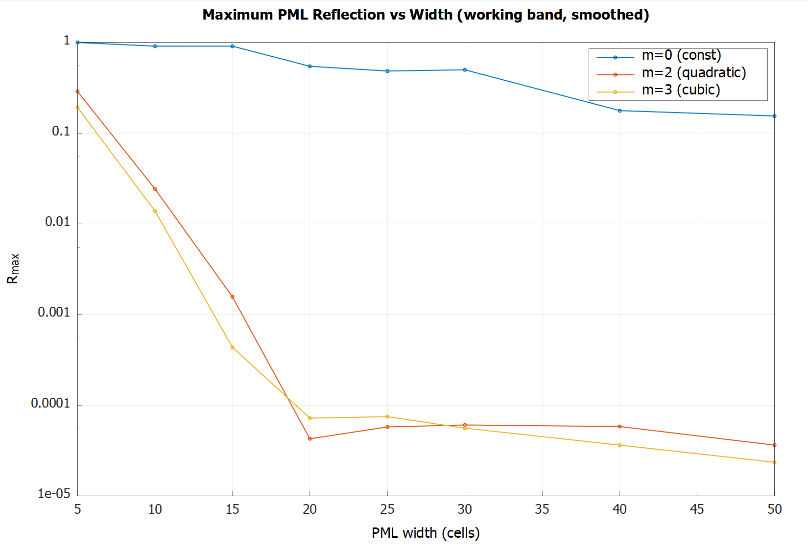
</p>

<p align="center">
  <em>Рисунок 8 — Зависимость максимального коэффициента отражения от толщины PML</em>
</p>

На рисунке 8 показана зависимость максимального коэффициента отражения

$$
R_{\max}
$$

от толщины PML для трёх профилей проводимости. Здесь также использована логарифмическая шкала по оси ординат, поскольку при увеличении толщины слоя отражение у квадратичного и кубического профилей быстро уменьшается на несколько порядков. Логарифмический масштаб позволяет одновременно показать как область сравнительно больших отражений, так и режим очень эффективного поглощения, где

$$
R_{\max}\ll 1
$$

Из рисунка 8 видно, что увеличение толщины PML в целом уменьшает отражение, однако эффективность этого уменьшения сильно зависит от формы профиля проводимости. Для постоянного профиля даже при увеличении толщины отражение остаётся сравнительно большим, то есть само по себе утолщение слоя не компенсирует плохое согласование на его входе.

Для квадратичного и кубического профилей ситуация существенно лучше. Уже при переходе от малых толщин к значениям порядка 15–20 ячеек коэффициент отражения резко падает на несколько порядков, после чего дальнейшее увеличение толщины приводит уже к более медленному улучшению. Это означает, что для плавных полиномиальных профилей существует область разумных толщин, начиная с которой PML работает достаточно эффективно и дальнейшее утолщение даёт лишь ограниченный выигрыш.

Сопоставление квадратичного и кубического профилей показывает, что кубический профиль в среднем обеспечивает наименьшее отражение при достаточно больших толщинах слоя. Именно такой профиль использовался далее в остальных задачах, поскольку он обеспечивает хорошее поглощение волн в широком диапазоне частот и уменьшает паразитное влияние границ на результаты моделирования.

Таким образом, численный эксперимент полностью подтверждает ожидаемые свойства PML. Постоянный профиль проводимости оказывается наименее эффективным, тогда как плавные квадратичный и особенно кубический профили существенно уменьшают отражение. Кроме того, увеличение толщины PML приводит к снижению отражения, но наилучший результат достигается не только за счёт толщины слоя, но и за счёт правильного выбора формы профиля проводимости.

---

#### Задача 2. Отражение от бесконечного диэлектрика

В задаче 2 исследовалось отражение и пропускание электромагнитной волны на границе раздела вакуума и полубесконечного диэлектрика. Согласно постановке работы, правая часть расчётной области заполнялась кварцем с показателем преломления 1.45, а спектральные коэффициенты требовалось определить в диапазоне длин волн от 300 нм до 900 нм.

<p align="center">
  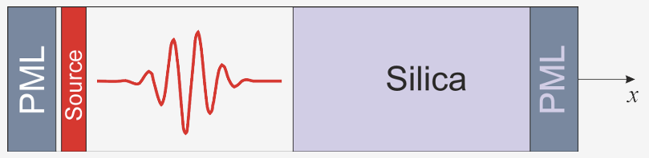
</p>

<p align="center">
  <em>Конфигурация задачи 2</em>
</p>

В численном эксперименте использовалась одномерная область с пространственным шагом

$$
\Delta x = 10 \text{ нм}
$$

и числом Куранта

$$
Q = 0.5
$$

Для подавления паразитных отражений на краях области применялись PML-слои толщиной 40 ячеек, а расчёт выполнялся на протяжении 30000 временных шагов. Источник располагался в левой части области и задавался широкополосным гауссовым импульсом, спектр которого покрывал весь исследуемый диапазон длин волн.

Для вычисления коэффициентов отражения и пропускания использовались два спектральных монитора: один перед границей раздела сред, второй — после неё. После основного расчёта дополнительно выполнялся нормировочный прогон без структуры, что позволяло выделить падающую, отражённую и прошедшую составляющие поля и затем вычислить спектральные зависимости
$R(\lambda)$ и $ T(\lambda)$.

Теоретическое значение коэффициента отражения при нормальном падении на границу двух однородных недисперсионных сред определяется формулами Френеля

$$
r = \frac{n_1 - n_2}{n_1 + n_2}
$$

$$
R = |r|^2 = \left(\frac{n_1 - n_2}{n_1 + n_2}\right)^2
$$

Для коэффициента пропускания по мощности при нормальном падении используется выражение

$$
T = \frac{n_2}{n_1}|t|^2
= \frac{4n_1n_2}{(n_1+n_2)^2}
$$

где

$$
t = \frac{2n_1}{n_1+n_2}
$$

— амплитудный коэффициент прохождения. В отсутствие потерь выполняется соотношение

$$
R + T = 1
$$

В рассматриваемом случае имеем

$$
n_1 = 1, \qquad n_2 = 1.45
$$

поэтому теоретические коэффициенты равны

$$
R = \left(\frac{1 - 1.45}{1 + 1.45}\right)^2 \approx 0.0337
$$

и

$$
T = 1 - R \approx 0.9663
$$

Так как кварц в модели задаётся как бездисперсионная среда с постоянным показателем преломления, теоретические значения $R$ и $T$ не зависят от длины волны и на графике должны представлять собой горизонтальные линии. Именно такая картина и ожидается для полубесконечного однородного диэлектрика при нормальном падении волны.

<p align="center">
  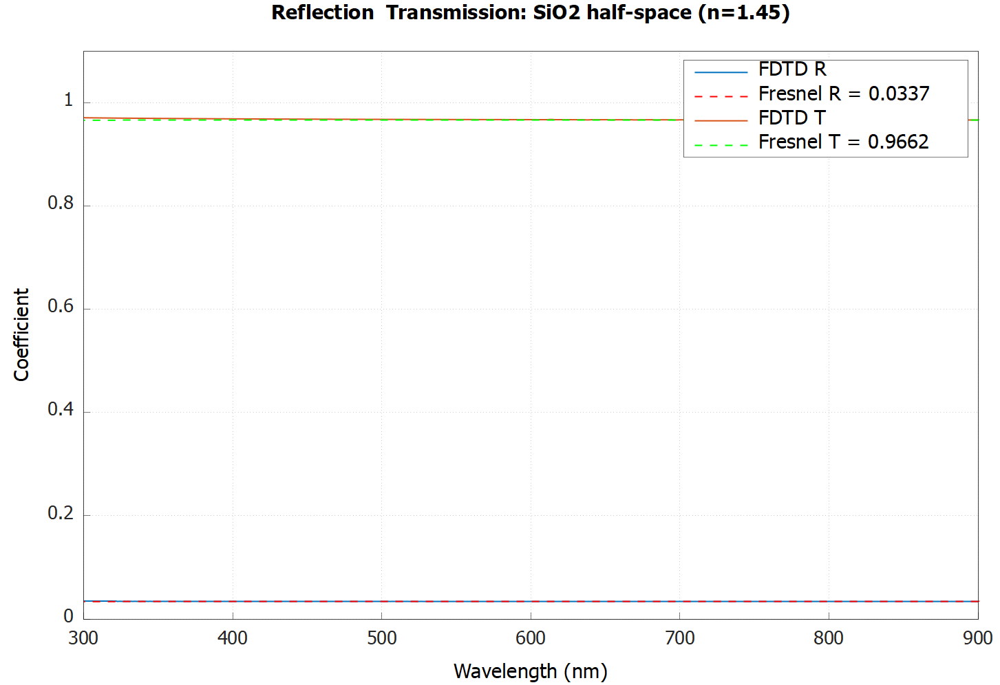
</p>

<p align="center">
  <em>Рисунок 9 — Зависимость коэффициента отражения и пропускания от длины волны, сравнение с теорией Френеля</em>
</p>

При численном расчёте коэффициент отражения, полученный методом FDTD, практически идеально совпал с теоретическим значением по формулам Френеля во всём диапазоне от 300 нм до 900 нм. Аналогично коэффициент пропускания после пересчёта в энергетической форме также совпал с аналитическим результатом.

Следует отметить, что в программе коэффициент прохождения, полученный из амплитудного отношения, дополнительно умножался на показатель преломления кварца, то есть использовалась величина

$$
T_{\text{power}} = n_{\text{quartz}} \, T_{\text{FDTD}}
$$

что необходимо для корректного сравнения с коэффициентом пропускания по мощности. Такая поправка согласуется с замечанием в реализации `computeRT`, где для прохождения в среду с другим показателем преломления требуется учитывать импедансный множитель.

Практически идеальное совпадение численного и аналитического результатов показывает, что реализованный алгоритм корректно описывает отражение и прохождение волны на одиночной границе раздела сред. Это подтверждает правильность задания материала, работы источника, размещения мониторов, нормировочного расчёта и процедуры вычисления спектральных коэффициентов.

Таким образом, задача 2 является важной верификацией реализованной FDTD-схемы. Совпадение с теорией Френеля показывает, что программа надёжно воспроизводит базовые оптические эффекты на простой диэлектрической границе и может использоваться далее для исследования более сложных структур, где аналитическое решение уже не столь очевидно.

---

#### Задача 3. Отражение от диэлектрической пластины

В задаче 3 исследовались спектры отражения и пропускания кварцевой пластины конечной толщины, помещённой в центре расчётной области. Согласно постановке работы, требовалось рассчитать зависимости
$R(\lambda)$ и $T(\lambda)$ в диапазоне длин волн от 300 нм до 900 нм, сравнить численные результаты с теорией и проанализировать влияние толщины пластины и времени моделирования.

<p align="center">
  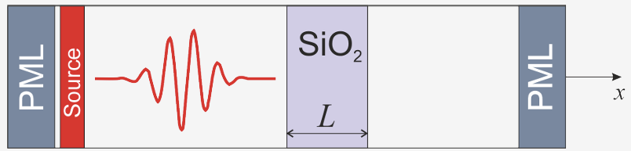
</p>

<p align="center">
  <em>Конфигурация задачи 3</em>
</p>

В расчётах использовалась кварцевая пластина с показателем преломления

$$
n = 1.45
$$

а пространственный шаг сетки выбирался равным

$$
\Delta x = 5 \text{ нм}
$$

При этом на границах области располагались PML-слои толщиной 40 ячеек, источник задавался широкополосным гауссовым импульсом, а спектральные коэффициенты вычислялись по данным двух DFT-мониторов с использованием нормировочного прогона.

Для аналитического сравнения использовалась модель интерференции в плоскопараллельной пластине, то есть формулы Фабри–Перо. В программе амплитудный коэффициент отражения на одной границе задавался как

$$
r_{12} = \frac{1-n}{1+n}
$$

а фазовый набег при прохождении пластины определялся выражением

$$
\delta = \frac{2\pi nL}{\lambda}
$$

где $L$ — толщина пластины.

Тогда коэффициенты отражения и пропускания вычислялись по формулам

$$
R =
\frac{2r_{12}^2\left(1-\cos 2\delta\right)}
{1+r_{12}^4-2r_{12}^2\cos 2\delta}
$$

$$
T =
\frac{\left(1-r_{12}^2\right)^2}
{1+r_{12}^4-2r_{12}^2\cos 2\delta}
$$

которые и использовались для построения теоретических кривых на графиках.

<p align="center">
  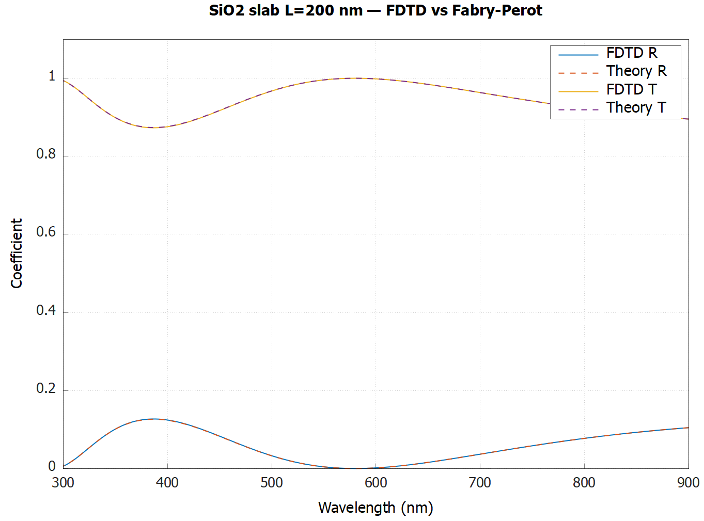
</p>

<p align="center">
  <em>Рисунок 10 — Зависимость коэффициента отражения и пропускания от длины волны, сравнение с теорией Фабри-Перо</em>
</p>

На рисунке 10 показано сравнение результатов FDTD и теории Фабри–Перо для кварцевой пластины толщиной 200 нм. Численные кривые для коэффициентов отражения и пропускания практически совпадают с аналитическими зависимостями во всём диапазоне длин волн, что свидетельствует о высокой точности реализованной схемы. Кроме того, хорошо видно, что при уменьшении $R$ коэффициент $T$ возрастает, то есть поведение системы соответствует безызлучательной и без потерь интерференции в диэлектрической пластине.

Характер полученных зависимостей определяется многократными отражениями внутри пластины. Волны, отражающиеся от обеих границ слоя, интерферируют между собой, из-за чего в спектре возникают чередующиеся максимумы и минимумы отражения, то есть осцилляции Фабри–Перо. Именно поэтому в отличие от задачи с полубесконечным диэлектриком коэффициенты $R$ и $T$ здесь уже существенно зависят от длины волны.

<p align="center">
  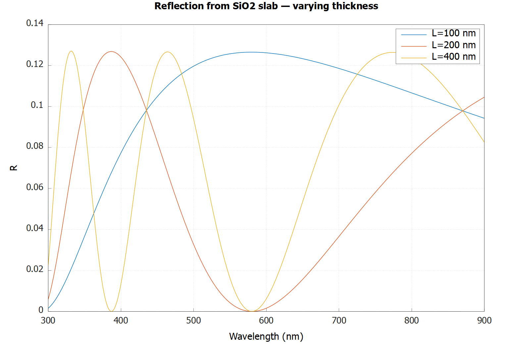
</p>

<p align="center">
  <em>Рисунок 11 — Зависимость коэффициента отражения от толщины L</em>
</p>

На рисунке 11 показано, как меняется спектр отражения при изменении толщины пластины. Для значений

$$
L = 100,\ 200,\ 400 \text{ нм}
$$

видно, что при увеличении толщины число осцилляций в рассматриваемом диапазоне длин волн возрастает. Это объясняется тем, что фазовый набег

$$
\delta = \frac{2\pi nL}{\lambda}
$$

прямо пропорционален толщине пластины, поэтому при большем $L$ интерференционные условия быстрее меняются с длиной волны и спектр становится более осциллирующим.

Из рисунка 11 также видно, что положения максимумов и минимумов отражения смещаются при изменении толщины слоя. Это полностью соответствует физике интерференции: резонансные условия определяются оптической толщиной пластины, поэтому изменение $L$ перестраивает весь спектр отражения. Для более толстой пластины в одном и том же диапазоне длин волн укладывается больше интерференционных периодов.

<p align="center">
  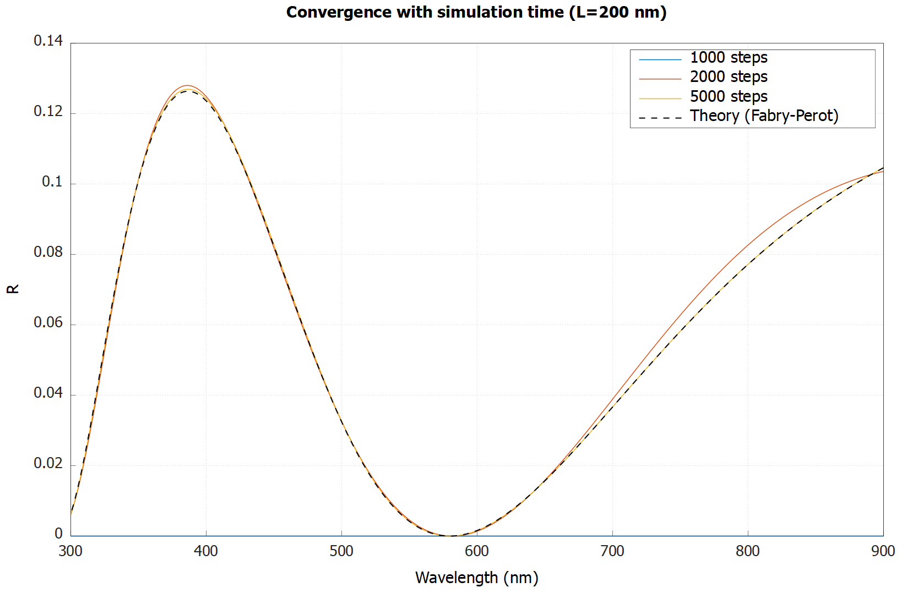
</p>

<p align="center">
  <em>Рисунок 12 — Зависимость коэффициента отражения от времени моделирования</em>
</p>

На рисунке 12 исследовано влияние времени моделирования на рассчитанный спектр отражения для пластины толщиной 200 нм. При слишком малом числе шагов, например при 1000 шагах, численный результат ещё не успевает сформироваться и заметно отличается от теоретической кривой. При увеличении времени расчёта до 2000 и особенно до 5000 шагов получаемый спектр быстро приближается к аналитическому решению Фабри–Перо.

Такое поведение связано с тем, что спектр отражения пластины формируется за счёт многократных переотражений внутри слоя. Если моделирование остановить слишком рано, то часть волн, многократно прошедших через пластину и снова вышедших наружу, просто не успевает внести вклад в суммарный сигнал на мониторе. Поэтому для корректного восстановления интерференционной картины необходимо достаточно большое время расчёта.

Полученные результаты позволяют сделать несколько выводов. Во-первых, реализованный FDTD-алгоритм корректно воспроизводит интерференционные эффекты в диэлектрической пластине, поскольку численные спектры хорошо совпадают с теорией Фабри–Перо. Во-вторых, увеличение толщины пластины приводит к росту числа осцилляций отражения в заданном диапазоне длин волн. В-третьих, недостаточное время моделирования приводит к потере части интерференционной структуры, тогда как при достаточном числе временных шагов численное решение сходится к аналитическому.

Таким образом, задача 3 подтверждает, что программа корректно описывает не только отражение от одиночной границы раздела сред, но и более сложные эффекты многолучевой интерференции в ограниченных диэлектрических структурах. Это является важным этапом перед переходом к моделированию фотонных кристаллов и резонаторных систем.

---

#### Задача 4. Отражение и пропускание фотонного кристалла

В задаче 4 исследовалось распространение электромагнитной волны в одномерном фотонном кристалле, образованном периодическим чередованием слоёв SiO2 и TiO2. Согласно постановке работы, требовалось построить спектры отражения и пропускания в видимом диапазоне, сравнить структуры с равными физическими и равными оптическими толщинами слоёв, а также проанализировать влияние числа периодов на форму спектров.

<p align="center">
  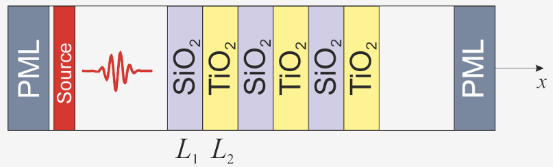
</p>

<p align="center">
  <em>Конфигурация задачи 4</em>
</p>

В расчётах использовались показатели преломления

$$
n_{\mathrm{SiO2}} = 1.45,
\qquad
n_{\mathrm{TiO2}} = 2.28
$$

а спектральный диапазон задавался от 300 нм до 900 нм. Источник представлял собой широкополосный гауссов импульс, а коэффициенты
$R(\lambda)$ и $T(\lambda)$ определялись по данным двух DFT-мониторов с использованием нормировочного расчёта, как и в предыдущих задачах.

<p align="center">
  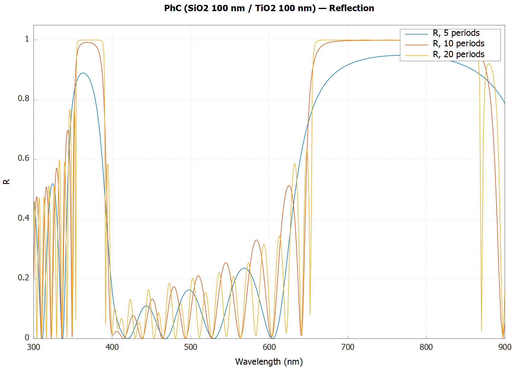
</p>

<p align="center">
  <em>Рисунок 13 — Зависимость коэффициента отражения от длины волны при разном числе периодов и равной физической толщине</em>
</p>

Сначала рассматривался фотонный кристалл с равными физическими толщинами слоёв

$$
L_{\mathrm{SiO2}} = 100 \text{ нм},
\qquad
L_{\mathrm{TiO2}} = 100 \text{ нм}
$$

для трёх значений числа периодов: 5, 10 и 20. На графике коэффициента отражения видно, что при увеличении числа периодов формируется и усиливается область высокой отражательной способности, то есть фотонная запрещённая зона. Для 20 периодов эта область становится практически полностью отражающей, так что в широком диапазоне длин волн выполняется

$$
R \approx 1
$$

Физически появление запрещённой зоны связано с брэгговской интерференцией волн, многократно отражающихся на границах периодической структуры. При выполнении условий фазового согласования отражённые волны от разных периодов складываются когерентно, что приводит к резкому усилению суммарного отражения и, соответственно, к подавлению прохождения. Именно поэтому увеличение числа периодов делает границы запрещённой зоны более резкими, а саму область высокой отражательной способности — более выраженной.

Для структуры с 20 периодами дополнительно были построены зависимости

$$
R(\lambda),
\qquad
T(\lambda),
\qquad
R(\lambda)+T(\lambda).
$$

<p align="center">
  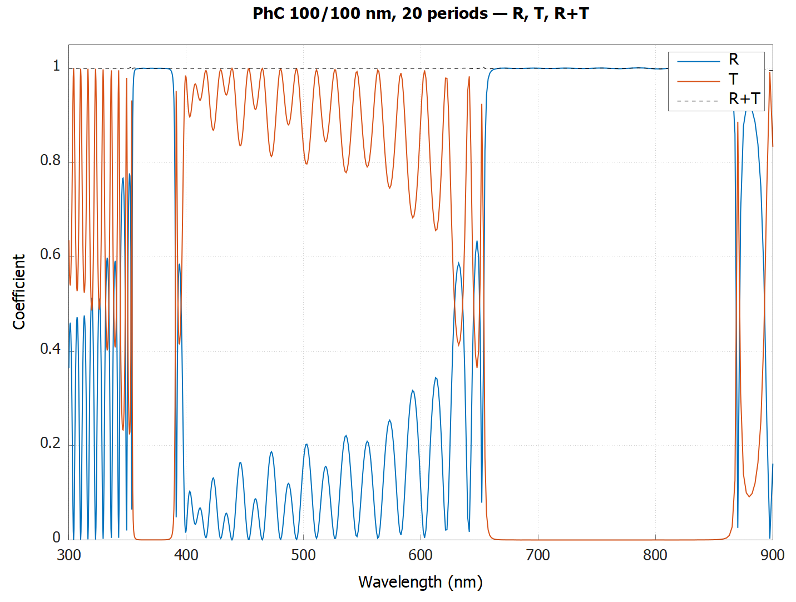
</p>

<p align="center">
  <em>Рисунок 14 — Зависимость коэффициента отражения и пропускания от длины волны при числе периодов 20 и равной физической толщине</em>
</p>

На соответствующем графике хорошо видно, что в области запрещённой зоны коэффициент отражения близок к единице, а коэффициент пропускания близок к нулю, тогда как вне этой области энергия в основном проходит через структуру. При этом сумма
$R+T$ остаётся близкой к единице во всём исследуемом диапазоне, что подтверждает энергетическую корректность расчёта и отсутствие заметных численных потерь вне специально введённых поглощающих слоёв PML на границах области.

Далее исследовался вариант с равными оптическими толщинами слоёв. В коде толщина слоя SiO2 фиксировалась как 100 нм, а толщина слоя TiO2 выбиралась из условия равенства оптических толщин и составляла

$$
L_{\mathrm{TiO2}} = 100 \cdot \frac{1.45}{2.28} \approx 63.6 \text{ нм}
$$

Именно такая конфигурация соответствует четвертьволновой укладке для центральной длины волны, определяемой выбранной оптической толщиной слоёв.

<p align="center">
  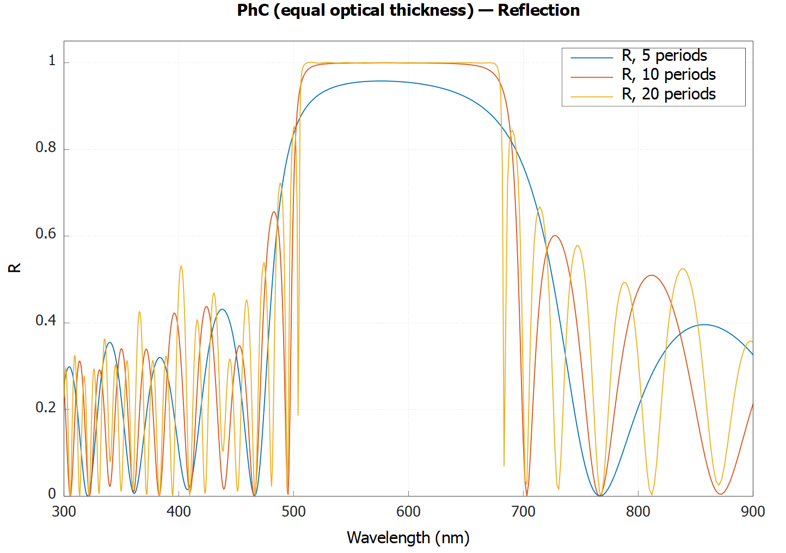
</p>

<p align="center">
  <em>Рисунок 15 — Зависимость коэффициента отражения и пропускания от длины волны при разном числе периодов и равной оптической толщине</em>
</p>

На графике отражения для структуры с равными оптическими толщинами также наблюдается формирование выраженной фотонной запрещённой зоны, причём уже при сравнительно небольшом числе периодов она оказывается более регулярной и лучше центрированной. Для 10 и особенно 20 периодов отражение в центральной части запрещённой зоны становится практически единичным, а границы полосы получаются более симметричными и физически ожидаемыми, чем в случае равных физических толщин.

Это объясняется тем, что четвертьволновая структура специально оптимизирована на максимальное брэгговское отражение около некоторой центральной длины волны. При равенстве оптических толщин фазовые сдвиги в соседних слоях согласованы таким образом, что отражения от всех периодов усиливают друг друга наиболее эффективно. Поэтому такой вариант структуры обычно используется как базовый при проектировании одномерных брэгговских зеркал.

Для структуры с равными оптическими толщинами и 20 периодами также были построены зависимости

$$
R(\lambda),
\qquad
T(\lambda),
\qquad
R(\lambda)+T(\lambda).
$$

<p align="center">
  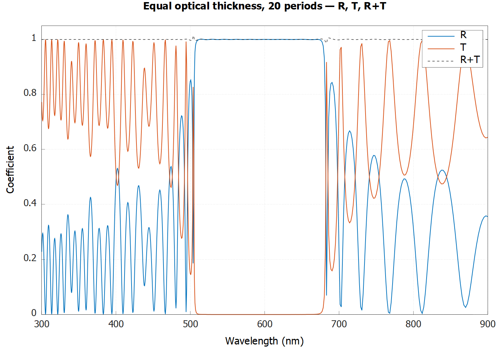
</p>

<p align="center">
  <em>Рисунок 16 — Зависимость коэффициента отражения и пропускания от длины волны при числе периодов 20 и равной оптической толщине</em>
</p>

На этом графике особенно хорошо видно, что в центральной части запрещённой зоны коэффициент отражения практически равен единице, а коэффициент пропускания падает почти до нуля. Сумма
$R+T$ и в этом случае остаётся близкой к единице, что дополнительно подтверждает корректность вычисления спектральных коэффициентов.

<p align="center">
  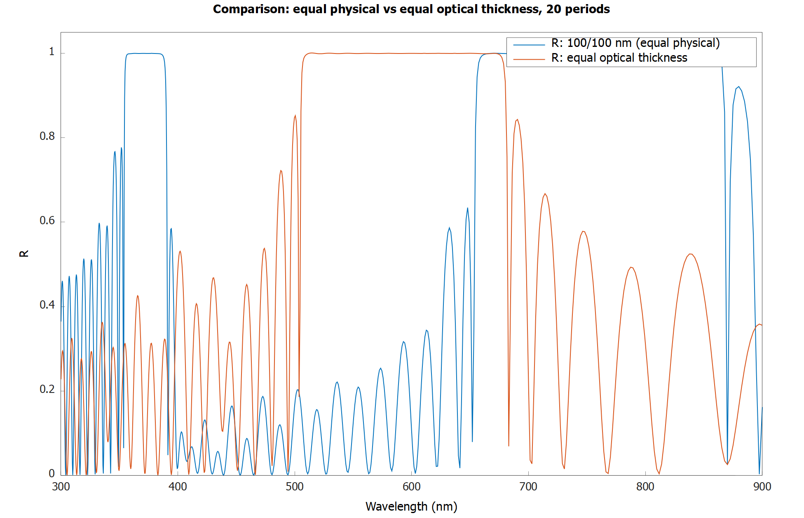
</p>

<p align="center">
  <em>Рисунок 17 — Зависимость коэффициента отражения и пропускания от длины волны при числе периодов 20. Сравнение для равной физической и оптической толщины</em>
</p>

Отдельный интерес представляет прямое сравнение двух структур при одинаковом числе периодов, равном 20. На сравнительном графике видно, что запрещённые зоны для случая равных физических толщин и для случая равных оптических толщин заметно различаются по положению, ширине и внутренней структуре спектра. Вариант с равными оптическими толщинами даёт более “правильную” брэгговскую полосу, тогда как при равных физических толщинах спектр оказывается менее симметричным и сильнее смещён по длине волны.

Таким образом, результаты задачи 4 позволяют сделать несколько выводов. Во-первых, периодическая структура SiO2/TiO2 действительно обладает фотонной запрещённой зоной.
Во-вторых, увеличение числа периодов делает запрещённую зону более выраженной и увеличивает эффективность отражения. В-третьих, структура с равными оптическими толщинами слоёв оказывается более предпочтительной для формирования брэгговского зеркала, поскольку обеспечивает более чёткую и физически ожидаемую полосу отражения.

Следовательно, задача 4 показывает, что реализованный FDTD-алгоритм корректно воспроизводит ключевые свойства одномерных фотонных кристаллов и позволяет анализировать формирование запрещённых зон в периодических диэлектрических структурах. Это создаёт естественную основу для следующей задачи, где в периодическую структуру вводится дефект и возникает локализованная резонансная мода брэгговской микрополости.

---

#### Задача 5. Брэгговская микрополость

В задаче 5 исследовалась брэгговская микрополость, представляющая собой воздушный дефектный слой, заключённый между двумя одномерными фотонными кристаллами. Согласно постановке работы, требовалось изучить спектры отражения и пропускания такой структуры, сравнить их со спектрами чисто периодического фотонного кристалла и проанализировать эволюцию полей внутри микрополости.

<p align="center">
  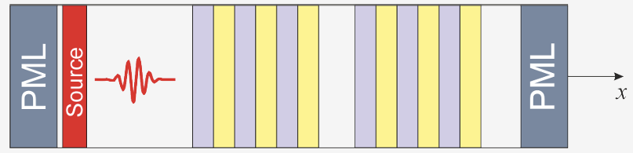
</p>

<p align="center">
  <em>Конфигурация задачи 5</em>
</p>

В численном эксперименте центральная длина волны была выбрана равной

$$
\lambda_0 = 650 \text{ нм},
$$

а толщины слоёв брэгговских зеркал задавались по четвертьволновому правилу

$$
L_{\mathrm{SiO2}} = \frac{\lambda_0}{4n_{\mathrm{SiO2}}},
\qquad
L_{\mathrm{TiO2}} = \frac{\lambda_0}{4n_{\mathrm{TiO2}}},
$$

где

$$
n_{\mathrm{SiO2}} = 1.45,
\qquad
n_{\mathrm{TiO2}} = 2.28.
$$

Основной вариант микрополости в коде соответствовал воздушному дефектному слою толщиной

$$
L_{\mathrm{cav}} = \frac{\lambda_0}{2} = 325 \text{ нм}
$$

то есть полуволновой полости в воздухе. Дополнительно был рассмотрен случай более тонкой воздушной полости толщиной

$$
L_{\mathrm{cav}} = \frac{\lambda_0}{4} = 162.5 \text{ нм}
$$

что позволило проследить влияние толщины дефекта на положение и характер резонансной моды.

Сначала были построены спектры отражения и пропускания для микрополости с различным числом периодов в каждом из зеркал.

<p align="center">
  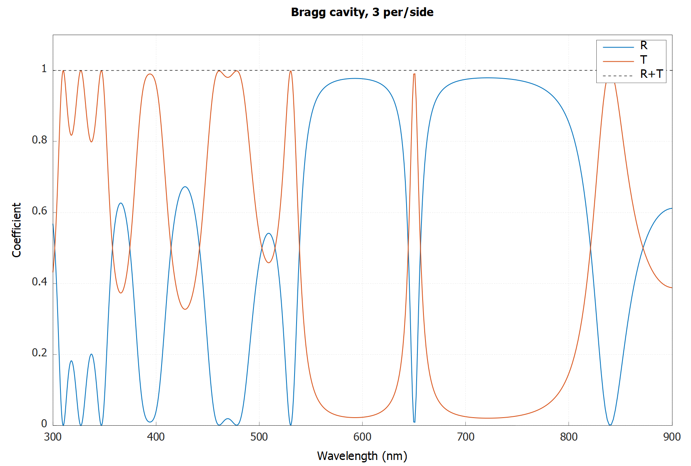
</p>

<p align="center">
  <em>Рисунок 18 — Зависимость коэффициента отражения и пропускания от длины волны при числе периодов 3 на сторону</em>
</p>

---

<p align="center">
  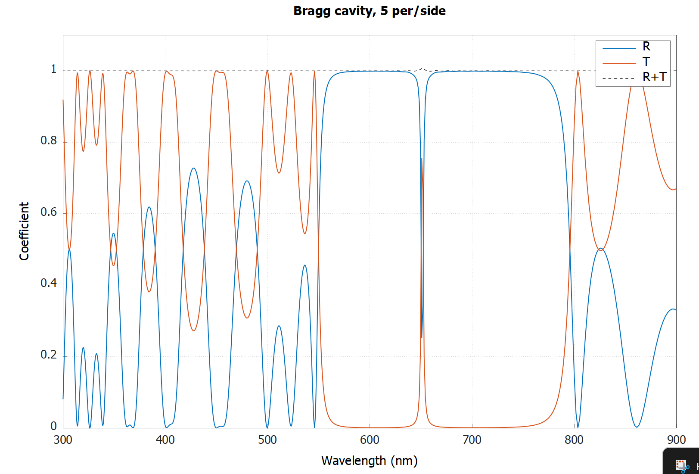
</p>

<p align="center">
  <em>Рисунок 19 — Зависимость коэффициента отражения и пропускания от длины волны при числе периодов 5 на сторону</em>
</p>

---

<p align="center">
  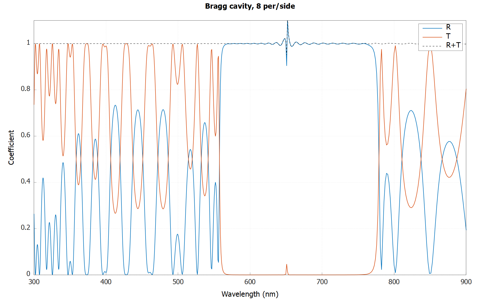
</p>

<p align="center">
  <em>Рисунок 20 — Зависимость коэффициента отражения и пропускания от длины волны при числе периодов 8 на сторону</em>
</p>

Для случаев 3, 5 и 8 периодов на сторону хорошо видно, что в области фотонной запрещённой зоны возникает узкая резонансная особенность, соответствующая дефектной моде микрополости.
При увеличении числа периодов отражение в запрещённой зоне становится ближе к единице, а резонансный пик пропускания внутри неё становится более узким и более выраженным.

Такое поведение физически естественно, поскольку увеличение числа периодов повышает отражательную способность брэгговских зеркал. В результате поле дольше удерживается между зеркалами, добротность резонансной моды возрастает, а спектральная линия дефектного состояния сужается.

На графиках для микрополости также показана сумма $R + T$.
Она остаётся близкой к единице во всём исследуемом диапазоне длин волн, что подтверждает энергетическую корректность расчёта и отсутствие заметных нефизических потерь в самой структуре.

Наиболее наглядный спектр получен для случая 8 периодов с каждой стороны. Для полуволновой воздушной полости внутри широкой запрещённой зоны возникает узкий пик пропускания около расчётной центральной длины волны, тогда как вне резонанса структура ведёт себя как почти идеальное брэгговское зеркало.

Это и есть главный эффект введения дефекта в периодическую структуру: внутри запрещённой зоны появляется локализованное разрешённое состояние. Спектрально оно проявляется как узкий канал прохождения на фоне области, где для чисто периодической структуры распространение практически запрещено.

<p align="center">
  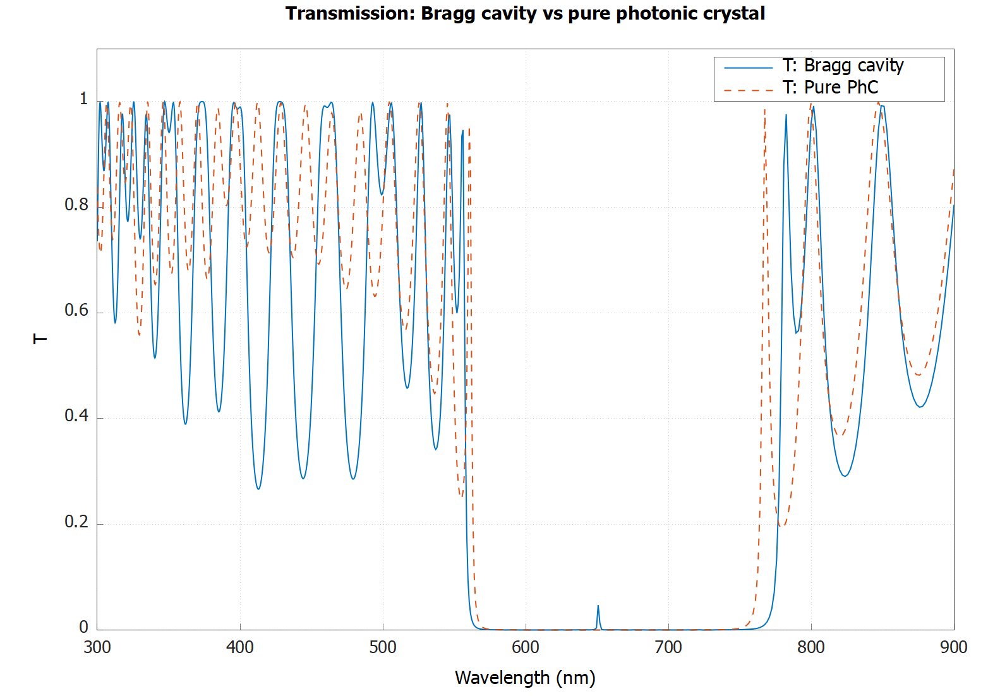
</p>

<p align="center">
  <em>Рисунок 21 — Сравнение брэгговской микрополости с чистым фотонным кристаллом при полуволновой толщине воздушной прослойки</em>
</p>

Сравнение брэгговской микрополости с чистым фотонным кристаллом подтверждает этот вывод. На графике пропускания видно, что у чисто периодической структуры в запрещённой зоне прохождение практически отсутствует, тогда как у структуры с воздушной полостью появляется дополнительный резонансный пик пропускания.

Для полуволновой воздушной полости этот пик расположен вблизи центра запрещённой зоны, что соответствует ожидаемому резонансному условию для дефектной моды. Таким образом, введение воздушного слоя толщиной $\lambda_0/2$ создаёт хорошо выраженную локализованную моду внутри брэгговского зеркала.

Отдельно был исследован случай воздушной полости толщиной $\lambda_0/4$.

<p align="center">
  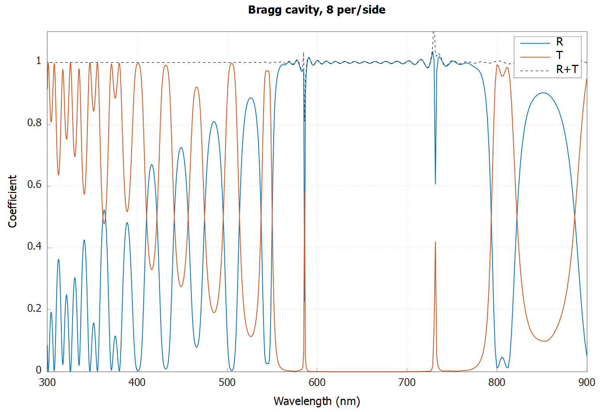
</p>

<p align="center">
  <em>Рисунок 22 — Зависимость коэффициента отражения и пропускания от длины волны при числе периодов 8 на сторону и четвертьволновой толщине воздушной прослойки</em>
</p>

Соответствующие спектры показывают, что при уменьшении толщины дефектного слоя резонансная особенность смещается и уже не совпадает с центральной частью запрещённой зоны так же хорошо, как в полуволновом случае.

<p align="center">
  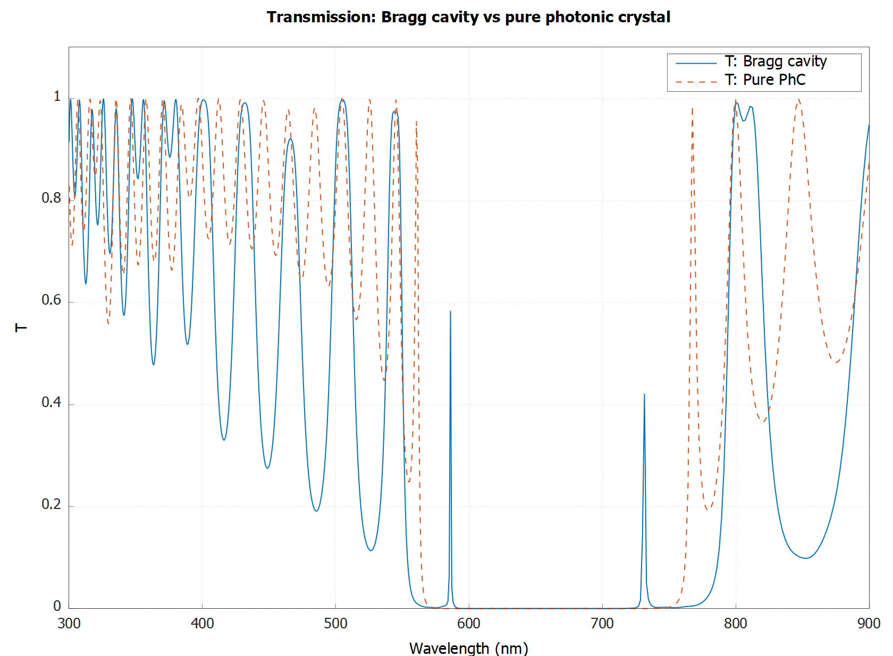
</p>

<p align="center">
  <em>Рисунок 23 — Сравнение брэгговской микрополости с чистым фотонным кристаллом при четвертьволновой толщине воздушной прослойки</em>
</p>

Из сравнения с чистым фотонным кристаллом видно, что и в этом случае дефектный слой меняет спектр прохождения, однако локализованная мода становится менее “центральной” и её положение определяется уже новой фазовой настройкой полости. Иными словами, толщина воздушного дефекта напрямую управляет положением резонансного уровня внутри запрещённой зоны.

Кроме спектральных характеристик, в работе была исследована пространственно-временная эволюция электрического поля внутри микрополости. Для этого были построены распределения $E_y(x)$ в разные моменты времени как для гауссова импульса, так и для гармонического CW-источника, а границы полости на графиках были дополнительно отмечены вертикальными пунктирными линиями.

<p align="center">
  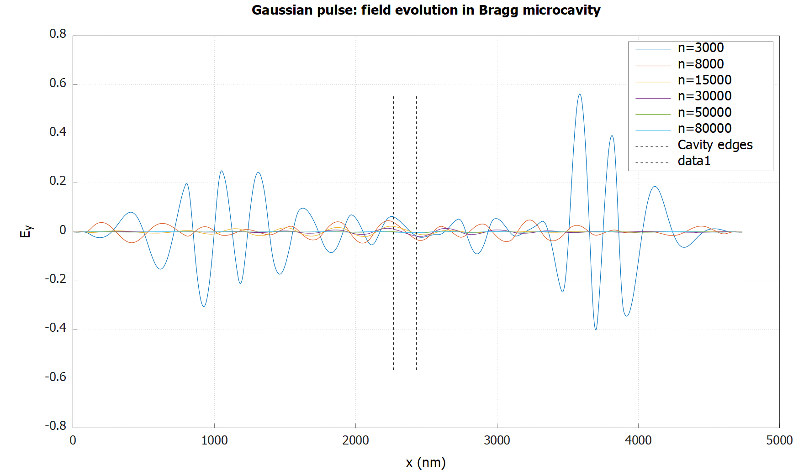
</p>

<p align="center">
  <em>Рисунок 24 — Эволюция гауссова импульса</em>
</p>

На графике эволюции гауссова импульса для случая $\lambda_0/4$ видно, что заметного устойчивого накопления энергии внутри полости не возникает. Поле в основном отражается и перераспределяется в окружающих брэгговских зеркалах, а внутри самой полости амплитуда остаётся сравнительно небольшой.

Это согласуется со спектральными результатами: если дефектная мода смещена относительно наиболее эффективного резонансного условия, то широкополосный импульс не приводит к ярко выраженной локализации поля именно в центре структуры. Поэтому для четвертьволновой воздушной полости эффект захвата энергии выражен слабее.

<p align="center">
  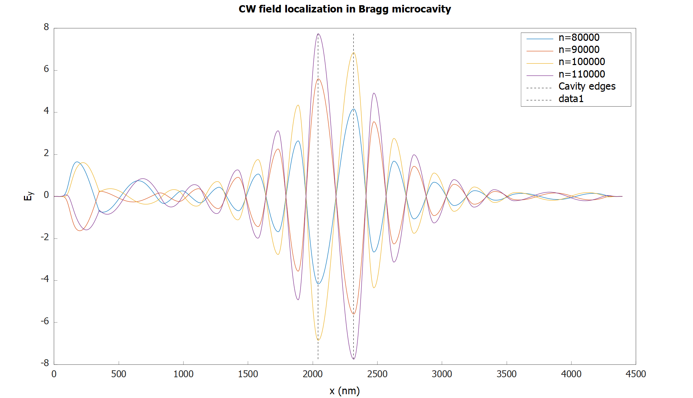
</p>

<p align="center">
  <em>Рисунок 25 — Эволюция CW импульса при полуволновой толщине воздушной прослойки</em>
</p>

Совсем иная картина наблюдается для CW-источника в случае полуволновой воздушной полости. На соответствующем графике хорошо видно формирование стоячеволнового распределения с резко повышенной амплитудой именно между границами полости, тогда как в брэгговских зеркалах амплитуда затухает по мере удаления от дефекта.

Такое распределение является прямым признаком локализованной резонансной моды микрополости. Брэгговские зеркала выполняют роль отражающих “стенок”, а воздушный дефектный слой — роль резонатора, в котором поле накапливается и образует пространственно локализованную стоячую волну.

<p align="center">
  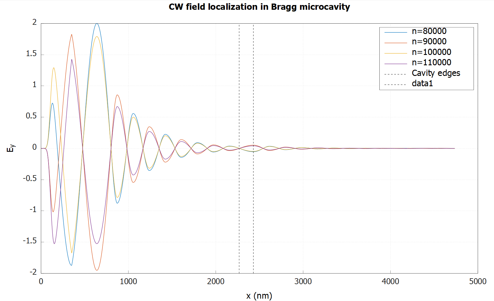
</p>

<p align="center">
  <em>Рисунок 26 — Эволюция CW импульса при четвертьволновой толщине воздушной прослойки</em>
</p>

Для CW-источника в случае воздушной полости толщиной $\lambda_0/4$ выраженной локализации в пределах полости уже не наблюдается. Максимумы поля располагаются в основном вне центрального дефектного слоя, а внутри него амплитуда существенно меньше, чем для полуволнового варианта.

Следовательно, именно полуволновая воздушная полость оказывается лучше согласованной с выбранной центральной длиной волны и обеспечивает наиболее эффективное возбуждение дефектной моды. Четвертьволновая полость также меняет спектр структуры, но не даёт столь сильной пространственной локализации поля в центре.

По итогам задачи можно сделать несколько выводов. Во-первых, введение воздушного дефектного слоя внутрь брэгговского зеркала приводит к появлению локализованной моды внутри фотонной запрещённой зоны. Во-вторых, увеличение числа периодов в зеркалах усиливает отражение и делает резонансный пик пропускания более узким. В-третьих, полуволновая воздушная полость создаёт наиболее наглядный резонансный режим с ярко выраженным пиком пропускания и сильной локализацией поля внутри дефекта.

Таким образом, задача 5 показывает, что реализованный FDTD-алгоритм корректно воспроизводит как спектральные свойства брэгговской микрополости, так и пространственную локализацию поля в дефектном резонаторе. Это завершает серию численных экспериментов и демонстрирует применимость разработанной программы к моделированию как простых диэлектрических границ, так и сложных резонансных фотонных структур.

---

## 4. Заключение и выводы 📝

В ходе работы был реализован одномерный алгоритм FDTD для моделирования распространения электромагнитных волн в неоднородных диэлектрических структурах. В программной реализации были построены Yee-сетка, конечно-разностная схема обновления полей, механизмы задания источников, поглощающие граничные условия PML, описание слоистых материалов и спектральные мониторы на основе дискретного преобразования Фурье.

Проведённые численные эксперименты показали, что разработанная программа корректно воспроизводит как базовые процессы распространения волн в свободном пространстве, так и отражение, прохождение, интерференцию и резонансные эффекты в более сложных оптических структурах. Это подтверждается как качественным соответствием физически ожидаемым картинам поля, так и количественным совпадением с аналитическими результатами в тех случаях, где такие результаты известны.

На начальном этапе была подтверждена корректность базовой FDTD-реализации в свободном пространстве, а также продемонстрирована необходимость использования поглощающих граничных условий для исключения паразитных отражений от краёв расчётной области. Исследование PML показало, что плавные полиномиальные профили проводимости значительно эффективнее постоянного профиля, а увеличение толщины поглощающего слоя уменьшает коэффициент отражения в рабочем частотном диапазоне.

Для задачи отражения от границы вакуума и кварца было получено практически идеальное совпадение численного результата с формулами Френеля, что подтвердило правильность задания материалов, нормировки и вычисления спектральных коэффициентов. В задаче с диэлектрической пластиной численные зависимости отражения и пропускания совпали с теорией Фабри–Перо, а также было показано влияние толщины пластины и времени моделирования на формирование интерференционной картины. 

При моделировании фотонных кристаллов была обнаружена фотонная запрещённая зона, положение и ширина которой зависят от выбора толщин слоёв и числа периодов. Было показано, что структура с равными оптическими толщинами формирует более выраженную и физически ожидаемую брэгговскую полосу отражения, а увеличение числа периодов усиливает отражение внутри запрещённой зоны и подавляет прохождение.

В заключительной задаче была исследована брэгговская микрополость, образованная воздушным дефектным слоем между двумя брэгговскими зеркалами. Численные результаты продемонстрировали появление локализованной дефектной моды внутри фотонной запрещённой зоны, а анализ пространственных распределений поля подтвердил локализацию электромагнитной энергии в области резонатора, особенно в случае полуволновой воздушной полости.

Таким образом, поставленная цель работы была достигнута: разработан и протестирован программный комплекс для одномерного FDTD-моделирования, пригодный для исследования открытых диэлектрических и периодических фотонных структур. Полученные результаты подтверждают корректность реализации метода и показывают, что созданная программа может использоваться как для учебных задач вычислительной электродинамики, так и для дальнейшего исследования более сложных волноводных, периодических и резонаторных систем.
