# Отчёт по лабораторной работе: Решение ОДУ и жёстких систем ОДУ ⚡️📊

## Содержание 📖

1. [Введение и цели работы 🎓](#1-введение-и-цели-работы-)
2. [Структура проекта 🛠️](#2-структура-проекта-)
3. [Ход выполнения работы 🔎](#3-ход-выполнения-работы-)
    - [Используемые методы](#используемые-методы)
        - [Рунге-Кутты 4 порядка](#рунге-кутты-4-порядка)
        - [Эйлера (явный)](#эйлера-(явный))
        - [Эйлера (улучшенный)](#эйлера-(улучшенный))
        - [Гира](#гира)
        - [Адамса-Башфорта-Моултона](#адамса-башфорта-моултона)
    - [Решение жёсткой системы ОДУ](#решение-жёсткой-системы-оду)
        - [Решение явным Эйлером](#решение-явным-эйлером)
        - [Решение улучшенным Эйлером](#решение-улучшенным-эйлером)
        - [Решение Гиром](#решение-гиром-эйлером)
    - [Решение ОДУ](#решение-оду)
        - [Решение Адамсом-Башфортом-Моултоном](#решение-адамсом-башфортом-моултоном)
        - [Решение Гиром второго порядка](#решение-гиром-второго-порядка)
4. [Заключение и выводы 📝](#4-заключение-и-выводы-)

## 1. Введение и цели работы 🎓

Обыкновенные дифференциальные уравнения являются одним из основных средств математического моделирования процессов в физике, технике и других областях, где необходимо описывать динамику систем во времени. Во многих задачах аналитическое решение дифференциальных уравнений отсутствует или его поиск затруднен, поэтому особое значение приобретает разработка и применение численных методов решения задач Коши для систем ОДУ.

В данной лабораторной работе рассматриваются системы обыкновенных дифференциальных уравнений с различными коэффициентами и правыми частями, в том числе демонстрирующие жёсткое поведение, что позволяет исследовать устойчивость и точность численных алгоритмов на сериях тестовых задач.

При выполнении работы используются вычислительные средства для реализации численных методов, анализа влияния шага интегрирования и параметров модели на качество приближённого решения, а также построения графиков и интерпретации полученных результатов.

**Цели: 🎯**

- Изучить постановку задач Коши для систем обыкновенных дифференциальных уравнений с различными параметрами и начальными условиями
- Освоить применение численных методов для решения систем ОДУ на заданных интервалах времени при различных значениях шага интегрирования
- Исследовать влияние шага интегрирования и параметров системы на устойчивость и точность численного решения, выявить проявления жёсткости и связанные с ней особенности расчёта
- Провести обработку и сравнительный анализ полученных результатов 

## 2.Структура проекта 🛠️

Вся работа выполнена в виде модульного C++-проекта со следующей структурой:
```
include/
├── Base/            # Базовые интерфейсы генераторов/решателей
├── Labs/            # Заголовки лабораторных заданий
src/
└── Labs/
    └── LabN/
        └── TaskK.cpp    # Основные реализации по заданиям
CMakeLists.txt          # Конфигурация сборки проекта
```
Реализация поддерживает автоматическое добавление новых заданий, централизованное подключение заголовков и простое масштабирование под разные лабораторные работы. Реализацию всех заголовков заданий можно найти по пути `include/Labs/Special/Lab1/Tasks`

---

### Используемые методы

В данной работе используются как _одношаговые_, так и _многошаговые_ методы.

К _одношаговым_ относятся методы, которые для перехода от шага $n$ к $n+1$ используют только значения в точке $t_n$
(и промежуточные стадии внутри этого же шага), но не требуют хранения решений на нескольких прошлых шагах.

**Одношаговые методы, используемые в данной работе:**

- Рунге-Кутты 4 порядка
- Эйлера (явный)
- Эйлера (улучшенный)

_Многошаговые_ методы используют несколько предыдущих значений решения для вычисления нового шага.​

**Многошаговые методы, используемые в данной работе:**

- Гира
- Адамса-Башфорта-Моултона

---

#### Рунге-Кутты 4 порядка

Метод Рунге–Кутты 4-го порядка (RK4) относится к одношаговым численным методам решения задачи Коши для обыкновенных дифференциальных уравнений вида $y'(t) = f(t,y), y(t_0) = y_0$. На каждом шаге он использует четыре оценки наклона решения внутри интервала $[t_n, t_{n+1}]$, которые затем усредняются с особыми весами, что обеспечивает высокий порядок точности при сравнительно простой реализации.

При заданном шаге $h$ переход от значения $y_n$ к $y_{n+1}$ осуществляется по формулам:

$$
\begin{align*}
    k_1 & = f(x_i, y_i) \\
    k_2 & = f\left(x_i + \frac{h}{2},\ y_i + \frac{h}{2}k_1\right) \\
    k_3 & = f\left(x_i + \frac{h}{2},\ y_i + \frac{h}{2}k_2\right) \\
    k_4 & = f(x_i + h,\ y_i + h k_3) \\
    y_{i+1} & = y_i + \frac{h}{6}(k_1 + 2k_2 + 2k_3 + k_4)
\end{align*}
$$

Такой выбор комбинации наклонов дает следующее: локальная погрешность на одном шаге имеет порядок $O(h^5)$,  глобальная (накопленная) погрешность на отрезке интегрирования $O(h^4)$.

RK4 широко применяется в задачах, где требуется хорошее соотношение между точностью и вычислительными затратами: по сравнению с простым методом Эйлера он требует четыре вычисления правой части на шаг, но даёт существенно более точное приближение решения при том же шаге. 

Программную реализацию метода можно найти по пути `include/Labs/Lab4/ODESolvers/RungeKutta4Solver.h`

---

#### Эйлера (явный)

Явный метод Эйлера — это самый простой одношаговый численный метод приближённого решения задачи Коши для ОДУ вида $y'(t) = f(t,y), y(t_0) = y_0$. На каждом шаге новое значение приближённого решения вычисляется по формуле:

$$
    y_{n+1} = y_n + h \cdot f(t_n, y_n)
$$

где $h$ - шаг интегрирования, $y_n$ - приближённое значение решения в узле $t_n$. Метод Эйлера геометрически реализует переход из текущей точки вдоль касательной, определяемой значением производной в начале шага. Локальная погрешность метода порядка $O(h^2)$, глобальная - $O(h)$.

Метод прост в реализации и даёт удовлетворительные результаты для "не жёстких" задач и достаточно малого шага, но быстро накапливает ошибку при увеличении шага или при решении жёстких ОДУ.

Программную реализацию метода можно найти по пути `include/Labs/Lab4/ODESolvers/EulerSolver.h`

---

#### Эйлера (улучшенный)

Улучшенный (модифицированный) метод Эйлера относится к одношаговым численным методам решения задачи Коши для ОДУ вида $y'(t) = f(t,y), y(t_0) = y_0$. Он является методом второго порядка точности и может рассматриваться как простейший двухстадийный метод Рунге–Кутты.

При шаге $h$ переход от $y_n$ к $y_{n+1}$ выполняется в два этапа:

1. Предсказание (обычный Эйлер):

$$
    y^{*} = y_n + h \cdot f(t_n, y_n)
$$

2. Коррекция (усреднение наклонов):

$$
    y_{n+1} = y_n + \frac{h}{2}\Big(f(t_n, y_n) + f(t_n + h, y^{*})\Big)
$$

Таким образом, на шаге используются две оценки производной: в начале интервала и в предсказанной точке. За счёт усреднения этих наклонов локальная погрешность имеет порядок $O(h^3)$, а глобальная погрешность - $O(h^2)$, что делает метод существенно более точным по сравнению с явным методом Эйлера первого порядка при сопоставимом шаге интегрирования.

Программную реализацию метода можно найти по пути `include/Labs/Lab4/ODESolvers/ImprovedEulerSolver.h`

---

#### Гира

Метод Гира относится к семейству неявных линейных многошаговых методов – формул обратного дифференцирования (Backward Differentiation Formulas, BDF), предназначенных для численного решения жёстких задач Коши для ОДУ.

В общем виде k-шаговая схема BDF записывается как:

$$
    \sum_{j=0}^{k} \alpha_j y_{n+j}
    = h \beta f(t_{n+k}, y_{n+k})
$$

где коэффициенты $\alpha_j$ и $\beta$ подбираются так, чтобы обеспечить требуемый порядок точности. Для каждого нового значения $y_{n+k}$ используются несколько уже известных предыдущих значений решения, поэтому метод является многошаговым и неявным (на каждом шаге требуется решать нелинейное или линейное уравнение относительно $y_{n+k}$).

Методы Гира обладают расширенной областью устойчивости и хорошо подходят для интегрирования жёстких систем, обеспечивая приемлемую точность при достаточно больших шагах интегрирования, что делает их широко используемыми в программных пакетах для решения жёстких ОДУ.

Программную реализацию метода можно найти по пути `include/Labs/Special/Lab1/ODESolvers/GearBDFSolver.h`

---

#### Адамса-Башфорта-Моултона

Предиктор–корректорный метод Адамса–Башфорта–Адамса–Моултона относится к линейным многошаговым методам решения задачи Коши для ОДУ. Он строится как пара: явный многошаговый метод Адамса–Башфорта используется на шаге предсказания, а неявный метод Адамса–Моултона – на шаге уточнения.

В данной работе используется метод Адамса-Башфорта-Моултона 4 порядка, который задается формулами:

**Предиктор Адамса–Башфорта 4-го порядка:**

$$
    y_{n+1}^{(p)} = y_n + h\left(
    \frac{55}{24} f_n
    - \frac{59}{24} f_{n-1}
    + \frac{37}{24} f_{n-2}
    - \frac{9}{24}  f_{n-3}
    \right)
$$

где $f_k = f(t_k, y_k)$

**Корректор Адамса–Моултона 4-го порядка:**

$$
    y_{n+1} = y_n + h\left(
    \frac{9}{24}  f_{n+1}^{(p)}
    + \frac{19}{24} f_n
    - \frac{5}{24} f_{n-1}
    + \frac{1}{24} f_{n-2}
    \right)
$$

где $f_{n+1}^{(p)} = f(t_{n+1}, y_{n+1}^{(p)})$

Локальная погрешность данного метода $O(h^5)$, а глобальная - $O(h^4)$. То есть по порядку точности метод сопоставим с методом Рунге-Кутты 4 порядка.

Программную реализацию метода можно найти по пути `include/Labs/Special/Lab1/ODESolvers/AdamsMoulton4Solver.h`

---

### Решение жёсткой системы ОДУ

Перейдем к решению жесткой системы ОДУ. Говорят, что система жёсткая, если ограничения на шаг по времени определяются в первую очередь требованиями устойчивости явного метода, а не требованиями точности. Типичный признак: при численном решении явным методом приходится брать крайне маленький шаг, хотя график решения выглядит гладким.

**Коэффициент жёсткости** — это численная мера степени жёсткости системы ОДУ, основанная на разбросе собственных значений линейного оператора (или якобиана) системы. Чем больше этот коэффициент, тем сильнее различаются характерные временные масштабы и тем «жёстче» система.

Для линейной системы $y' = Ay$ оэффициент жёсткости обычно определяют как отношение модулей «самого быстрого» и «самого медленного» затухающего режима:

$$
    K = \frac{max_i|\lambda_i|}{min_i|\lambda_i|}
$$

где $\lambda_i$ - собственные значения матрицы $A$. Если $K>>1$ систему считают жёсткой.

Решим следующую систему:

$$
\begin{cases}
\dfrac{dy}{dt} = 998\,y + 1998\,z, \\
\dfrac{dz}{dt} = -999\,y - 1999\,z, \\
y(0) = 1, \\
z(0) = 1
\end{cases}
$$

Получим характеристическое уравнение:

$$
    \lambda^2 + 1001\lambda + 1000 = 0
$$

Откуда $\lambda_1 = - 1000$, $\lambda_2 = -1$.
Следовательно, число жесткости данной системы - $K = 1000$.

Решением системы является:

$$
\begin{cases}
y(t) = 4e^{-t} - 3e^{-1000 t}, \\
z(t) = -2e^{-t} + 3e^{-1000 t}.
\end{cases}
$$

---

#### Решение явным Эйлером

Для начала решим систему с малым шагом $h = 0.001$

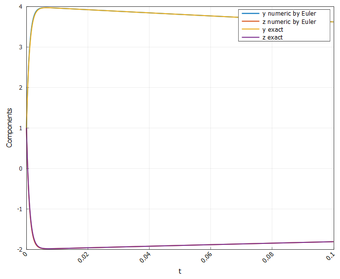

**Рисунок 1 - Решение жесткой системы ОДУ явным методом Эйлера с малым шагом**

На графике видно, что при столь малом шаге численное решение методом явного Эйлера практически совпадает с точным решением обеих компонент. Быстрая компонента с затуханием $e^{-1000t}$ корректно исчезает уже к $t \approx 0.005$, после чего численное решение плавно следует за медленной экспонентой $e^{-t}$ без заметных колебаний.

Для системы с коэффициентом жёсткости $K = 1000$ такой малый шаг удовлетворяет жёсткому ограничению по устойчивости явного Эйлера $h << 1/1000$, поэтому метод остаётся устойчивым и даёт хорошую аппроксимацию, хотя это достигается ценой очень большого числа шагов на коротком промежутке времени. Такой результат хорошо иллюстрирует типичную ситуацию: жёсткую систему можно решать явным методом, но только при сильно заниженном шаге, что делает расчёты неэффективными по сравнению с неявными или многошаговыми методами (Гира, Адамса–Моултона и др.).

**Построим зависимость Евклидовой ошибки (L2 - нормы) от времени для данного решения:**

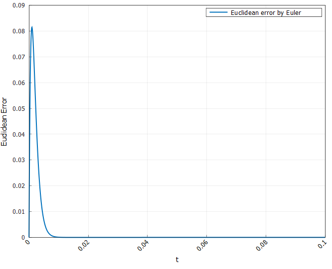

**Рисунок 2 - Зависимость Евклидовой ошибки (L2 - нормы) от времени для Эйлера с малым шагом**

В начале ошибка быстро возрастает до $\approx 0.08 - 0.09$, это момент, когда явный Эйлер грубо аппроксимирует очень быстро затухающую моду $e^{-1000t}$. Затем ошибка столь же быстро падает почти до нуля уже к $t \approx 0.01$. Быстрая компонента затухает, и дальше решение фактически описывается медленной модой $e^{-t}$, которую метод с шагом $h = 0.001$ аппроксимирует довольно точно. Это иллюстрирует жёсткость: из‑за «быстрой» компоненты максимальная ошибка сосредоточена в самом начале, дальше поведение устойчивое и точное при очень маленьком шаге.

---

Продемонстрируем также устойчивое и неустойчивое, устойчивое, но нефизичное поведение метода, связь свойств устойчивости со свойствами жесткости.

Для этого построим график решения при разном шаге:

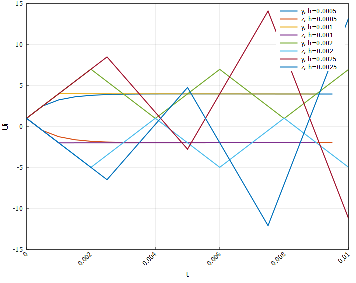

**Рисунок 3 - Решение жесткой системы ОДУ явным методом Эйлера с разным шагом**

Проанализируем решение:

$h = 0.0005, 0.001$: 
Траектории $y(t), z(t$) быстро выходят на плавное затухание. Колебаний и взрывного роста нет → метод устойчив и даёт физически разумное поведение

$h = 0.002$: Значения не растут неограниченно, но появляются заметные осцилляции и “ломаная” траектория → устойчиво, но нефизично: метод формально не расходится, но динамика плохо напоминает реальное гладкое решение жёсткой системы.

$h = 0.0025$: Амплитуды y,z растут, решение “разносит” уже на очень коротком интервале → неустойчивое поведение: шаг выходит за пределы области устойчивости явного Эйлера для жёсткой системы.

**Построим график ошибок:**

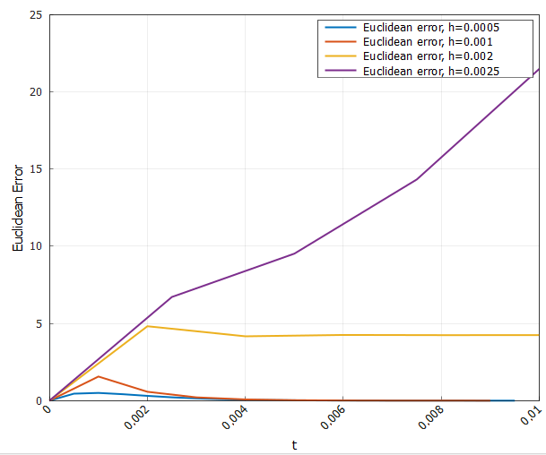

**Рисунок 4 - Зависимость Евклидовой ошибки (L2 - нормы) от времени для Эйлера с разным шагом**

Для малых шагов $h = 0.0005, 0.001$ L2‑ошибка быстро растёт чуть в начале (из‑за плохо пойманной быстрой моды), затем падает и остаётся малой → устойчивое и достаточно точное решение.

При $h = 0.002$ ошибка быстро достигает уровня ≈4 и почти не уменьшается → метод ещё не “взорвался”, но даёт заметно искажённую динамику (устойчиво, но нефизично).

При $h = 0.0025$ ошибка растёт почти линейно вверх до >20 → отражение уже полной неустойчивости схемы.

Такой характер зависимости ошибки от шага показывает, что для жёстких ОДУ ограничения на шаг у явного Эйлера задаются в первую очередь устойчивостью, а не точностью.

---

#### Решение улучшенным Эйлером

Теперь решим нашу систему улучшенным методом Эйлера второго порядка.

Решение системы с шагом $h = 0.001$ имеет вид:

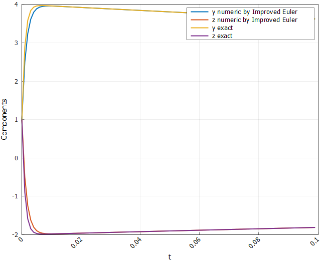

**Рисунок 5 - Решение жесткой системы ОДУ улучшенным методом Эйлера с малым шагом**

На этом графике видно, что улучшенный Эйлер с тем же шагом заметно сильнее «заваливает» траектории $y(t)$ и $z(t)$ относительно точных решений, чем обычный Эйлер. 

Причина: для жёсткой системы шаг уже на границе устойчивости. У улучшенного Эйлера область устойчивости для отрицательных собственных значений «уже», чем у явного Эйлера, поэтому для $\lambda = −1000$ и выбранного $h$ метод попадает ближе к краю или за пределы устойчивости. В результате быстрый режим аппроксимируется хуже, ошибка на старте больше и дольше влияет на решение.

**Построим график ошибок:**

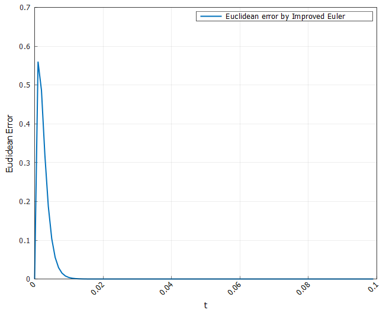

**Рисунок 6 - Зависимость Евклидовой ошибки (L2 - нормы) от времени для улучшенного Эйлера с малым шагом**

В целом, поведение графика аналогично тому, что и у Эйлера.

**Проведем оценку устойчивости метода при разном шаге:**

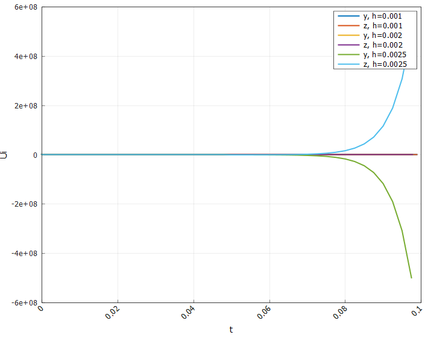

**Рисунок 7 - Решение жесткой системы ОДУ улучшенным методом Эйлера с разным шагом (часть 1)**

Как видим, при шаге $h = 0.0025$ явное расхождение метода, так как для нашей задачи условием устойчивости является $|1 + h\lambda + 0.5(h\lambda)^2| < 1$ => $h < 0.002$.

---

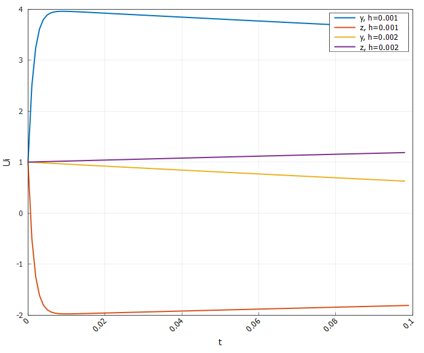

**Рисунок 8 - Решение жесткой системы ОДУ улучшенным методом Эйлера с разным шагом (часть 2)**

На рисунке видно, что для $h = 0.001$ решение быстро выходит на почти линейное поведение: быстрая компонента затухает, и метод ведёт себя устойчиво и физично. При 
$h = 0.002$ траектории уже заметно отклоняются: медленная часть не затухает как должна, появляется дрейф — шаг попадает на границу области устойчивости, поэтому решение хоть и не «взрывается», но заметно нефизично для жёсткой системы.

График ошибок выглядит следующим образом:


**Рисунок 9 - Зависимость Евклидовой ошибки (L2 - нормы) от времени для улучшенного Эйлера с разным шагом**

Наличие столь резкого скачка и неубывания ошибки для шага $h = 0.002$ говорит об устойчивом, но нефизичном поведении.

---

#### Решение Гиром

Для начала решим систему методом гира первого порядка, он же неявный метод Эйлера:

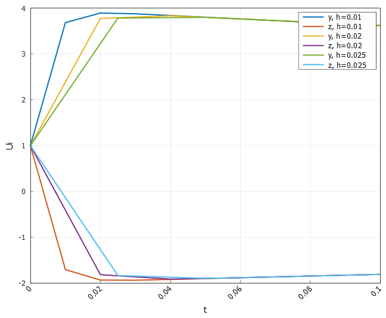

**Рисунок 10 - Решение жесткой системы ОДУ неявным методом Эйлера с разным шагом**

Все три шага $h = 0.01$ 0.02, 0.025$ дают похожие траектории: решения быстро выходят на плато и потом плавно затухают. Метод остаётся устойчивым даже при самом крупном шаге. С точки зрения точности: видно, что при $h = 0.025$ решение сильнее отличается от более мелких шагов, то есть на практике шаг выбирают малым (например, 0.01 или меньше), чтобы уменьшить смещение.

**Построим график ошибок:**

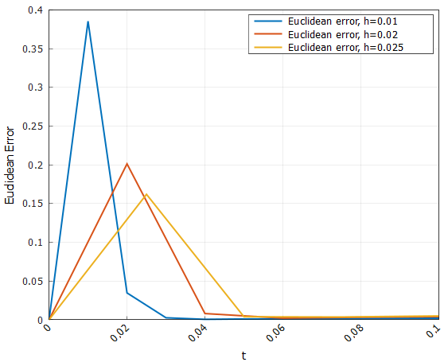

**Рисунок 11 - Зависимость Евклидовой ошибки (L2 - нормы) от времени для неявного Эйлера с разным шагом**

Для всех трёх шагов ошибка сначала растёт до небольшого пика, потом быстро падает к нулю, когда быстрая мода затухает. С уменьшением $h$ максимум ошибки становится ниже: $h = 0.01$ даёт наибольший пик, $h = 0.02 и 0.025$ — ещё меньше. Это показывает, что неявный Эйлер стабилен даже на сравнительно грубом шаге, но точность заметно улучшается при его уменьшении.

---

Теперь решим нашу систему методом Гира 4 порядка с разным стартом:

**Старт по Рунге-Кутты 4 порядка:**

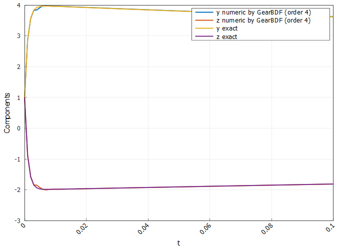

**Рисунок 12 - Решение жесткой системы ОДУ методом Гира 4 порядка с стартом по RK4**

Численные кривые практически сливаются с точными по всему интервалу. Быстрая мода быстро затухает (как и в точном решении), затем идёт плавное почти линейное снижение — никаких осцилляций и «запаздываний». Это показывает, что BDF4 с RK4‑стартом даёт одновременно и устойчивое, и физичное решение жёсткой системы уже на выбранном шаге.

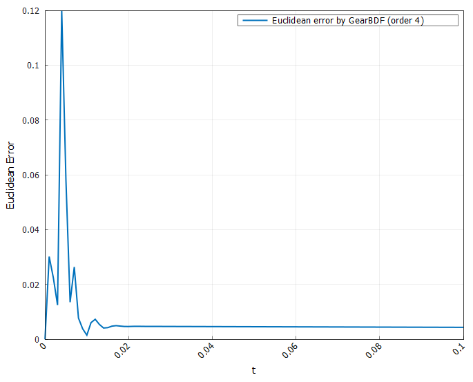

**Рисунок 13 - Зависимость Евклидовой ошибки (L2 - нормы) от времени для метода Гира 4 порядка с стартом по RK4**

В начале видно несколько небольших пиков (до ≈ 0.1 – 0.12) — это стадия, пока метод «поймал» быструю компоненту и отыгрывает стартовые погрешности. Уже после $t \approx 0.01$ ошибка падает до очень малого почти постоянного уровня и дальше практически не растёт. Многошаговый неявный метод высокого порядка хорошо подходит к жёстким ОДУ и по устойчивости, и по точности.

---

**Исследуем влияние стратера на характер решения:**

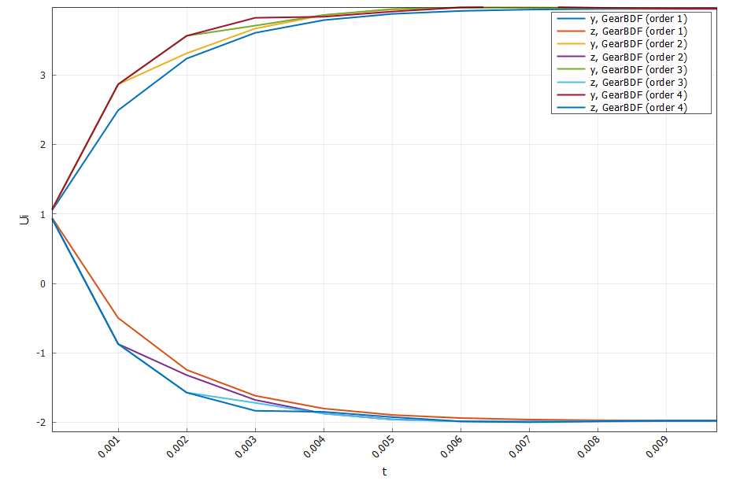

**Рисунок 14 - Решение жесткой системы ОДУ методом Гира 4 порядка с разным стартом**

Все кривые быстро «слипаются», но в первые шаги разные стартёры дают разные траектории. После нескольких шагов BDF4 «перебивает» влияние стартера: решения почти совпадают — проявляется высокая устойчивость и собственная точность схемы. Вывод: стартёр влияет главным образом на первые шаги; чем он точнее, тем меньше начальный «рывок» решения.

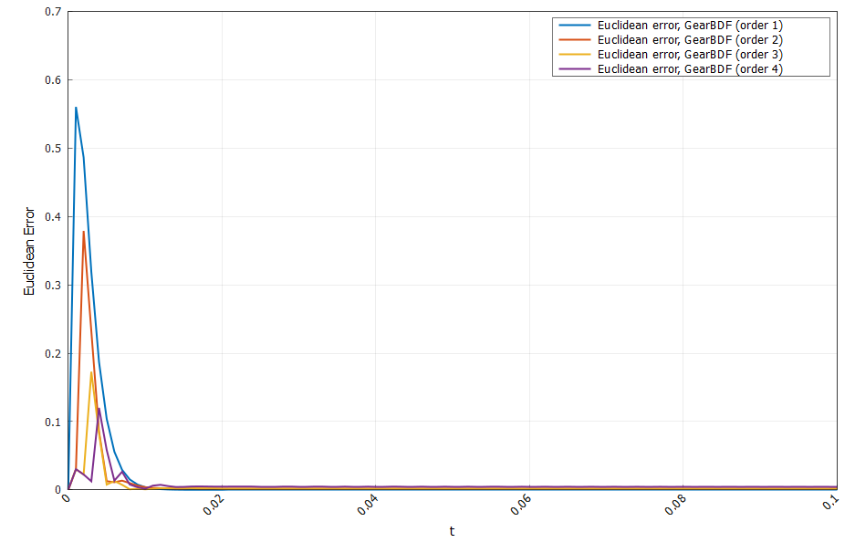

**Рисунок 15 - Зависимость Евклидовой ошибки (L2 - нормы) от времени для метода Гира 4 порядка с разным стартом**

Ошибка у всех стартёров сосредоточена в самом начале (пики до ~0.4 – 0.6), затем стремительно падает почти к нулю. Наиболее высокий и широкий пик у самого грубого стартера; у РК4‑старта пик ниже и быстрее затухает. Дальше кривые ошибок практически совпадают: доминирует уже поведение самого метода Гира 4‑го порядка. Таким образом, качество стартера важно только на коротком промежутке, а дальше решает порядок и устойчивость схемы Гира.

---

### Решение ОДУ

Решим следующее ОДУ:

$$
    U' = 1 + 0.5U^2,
$$

$$
    U(0) = 0.5.
$$

---

#### Решение Адамсом-Башфортом-Моултоном

График решения выглядит следующим образом:

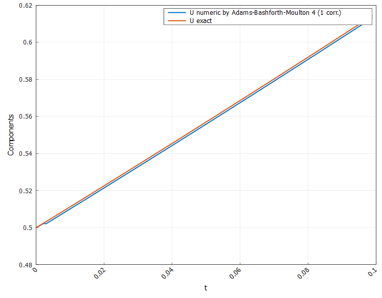

**Рисунок 16 - Решение ОДУ методом Адамса-Башфорта-Моултона**

На графике синяя кривая (численное решение) практически совпадает с оранжевой (точным решением). Небольшое постоянное «отставание» вниз показывает малую систематическую погрешность порядка $O(h^4)$; форма траектории полностью повторяет точное решение, без колебаний и взрывов — поведение устойчивое и физичное.

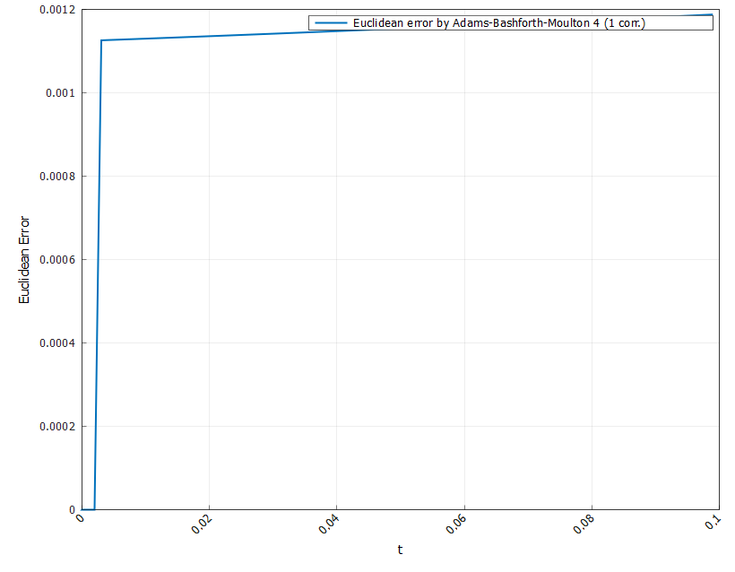

**Рисунок 17 - Зависимость Евклидовой ошибки (L2 - нормы) от времени для метода Адамса-Башфорта-Моултона**

На первом графике L2‑ошибка быстро растёт из нуля до ~ $1.1 \cdot 10^-3$ уже около $t \approx 0.002$ и дальше почти не меняется: метод сразу выходит на стационарный малый уровень ошибки и больше её не накапливает заметно. Это типично для высокопорядкового многошагового метода на гладком, не жёстком ОДУ.

---

**Исследуем как влияет на характер поведения ошибки число итераций коррекции:**

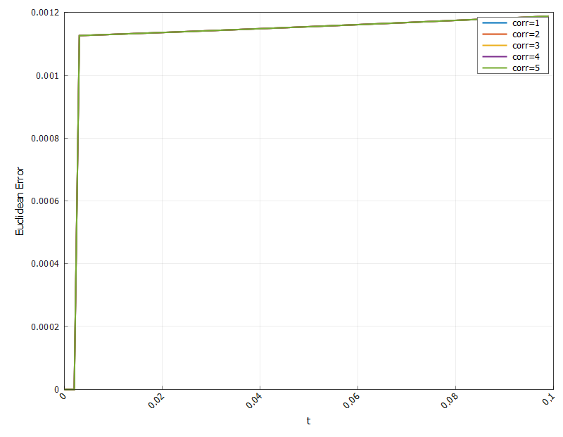

**Рисунок 18 - Зависимость Евклидовой ошибки (L2 - нормы) от времени для метода Адамса-Башфорта-Моултона с разным числом итераций коррекции**

Для достаточно гладкой, не жёсткой задачи с малыми шагами правые части мало меняются на каждом шаге, поэтому уже первая коррекция (или даже нулевая, если использовать только предсказатель) дает результат, отличающийся от последующих итераций на уровне вычислительной точности.

Если бы уравнение было жёстким или сильно нелинейным, итеративная корректировка уже заметно влияла бы на траекторию. В нашей задаче этого эффекта нет из‑за гладкости и простоты.

Так, например, рассмотрим следующую жесткую задачу:

$$
\frac{dy}{dt} = -1000y + 3000 - 2000e^{-t}, \quad y(0) = y_0
$$

И для нее график ошибки в зависимости от числа итераций коррекции имеет следующий вид:

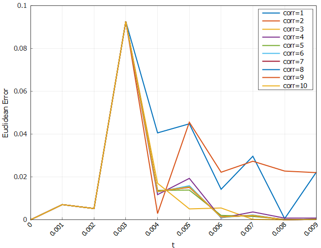

**Рисунок 19 - Зависимость Евклидовой ошибки (L2 - нормы) от времени для метода Адамса-Башфорта-Моултона для жесткого ОДУ**

При 1–2 коррекциях ошибка заметно больше и сильнее «скачет» на первых шагах. Начиная с 3–4 коррекций, кривые быстро сближаются, пики становятся ниже. Для 6–10 коррекций линии практически совпадают: дальнейшее увеличение числа итераций почти не уменьшает ошибку.

Для нашей задачи (жёсткое, но одномерное уравнение, маленький шаг) уже несколько коррекций достаточно, чтобы почти полностью «дойти» до неявной формулы; дальше ограничивающим фактором становится шаг и порядок метода, а не неточность итераций.

---

#### Решение Гиром второго порядка

Решим наше нежесткое ОДУ методом Гира второго порядка:

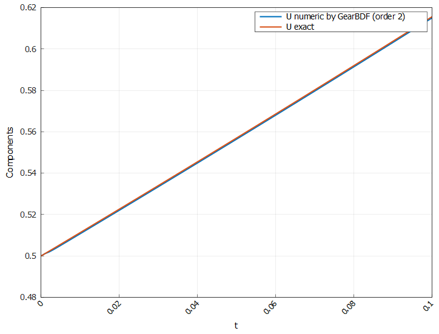

**Рисунок 20 - Решение ОДУ методом Гира второго порядка**

Синяя кривая (численное решение) практически совпадает с оранжевой (точное). Видно небольшое постоянное «отставание» вниз: это систематическая погрешность порядка $O(h^2)$, но форма траектории полностью совпадает. Метод даёт устойчивое и физичное решение на всём интервале.

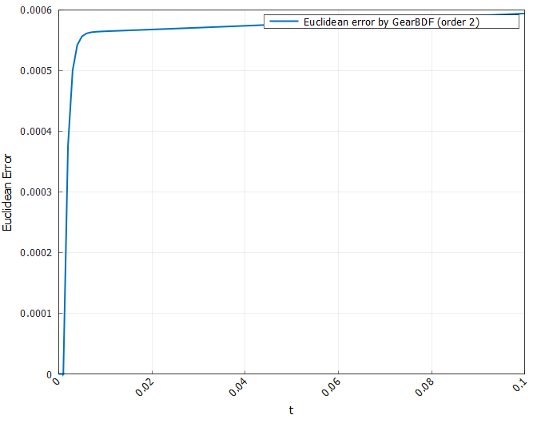

**Рисунок 21 - Зависимость Евклидовой ошибки (L2 - нормы) от времени для метода Гира второго порядка**

Ошибка быстро растёт из нуля до $\approx 6 \cdot 10^{-4}$ в самом начале и дальше почти не меняется. То есть за первые шаги накапливается глобальная погрешность порядка $O(h^2)$,а потом BDF2 уже практически не увеличивает её.

---

## 4. Заключение и выводы 📝

В работе были численно исследованы задачи Коши для обычных и жёстких ОДУ с использованием явных и неявных одношаговых и многошаговых методов. Сравнение метода Эйлера, улучшенного Эйлера, Рунге–Кутты 4‑го порядка, неявного Эйлера, методов Гира (BDF), предиктор–корректорной схемы Адамса–Башфорта–Моултона показало:

- явные методы на жёстких задачах требуют очень малого шага, иначе проявляются неустойчивость или «устойчивое, но нефизичное» поведение;
- неявные и многошаговые методы (неявный Эйлер, BDF, ABM) обеспечивают устойчивые решения жёстких систем при существенно более крупных шагах, при этом многошаговые схемы высокого порядка дают высокую точность;
- влияние стартовых методов и числа коррекций заметно только на начальном участке интегрирования, далее поведение определяется устойчивостью и порядком основного метода;
- для нежёстких задач предиктор–корректорный метод Адамса–Башфорта–Моултона 4‑го порядка демонстрирует малую и почти стационарную ошибку, подтверждая заявленный порядок точности.
