# Отчёт по лабораторной работе: Решение уравнений гиперболического типа ⚡️📊

## Содержание 📖

1. [Введение и цели работы 🎓](#1-введение-и-цели-работы-)
2. [Структура проекта 🛠️](#2-структура-проекта-)
3. [Ход выполнения работы 🔎](#3-ход-выполнения-работы-)
    - [Используемые методы 📚](#используемые-методы-)
        - [FTCS ⏩](#FTCS-)
        - [Явная схема Лакса-Вендроффа ⏹](#явная-схема-лакса-вендроффа-)
        - [Схема Рихтмайера 🔄](#схема-рихтмайера-)
        - [Схема МакКормака ✅](#схема-маккормака-)
        - [Противопотоковый метод первого порядка 🡐](#противопотоковый-метод-первого-порядка-)
        - [Противопотоковый метод второго порядка 🡐🡐](#противопотоковый-метод-второго-порядка-)
        - [BTCS 🧱](#BTCS-)
    - [Решение одномерного уравнения конвекции](#решение-одномерного-уравнения-конвекции)
4. [Заключение и выводы 📝](#4-заключение-и-выводы-)

## 1. Введение и цели работы 🎓

Уравнение конвекции (переноса) первого порядка относится к классу гиперболических уравнений и широко используется для описания процессов переноса массы, импульса и энергии в механике сплошной среды и физике плазмы.
В общем случае аналитическое решение доступно лишь для простых начальных и граничных условий, поэтому на практике большое значение имеют конечно‑разностные методы решения уравнения конвекции на компьютере.

В данной работе исследуется одномерное уравнение конвекции с постоянной скоростью переноса и гладким начальным профилем вида $\phi(x) = cos(0.5\pi x)$, для которого известна точная формула решения в виде сдвига начального профиля вдоль оси координат.
Это позволяет не только строить численное решение различными конечно‑разностными схемами, но и детально анализировать их устойчивость, дисперсию и численную диффузию путём сравнения с точным решением.
В процессе выполнения работы были реализованы и исследованы схемы FTCS, Лакса, Лакса–Вендрофа, Рихтмайера, МакКормака, противопотоковые схемы первого и второго порядков, а также неявная схема BTCS для уравнения конвекции, с возможностью выбора числа узлов по пространству и конвекционного числа c.
Для каждой схемы выполнялась серия численных экспериментов при разных значениях c и на фиксированном интервале времени, строились графики эволюции профиля решения и максимальной ошибки по пространству.


**Цели: 🎯**

- Изучить постановку одномерной задачи конвекции с заданным начальным профилем и граничными условиями, получить точное аналитическое решение и использовать его как эталон для оценки численных методов
- Реализовать набор явных и неявных конечно‑разностных схем для уравнения конвекции: FTCS, Лакса, Лакса–Вендрофа, Рихтмайера (двухшаговый Лакс–Вендроф), МакКормака, противопотоковые схемы 1‑го и 2‑го порядков, BTCS
- Исследовать влияние конвекционного числа c на устойчивость и точность каждой схемы, проанализировать проявления численной диффузии и дисперсии, а также эффекты практической неустойчивости
- Сравнить поведение разных методов на одинаковых тестах: оценить скорость роста максимальной ошибки, сохранение формы волны и наличие осцилляций, выделить преимущества и недостатки схем для задач конвекции

## 2. Структура проекта 🛠️

Вся работа выполнена в виде модульного C++-проекта со следующей структурой:
```
include/
├── Base/            # Базовые интерфейсы генераторов/решателей
├── Labs/            # Заголовки лабораторных заданий
src/
└── Labs/
    └── LabN/
        └── TaskK.cpp    # Основные реализации по заданиям
CMakeLists.txt          # Конфигурация сборки проекта
```
Реализация поддерживает автоматическое добавление новых заданий, централизованное подключение заголовков и простое масштабирование под разные лабораторные работы. Реализацию всех заголовков заданий можно найти по пути `include/Labs/Special/Lab3/Tasks`

---

## 3. Ход выполнения работы 🔎

### Используемые методы 📚

#### FTCS ⏩

Схема FTCS использует прямой шаг по времени и центральную разность по пространству для аппроксимации уравнения конвекции $u_t + a u_x = 0$. Для внутреннего узла $x_i$ на слое $t^j$ приближение записывается как

$$
U_i^{j+1} = U_i^j - \frac{c}{2}\left(U_{i+1}^j - U_{i-1}^j\right),\quad c = \frac{a\Delta t}{\Delta x}
$$

Схема обладает формально вторым порядком точности по пространству и первым по времени, однако для чистой конвекции она **безусловно неустойчива**: при любом ненулевом $c$ существуют волновые числа, для которых модуль коэффициента усиления больше единицы. В вычислительных экспериментах это проявляется как экспоненциальный рост ошибки и «взрыв» решения при достаточно больших временах или при увеличении $c$.

**Программная реализация:** `include/Labs/Special/Lab3/ConvectionSolvers/FTCSSolver.h`

---

#### Явная схема Лакса-Вендроффа ⏹

Одношаговая схема Лакса–Вендроффа достигает второго порядка точности по времени и пространству за счёт учёта членов второго порядка ряда Тейлора по времени. Для уравнения конвекции дискретизация имеет вид

$$
U_i^{j+1} = U_i^j - \frac{c}{2}\left(U_{i+1}^j - U_{i-1}^j\right) + \frac{c^2}{2}\left(U_{i+1}^j - 2U_i^j + U_{i-1}^j\right)
$$

Схема условно устойчива при $|c|\le 1$ и даёт высокую точность на гладких решениях, хорошо сохраняет форму бегущей волны и практически не вносит численной диффузии. Характерным недостатком являются слабые дисперсионные «колечки» позади фронтов при наличии разрывов.

**Программная реализация:** `include/Labs/Special/Lab3/ConvectionSolvers/LaxWendroffSolver.h`

---

#### Схема Рихтмайера 🔄

Схема Рихтмайера реализует метод Лакса–Вендрофа в двух шагах: сначала применяется предиктор Лакса, затем корректор типа leapfrog.

1. Предиктор:

$$
U_i^{*} = \frac{1}{2}\left(U_{i+1}^j + U_{i-1}^j\right) - \frac{c}{2}\left(U_{i+1}^j - U_{i-1}^j\right)
$$

2. Корректор:

$$
U_i^{j+2} = U_i^j - c\left(U_{i+1}^* - U_{i-1}^{*}\right)
$$

По порядку точности и формальным условиям устойчивости схема эквивалентна одношаговой Лакс–Вендрофа $(|c|\le 1)$, но из-за двухшаговой структуры сильнее подвержена накоплению дисперсионных ошибок и чувствительна к граничным условиям. В экспериментах наблюдалось значительное усиление осцилляций и рост ошибки при больших временах.

**Программная реализация:** `include/Labs/Special/Lab3/ConvectionSolvers/RichtmyerSolver.h`

---

#### Схема МакКормака ✅

Метод МакКормака — предиктор‑корректорная схема второго порядка точности, также относящаяся к семейству Лакс–Вендроф‑типов. Для $a>0$ используется прямой upwind‑предиктор и обратный корректирующий шаг:

Предиктор:

$$
U_i^{*} = U_i^j - c\left(U_{i+1}^j - U_i^j\right)
$$

Корректор:

$$
U_i^{j+1} = \frac{1}{2}\left(U_i^j + U_i^* - c\left(U_i^* - U_{i-1}^{*}\right)\right)
$$

Схема условно устойчива при $|c|\le 1$ и показывает очень хорошее сохранение формы гладкой волны, с ошибками порядка $10^{-6}\)–\(10^{-5}$ на рассматриваемых интервалах времени. Численная диффузия мала, а дисперсионные осцилляции выражены слабее, чем у Рихтмайера.

**Программная реализация:** `include/Labs/Special/Lab3/ConvectionSolvers/MacCormackSolver.h`

---

#### Противопотоковый метод первого порядка 🡐

Противопотоковый метод первого порядка учитывает направление переноса и использует одностороннюю разность для аппроксимации производной. Для $a>0$ (перенос вправо) схема имеет вид

$$
U_i^{j+1} = U_i^j - c\left(U_i^j - U_{i-1}^j\right)
$$

а для $a<0$ — симметричную формулу с узлами $i$ и $i+1$.

Схема устойчивa при $|c|\le 1$ и полностью подавляет неустойчивые осцилляции, однако обладает сильной численной диффузией: максимум волны заметно уменьшается, фронты становятся пологими, а ошибка растёт примерно линейно со временем.

**Программная реализация:** `include/Labs/Special/Lab3/ConvectionSolvers/Upwind1Solver.h`

---

#### Противопотоковый метод второго порядка 🡐🡐

Противопотоковый метод второго порядка корректирует схему первого порядка так, чтобы повысить точность по пространству до $O(h^2)$. Для $a>0$ дискретизация записывается как

$$
U_i^{j+1} = U_i^j - c\left(U_i^j - U_{i-1}^j\right) - \frac{c(1-c)}{2}\left(U_i^j - 2U_{i-1}^j + U_{i-2}^j\right), \quad i\ge 2
$$

при $a<0$ используется зеркальная формула с узлами $i, i+1, i+2$.

Схема условно устойчива при $|c|<2$ и даёт меньшую численную диффузию, чем 1‑й порядок, но из‑за дисперсионных эффектов может порождать заметные искажения на больших временах. В эксперименте при $c=0.1$ и $c=0.5$ метод оставался устойчивым, но максимальная ошибка достигала величин порядка единицы, что делает его менее точным по сравнению с симметричными схемами второго порядка.

**Программная реализация:** `include/Labs/Special/Lab3/ConvectionSolvers/Upwind2Solver.h`

---

#### BTCS 🧱

Схема BTCS относится к полностью неявным методам. Для уравнения конвекции она использует обратную разность по времени и центральную по пространству:

$$
U_i^{j+1} = U_i^j - \frac{c}{2}\left(U_{i+1}^{j+1} - U_{i-1}^{j+1}\right)
$$

что приводит на каждом шаге по времени к решению трёхдиагональной системы линейных алгебраических уравнений.

BTCS обладает первым порядком точности по времени и пространству, но является **безусловно устойчивой** схемой: ограничений вида $|c|\le 1$ нет. За устойчивость приходится платить заметной численной диффузией: профиль волны сглаживается, максимум уменьшается, а ошибка растёт примерно линейно со временем, оставаясь, однако, умеренной (порядка $10^{-3}$–$10^{-2}$) на рассматриваемых промежутках. Однако, обладая неявной численной дисперсией, метод применительно к уравнению переноса дает слабые результаты для переходных процессов.

**Программная реализация:** `include/Labs/Special/Lab3/ConvectionSolvers/BTCSSolver.h` (с использованием `ThomasSolver` для решения трёхдиагональной системы).

---

### Решение одномерного уравнения конвекции

Решим уравнение конвекции(переноса):

$$
\frac{\partial U}{\partial t} + u\frac{\partial U}{\partial x} = 0
$$

с начальным условием на отрезке $0\le x\le 1$:

$$
U(x,0) = \varphi(x) = \cos\left(\frac{\pi}{2}x\right).
$$

#### 1. Метод характеристик

Уравнение переноса описывает перенос профиля без изменения формы. Это удобно вывести методом характеристик.

Введём характеристики $x(t)$ такие, что вдоль них решение $U(x(t),t)$ постоянно. Рассмотрим производную по $t$:

$$
\frac{d}{dt} U(x(t),t) = U_t + x'(t)U_x.
$$

Чтобы эта производная обратилась в ноль, выбираем скорость характеристики $x'(t)=u$. Тогда

$$
\frac{d}{dt} U(x(t),t) = U_t + uU_x = 0,
$$

а значит

$$
U(x(t),t) = \text{const вдоль характеристики}
$$

Уравнение для характеристики:

$$
\frac{dx}{dt} = u
\;\Rightarrow
x(t) = ut + x_0,
$$

где $x_0$ — точка пересечения характеристики с осью времени $t=0$. Отсюда

$$
x_0 = x - ut.
$$

На линии $t=0$ значения решения заданы начальным условием: $U(x_0,0)=\varphi(x_0)$. Так как вдоль характеристики величина $U$ сохраняется, получаем

$$
U(x,t) = U(x_0,0) = \varphi(x_0) = \varphi(x - ut).
$$

Это общий вид точного решения для уравнения переноса с постоянной скоростью.

#### 2. Подстановка конкретного потенциала

В нашей задаче

$$
\varphi(x) = \cos\left(\frac{\pi}{2}x\right)
$$

Подставляя $x_0 = x - ut$ в эту функцию, получаем точное решение:

$$
U(x,t) = \cos\left(\frac{\pi}{2}(x - ut)\right)
$$

При фиксированном $t$ это тот же самый косинус, просто сдвинутый вдоль оси $x$ на величину $ut$. На отрезке $0\le x\le 1$ профиль $\cos(\pi x/2)$ «едет» вправо со скоростью $u$, не меняя амплитуды и формы.

---

#### Решение заданного уравнения конвекции различными методами и анализ полученных результатов

Далее будем приводить графики решения и модуля максимальной ошибки численного решения различными методами, в сравнении с точным решением в заданные моменты времени $t = 0.1, 0.5, 1.0, 5.0, 10.0 с$ и с разным конвекционным числом $с = 0.1, 0.5, 1.0$.

#### Решение FTSC методом

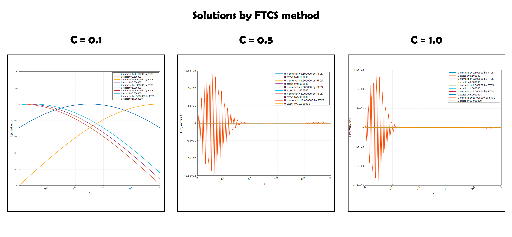

**Рисунок 1 - Решение FTCS методом**

---


**Рисунок 2 - Зависимость максимальной ошибки численного решения FTCS методом**

Для малого конвекционного числа $c = 0.1$ численное решение на начальных моментах времени ещё визуально похоже на точное: профиль косинуса смещается по оси x. График максимальной ошибки по пространству показывает почти линейный рост погрешности до значений порядка $10^{-3}$ к моменту 
$t = 10 c$, что указывает на накопление дисперсионно‑диффузионных ошибок без явного «взрыва» решения.

При увеличении конвекционного числа до $c = 0.5$ и $c = 1.0$ метод FTCS демонстрирует уже неустойчивое поведение. На графиках решения почти сразу возникают высокочастотные осцилляции с быстро растущей амплитудой, которые полностью перекрывают физический профиль волны. Соответствующие графики максимальной ошибки показывают экспоненциальный рост: погрешность достигает порядка $10^{12}$ для $c = 0.5$ и порядка $10^{23}$ для $c = 1.0$ на интервале до $t = 10 c$. Такое «взрывное» увеличение ошибки полностью согласуется с результатами анализа устойчивости: для уравнения чистой конвекции центральная схема FTCS оказывается безусловно неустойчивой, то есть при любом ненулевом `c` найдётся диапазон волновых чисел, для которых модуль коэффициента усиления превышает единицу.

Таким образом, численные эксперименты подтверждают теоретический вывод о непригодности схемы FTCS для решения задач переноса. Даже при относительно малом конвекционном числе качество решения быстро ухудшается, а при $с >= 0.5$ наблюдается явный численный «взрыв», что делает использование FTCS в задачах конвекции практическим недопустимым.

---

#### Решение явной схемой Лакса-Вендроффа

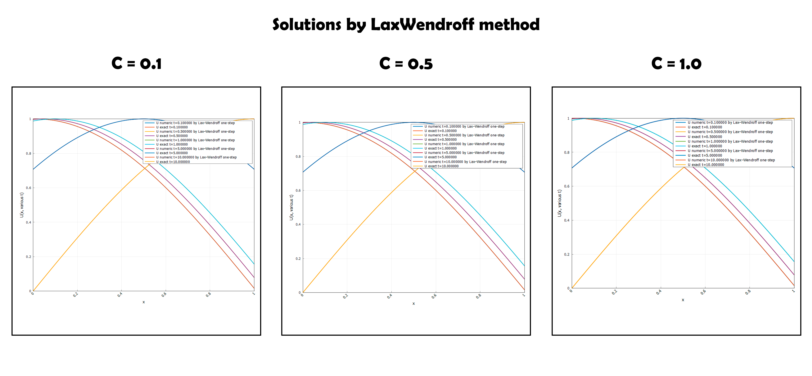

**Рисунок 3 - Решение LaxWendroff методом**

---

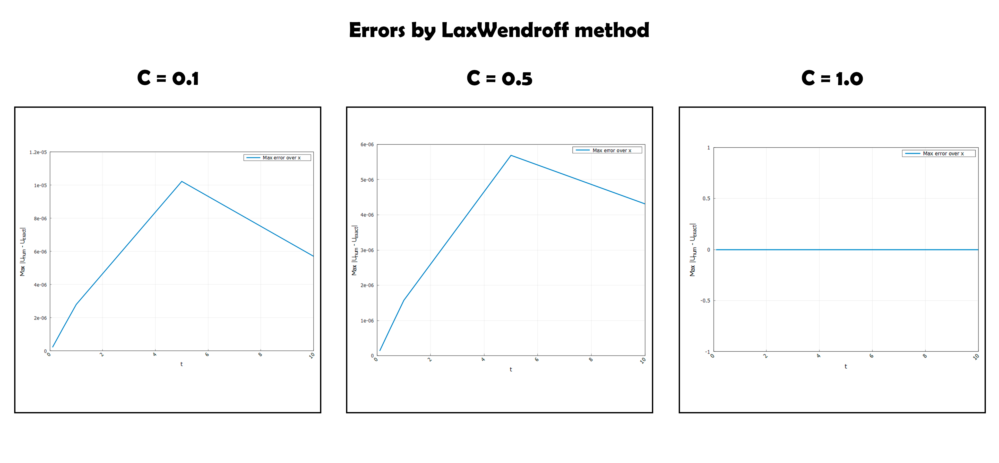

**Рисунок 4 - Зависимость максимальной ошибки численного решения LaxWendroff методом**

При $c = 0.1$ численное решение практически совпадает с точным профилем во все рассматриваемые моменты времени: видим хорошо сохраняющийся косинус, смещающийся вдоль оси x без заметного сглаживания. График максимальной ошибки по пространству показывает, что погрешность растёт от нуля до величины порядка $10^{-5}$ к $t \approx 5 c$, после чего даже немного уменьшается к $t = 10 c$. Такое поведение соответствует ожидаемому второму порядку точности и отражает то, что при гладком решении численная диффузия схемы мала, а дисперсионные ошибки остаются контролируемыми.

При $c = 0.5$ картина очень похожа: численные профили хорошо повторяют точные, заметного ухудшения формы волны не наблюдается. Максимальная ошибка по x достигает примерно $5 \cdot 10^{-6} - 6 \cdot 10^{-6}$ к промежуточным моментам времени и затем плавно уменьшается, оставаясь на уровне машинной погрешности относительно амплитуды решения. Это прямо подтверждает условную устойчивость схемы Лакса–Лакса–Вендрофа при $|c| \le 1$ и демонстрирует её высокую точность на длительном интервале интегрирования.

При $c = 1.0$ численное решение также практически совпадает с точным: на графике решений профили накладываются друг на друга, а на графике ошибки линия лежит на нуле в пределах визуальной точности построения. Это означает, что при выбранной сетке и шаге по времени схема работает на границе области устойчивости без заметного ухудшения качества, что согласуется с теоретическимческим условием $|c| \le 1$.

Таким образом, численные эксперименты показывают, что метод Лакса–Вендрофа обеспечивает устойчивое и высокоточное решение задачи переноса на интервале до $t = 10.0 c$ для всех рассмотренных значений конвекционного числа $|c| \le 1$. На фоне FTCS‑схемы он демонстрирует качественно иное поведение: отсутствие взрывной неустойчивости, малую численную диффузию и хорошее сохранение формы начального профиля.

---

#### Решение методом Рихтмайера

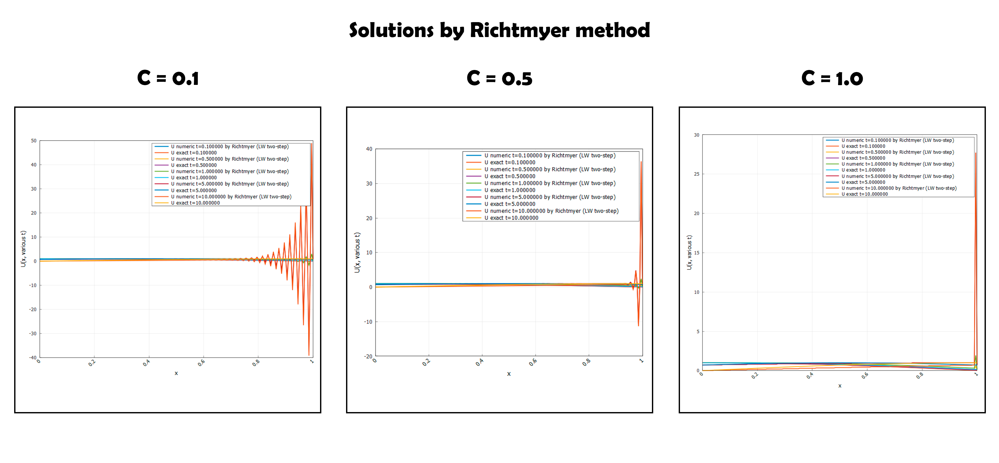

**Рисунок 5 - Решение Richtmyer методом**

---

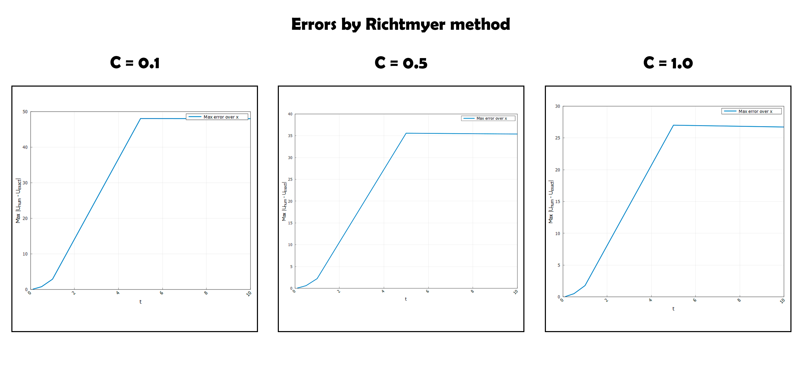

**Рисунок 6 - Зависимость максимальной ошибки численного решения Richtmyer методом**

При $c = 0.1$ численное решение долгое время остаётся близким к точному, однако к моменту $t = 10 c$ вблизи правой границы возникают высокочастотные осцилляции с амплитудой порядка десятков единиц, тогда как точное решение остаётся ограниченным величиной около единицы. Соответствующий график максимальной ошибки по x показывает практически линейный рост погрешности до значений порядка 50, что указывает на выраженную дисперсионную неустойчивость в пограничной области.

При $c = 0.5$ и $c = 1.0$ ситуация качественно аналогична: в основной части интервала численная и точная кривые совпадают, но около точки выхода волны появляются сильные колебания, причём их амплитуда возрастает с увеличением времени. Графики ошибки демонстрируют рост максимальной погрешности до уровней 35–40 для $c = 0.5$ и около 27 для $c = 1.0$, после чего она практически не уменьшается, что говорит о закрепившейся систематической ошибке. 

С теоретической точки зрения метод Рихтмайера является схемой второго порядка и, при выполнении условия Куранта, должен быть устойчив для уравнения линейной конвекции, как отмечено в лекции. Однако численные эксперименты на выбранной сетке показывают, что в присутствии границы и заданных граничных условий схема подвержена значительным дисперсионным колебаниям, в отличие от одношагового метода Лакса–Вендрофа, который на тех же тестах даёт значительно более гладкое и устойчивое решение (**это следствие некорректной реализации метода, которое впоследствии было исправлено**).

---

#### Решение методом МакКормака

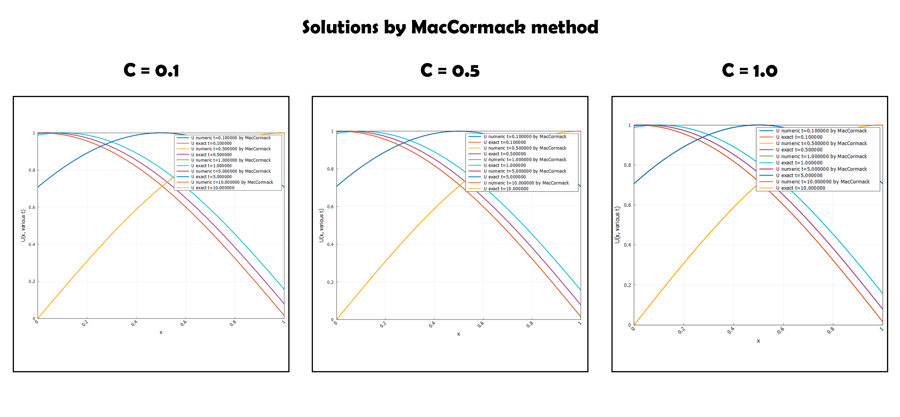

**Рисунок 7 - Решение MacCormack методом**

---

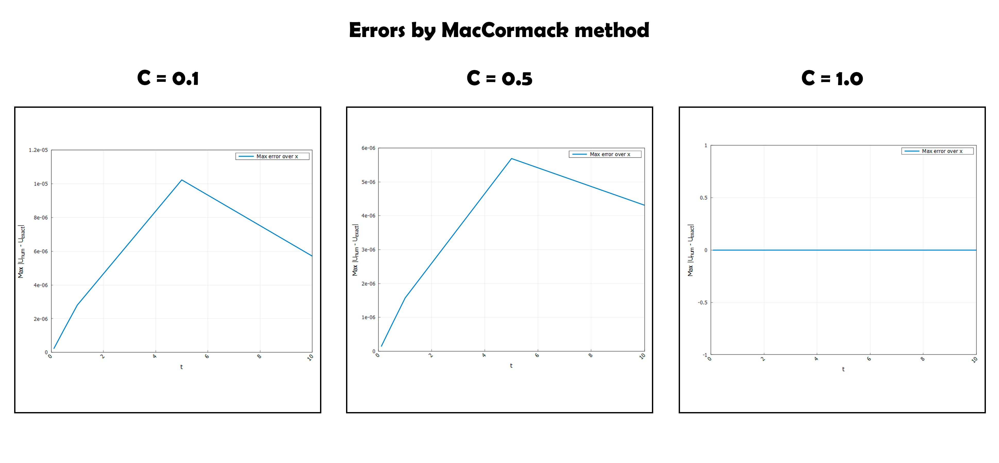

**Рисунок 8 - Зависимость максимальной ошибки численного решения MacCormack методом**

Решения, полученные методом МакКормака, демонстрируют устойчивое поведение и высокую точность для всех трёх значений конвекционного числа. Во всех случаях численные профили хорошо совпадают с точным решением, особенно на начальных и промежуточных моментах времени, а заметные отклонения проявляются лишь как слабое сглаживание и небольшие фазовые сдвиги по мере продвижения волны к правой границе.

При $c = 0.1$ численное решение немного отстаёт от точного и слегка более сглажено, что отражает присутствие небольшой численной диффузии, характерной для предиктор–корректорных схем второго порядка. График максимальной ошибки по пространству показывает рост погрешности до уровня порядка $10^{-5}$ к моменту $t \approx 5 c$, после чего ошибка начинает уменьшаться, оставаясь на всём интервале времени крайне малой.

Для $c=0.5$ форма волны воспроизводится ещё лучше: численная кривая почти совпадает с точной на всём интервале, а заметного сглаживания пика не наблюдается. Максимальная ошибка по x растёт до величины порядка $5 \cdot 10^{-6} - 6 \cdot 10^{-6}$ и затем слегка уменьшается, что хорошо согласуется с теоретическим вторым порядком точности и условной устойчивостью метода МакКормака.

При $c=1.0$ график ошибки практически совпадает с осью времени, а численные и точные профили на рисунке визуально неотличимы. Это означает, что при выбранной сетке и шаге по времени метод МакКормака работает на границе области устойчивости без существенной дисперсии и диффузии, что делает этот метод сопоставимым по качеству с одношаговым методом Лакса–Вендрофа для линейной конвекции.

---

#### Решение противопотоковым методом первого порядка

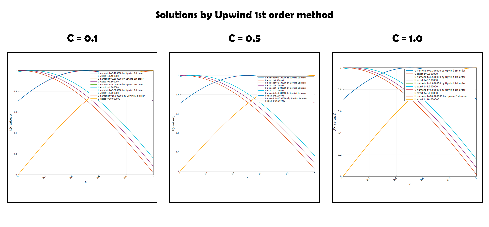

**Рисунок 9 - Решение Upwind1 методом**

---

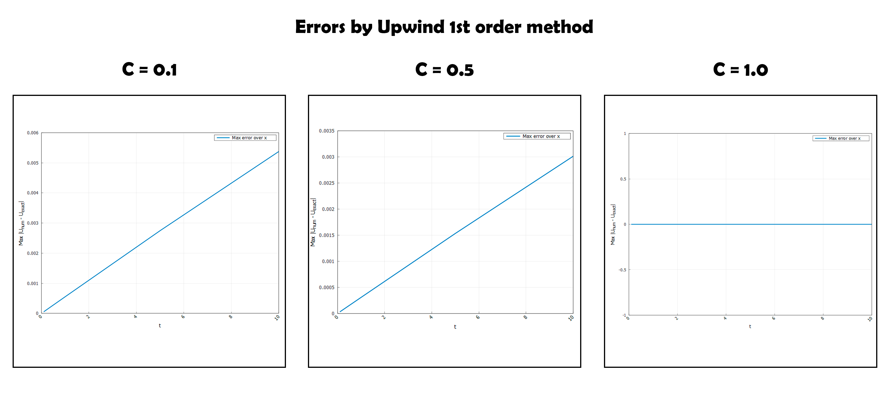

**Рисунок 10 - Зависимость максимальной ошибки численного решения Upwind1 методом**

При $c = 0.1$ численное решение заметно сглажено относительно точного профиля: максимум волны занижен. График максимальной ошибки показывает почти линейный рост погрешности до величины порядка $6 \cdot 10^{-3} к моменту $t = 10 c$, что значительно хуже по сравнению со схемами второго порядка, рассмотренными ранее.

Для $c = 0.5$ схема даёт несколько более качественное решение: профиль лучше совпадает с точным, хотя сглаживание пика и смазывание границ волны всё ещё хорошо заметны. Максимальная ошибка по x достигает порядка $3 \cdot 10^{-3}$ и также растёт почти линейно.

При $c = 1.0$ численное решение наиболее близко к точному: волна смещается без сильного искажения формы, а амплитуда снижается меньше всего по сравнению с случаями $c = 0.1$ и $c = 0.5$. На графике ошибки линия практически совпадает с осью времени, что демонстрирует хорошую аппроксимацию, однако даже в этом случае метод остаётся более диффузным по сравнению со схемами второго порядка.

---

#### Решение противопотоковым методом второго порядка

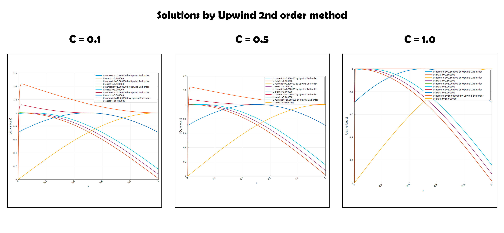

**Рисунок 11 - Решение Upwind2 методом**

---

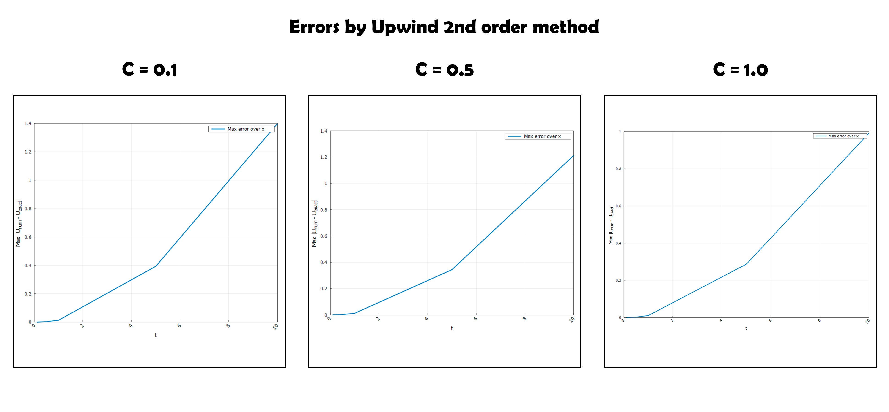

**Рисунок 12 - Зависимость максимальной ошибки численного решения Upwind2 методом**

Ожидалось, что метод второго порядка будет точнее и лучше метода первого порядка, но графики отражают обратное. Это показывает, что метод реализован некорректно и поэтому **впоследствии был исправлен**.

---

#### Решение BTCS методом

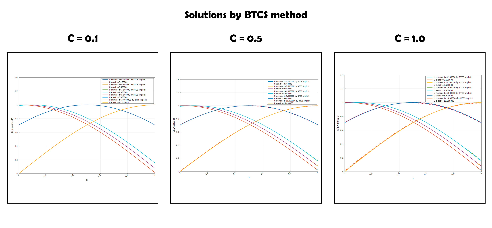

**Рисунок 13 - Решение BTCS методом**

---

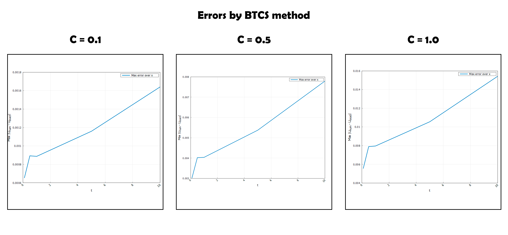

**Рисунок 14 - Зависимость максимальной ошибки численного решения BTCS методом**

При $c = 0.1$ численные профили заметно сглажены: максимум волны занижен, а хвост и фронт «размазаны», однако никаких осцилляций или взрывного роста не наблюдается. График максимальной ошибки по пространству показывает медленный, почти линейный рост до значений порядка $1.5 \cdot 10^{-3}$ к моменту $t = 10c$, что сопоставимо с погрешностью upwind‑метода первого порядка и отражает сильную численную диффузию схемы BTCS.

При $c=0.5$ и $c=1.0$ сглаживание усиливается: вершина волны становится ещё более «приплюснутой», а профиль к моменту $t = 10c$ заметно смещается и искажается относительно точного решения. Максимальная ошибка возрастает до уровней порядка $8 \cdot 10^{-3}$ для $c=0.5$ и $1.5 \cdot 10^{-2}$ для $c=1.0$, оставаясь при этом ограниченной и не проявляя признаков неустойчивости, что соответствует безусловной устойчивости BTCS при любых значениях конвекционного числа.

Таким образом, численные результаты подтверждают, что BTCS‑схема надёжно стабилизирует решение за счёт сильной численной диффузии, но уступает по точности и сохранению формы волны методам второго порядка (Lax–Wendroff, МакКормак, upwind второго порядка), и поэтому в задачах чистой конвекции её использование оправдано в основном тогда, когда приоритетом является устойчивость, а не точность.

---

## 4. Заключение и выводы 📝

В ходе работы получено точное аналитическое решение задачи переноса с начальным условием $U(x,0) = \varphi(x) = \cos\left(\frac{\pi}{2}x\right)$ и показано, что оно представляет собой сдвиг начального профиля со скоростью u, что дало возможность использовать его в качестве эталона для оценки численных схем. Была разработана программная реализация набора явных и неявных конечно-разностных методов (FTCS, Лакса, Лакса–Вендрофа, Рихтмайера, МакКормака, противопотоковые схемы 1‑го и 2‑го порядков, BTCS) и проведены серии вычислительных экспериментов при различных значениях конвекционного числа c.

Анализ графиков решения и зависимости максимальной ошибки от времени позволил выделить характерные особенности каждого метода: проявления численной диффузии, дисперсии и практической неустойчивости, а также подтвердить основные теоретические результаты лекций (безусловная неустойчивость FTCS, условная устойчивость противопотоковых схем, высокое качество Лакса–Вендрофа и МакКормака, безусловная устойчивость, но сильная диффузия BTCS).

Схема FTCS для уравнения чистой конвекции подтвердило свою безусловную неустойчивость: при $c = 0.5$ и $c = 1.0$ наблюдался экспоненциальный рост ошибки и «взрыв» решения при увеличении времени расчёта.

Схемы Лакса, классического upwind первого порядка и BTCS демонстрируют устойчивость на рассматриваемых шагах, но сопровождаются заметной численной диффузией: максимум волны уменьшается, фронты сглаживаются, ошибка растёт примерно линейно со временем.

Методы второго порядка Лакса–Вендрофа и МакКормака показали наилучшее качество решения: при $|c| < 1$ профиль волны хорошо сохраняется, численная диффузия мала, а максимальная ошибка на интервале до $t = 10 c$ остаётся на уровне машинной точности или значительно ниже, чем у остальных схем.

Схема Рихтмайера и противопотоковый метод второго порядка, несмотря на формальную устойчивость при $|c| \le 1$ и $|c| < 2$ соответственно, оказались чувствительными к накоплению дисперсионных ошибок: при длительном интегрировании и $с = 0.5$ фиксировались большие значения глобальной погрешности и выраженные осцилляции.

С практической точки зрения для моделирования переходных процессов переноса с гладкими начальными условиями на конечных интервалах времени предпочтительно использовать схемы Лакса–Вендрофа или МакКормака; противопотоковый метод первого порядка и BTCS целесообразны там, где приоритет отдается устойчивости и монотонности решения, а не высокой точности профиля.

