# Отчёт по лабораторной работе: Решение интегральных уравнений ⚡️📊

## Содержание 📖

1. [Введение и цели работы 🎓](#1-введение-и-цели-работы-)
2. [Структура проекта 🛠️](#2-структура-проекта-)
3. [Ход выполнения работы 🔎](#3-ход-выполнения-работы-)
    - [Используемые методы 📚](#используемые-методы-)
        - [Метод трапеций 🔺](#метод-трапеций-)
        - [Метод Гаусса 🎯](#метод-гаусса-)
        - [Метод Симпсона 🎢](#vtnjl-симпсона-)
    - [Решение уравнения Фредгольма 🧩](#решение-уравнения-фредгольма-)
        - [Решение методом трапеций 🔺](#решение-методом-трапеций-)
        - [Решение методом Гаусса 🎯](#решение-методом-гаусса-)
    - [Решение уравнения Вольтерры 🔁](#решение-уравнения-вольтерры-)
        - [Решение методом сведения к ОДУ 🧮](#решение-методом-сведения-к-оду-)
        - [Решение методом Симпсона 🎢](#решение-методом-симпсона-)
4. [Заключение и выводы 📝](#4-заключение-и-выводы-)

## 1. Введение и цели работы 🎓

Интегральные уравнения являются важным инструментом математического моделирования процессов в физике, механике, теории упругости, теплообмена, радиофизике и других областях, где связи между величинами задаются в виде интегральных соотношений, а не только дифференциальных зависимостей. Во многих прикладных задачах аналитическое решение интегральных уравнений оказывается затруднительным или невозможным, поэтому особое значение приобретает разработка и применение численных методов для уравнений Вольтерра и Фредгольма различных типов.

В данной лабораторной работе рассматриваются линейные интегральные уравнения с различными ядрами и правыми частями, что позволяет исследовать особенности приближённого решения при изменении шага сетки, вида квадратурных формул и параметров уравнения. Построение и анализ численных решений на серии тестовых задач дают возможность оценить устойчивость и точность алгоритмов, а также проследить влияние свойств ядра (гладкость, осцилляции, вырождение) на результаты вычислений.

При выполнении работы используются вычислительные средства для реализации выбранных численных схем, построения сеток на заданных интервалах, выполнения поэлементных интегрирований, а также визуализации полученных решений и их сравнения с эталонными или более точными приближениями. Особое внимание уделяется анализу погрешностей, влиянию шага разбиения и параметров модели на качество приближённого решения.

**Цели: 🎯**

- Изучить постановку задач для линейных интегральных уравнений Вольтерра и Фредгольма на заданных отрезках и в различных вариантах задания ядра и правой части
- Освоить применение численных методов решения интегральных уравнений (квадратурные схемы, замена уравнения линейной системой) при различных значениях шага сетки и параметров уравнения
- Исследовать влияние шага разбиения, свойств ядра и параметров задачи на устойчивость и точность численного решения, провести сравнение результатов для разных вариантов аппроксимации интеграла
- Выполнить обработку и анализ полученных численных данных, построить графики решений и оценок погрешности, сделать выводы о применимости рассматриваемых методов к решаемым задачам

## 2. Структура проекта 🛠️

Вся работа выполнена в виде модульного C++-проекта со следующей структурой:
```
include/
├── Base/            # Базовые интерфейсы генераторов/решателей
├── Labs/            # Заголовки лабораторных заданий
src/
└── Labs/
    └── LabN/
        └── TaskK.cpp    # Основные реализации по заданиям
CMakeLists.txt          # Конфигурация сборки проекта
```
Реализация поддерживает автоматическое добавление новых заданий, централизованное подключение заголовков и простое масштабирование под разные лабораторные работы. Реализацию всех заголовков заданий можно найти по пути `include/Labs/Special/Lab4/Tasks`

---

## 3. Ход выполнения работы 🔎

### Используемые методы 📚

В данной работе для численного решения интегральных уравнений используются классические квадратурные методы: _метод трапеций_, _метод Симпсона_ и _гауссовые квадратуры_ (формулы Гаусса–Кристоффеля). Все методы реализованы в виде обобщённых интеграторов, принимающих на вход функцию, границы интегрирования и параметры точности, и возвращающих численное значение интеграла вместе с историей оценок и ошибок.

#### Метод трапеций 🔺

Метод трапеций — это составная квадратурная формула, в которой подынтегральная функция на каждом подынтервале $[x_i, x_{i+1}]$ аппроксимируется линейной функцией, а интеграл на $[a,b]$ заменяется суммой площадей трапеций. При равномерном разбиении отрезка $[a,b]$ на $n$ частей с шагом $h = \frac{b-a}{n}$ приближённое значение интеграла вычисляется по формуле:

$$
\int_a^b f(x)dx \approx T_n(f) = h\left[\frac{f(x_0) + f(x_n)}{2} + \sum_{i=1}^{n-1} f(x_i)\right], \quad x_i = a + i h
$$

В реализации используется последовательное удвоение числа интервалов $n \to 2n$ и оценка погрешности по разности двух последовательных приближений $T_n(f)$ и $T_{2n}(f)$, что позволяет выполнять простейший адаптивный контроль точности.

**Программную реализацию метода можно найти по пути** `include/Labs/Lab3/IntegralSolvers/TrapezoidSolver.h`

---

#### Метод Гаусса 🎯

Гауссовые квадратуры приближают интеграл взвешенной суммой значений функции в специально выбранных узлах, обеспечивая точность для многочленов максимально возможной степени при фиксированном числе узлов. На стандартном отрезке $[-1,1]$ формула Гаусса порядка $n$ записывается как:

$$
\int_{-1}^{1} f(t)dt \approx \sum_{i=1}^{n} \omega_if(t_i),
$$

где $t_i$ — гауссовы узлы, а $\omega_i$ — соответствующие веса, задаваемые таблицей для каждого $n$. Для произвольного отрезка $[a,b]$ используется аффинное преобразование:

$$
x = \frac{a+b}{2} + \frac{b-a}{2}t,
$$

в результате чего формула принимает вид:

$$
\int_a^b f(x)dx \approx \frac{b-a}{2} \sum_{i=1}^{n} \omega_{i}f\left(\frac{a+b}{2} + \frac{b-a}{2}t_i\right).
$$

В реализации последовательно увеличивается число узлов от $2$ до заданного максимума, на каждом шаге вычисляется очередная оценка интеграла и по разности соседних оценок строится оценка погрешности и история сходимости.

**Программную реализацию метода можно найти по пути** `include/Labs/Lab3/IntegralSolvers/GaussSolver.h`

---

#### Метод Симпсона 🎢

Метод Симпсона (параболическая формула) использует аппроксимацию подынтегральной функции квадратичным многочленом на каждой паре соседних интервалов, что обеспечивает более высокий порядок точности по сравнению с методом трапеций. Для равномерного разбиения $[a,b]$ на чётное число частей $n$ с шагом $h = \frac{b-a}{n}$ формула имеет вид:

$$
\int_a^b f(x)dx \approx S_n(f) = \frac{h}{3}\left[f(x_0) + f(x_n) + 4\sum_{\substack{i=1 \\ i\ \text{нечёт}}}^{n-1} f(x_i) + 2\sum_{\substack{i=2 \\ i\ \text{чёт}}}^{n-2} f(x_i)\right],
\quad x_i = a + i h
$$

В программе применяется составной метод Симпсона с удвоением числа интервалов и оценкой погрешности по разности соседних приближений $S_n(f)$ и $S_{2n}(f)$, делённой на константу, связанную с порядком метода.

**Программную реализацию метода можно найти по пути** `include/Labs/Lab3/IntegralSolvers/SimpsonSolver.h`

---

### Решение уравнения Фредгольма 🧩

Рассматривается линейное интегральное уравнение Фредгольма второго рода вида:

$$
x(t) + \lambda \int_a^b Q(t,s)x(s)ds = f(t), \quad t \in [a,b]
$$

Для численного решения уравнение приводится к системе линейных алгебраических уравнений с помощью коллокации в узлах равномерной сетки и аппроксимации функции $x(s)$ по базису, построенному на этих узлах.

---

#### Построение сетки и базиса

На отрезке $[a,b]$ строится равномерная сетка из $n$ узлов с шагом $h$:

$$
t_i = a + i h, \quad
h = \frac{b-a}{n-1}, \quad i = 0,\dots,n-1.
$$

Приближённое решение представляется в виде линейной комбинации базисных функций $\phi_j(s)$, каждая из которых равна 1 в узле $t_j$ и 0 в остальных узлах (линейная интерполяция по сетке):

$$
x(s) \approx \sum_{j=0}^{n-1} x_j \phi_j(s), \qquad
\phi_j(t_k) = \delta_{jk}
$$

где коэффициенты $x_j$ — неизвестные значения решения в узлах $t_j$.

---

#### Получение системы линейных уравнений

Подставляя аппроксимацию $x(s)$ в уравнение Фредгольма и требуя его выполнения в узлах коллокации $t = t_i$, получаем систему:

$$
x(t_i) + \lambda \int_a^b Q(t_i,s)x(s)ds = f(t_i),
\quad i = 0,\dots,n-1.
$$

С учётом разложения по базису:

$$
x(t_i) \approx x_i, \qquad
\int_a^b Q(t_i,s)x(s)ds
\approx \sum_{j=0}^{n-1} x_j \int_a^b Q(t_i,s)\phi_j(s)ds.
$$

Обозначая

$$
K_{ij} = \int_a^b Q(t_i,s)\phi_j(s)ds,
$$

получаем систему линейных алгебраических уравнений

$$
x_i + \lambda \sum_{j=0}^{n-1} K_{ij}x_j = f(t_i),
\quad i = 0,\dots,n-1
$$

В матричной форме это записывается как:

$$
\bigl(I + \lambda K\bigr)\mathbf{x} = \mathbf{f}
$$

где $I$ — единичная матрица, $K = (K_{ij})$,  
$\mathbf{x} = (x_0,\dots,x_{n-1})^{\mathsf{T}}$,
$\mathbf{f} = (f(t_0),\dots,f(t_{n-1}))^{\mathsf{T}}$.

В коде элементы матрицы задаются выражением

```cpp
A(i,j) = (i == j ? 1.0 : 0.0) + lambda * K_ij;
```

что соответствует матрице $I + \lambda K$.

---

#### Численное вычисление матрицы K

Каждый элемент $K_{ij}$ вычисляется как интеграл:

$$
K_{ij} = \int_a^b Q(t_i,s)\phi_j(s)ds
$$

где подынтегральная функция в коде задаётся лямбда-выражением

```cpp
auto integrand = [&](double s) {
return kernel(ti, s) * basis(j, s);
};
```

и затем интегрируется любым из реализованных квадратурных методов (трапеции, Симпсон, Гаусс):

```cpp
auto res = integrator.integrate(integrand, a, b, 0.0);
double K_ij = res ? res->integral : 0.0;
```

тем самым численно реализуя формулу для $K_{ij}$.

---

#### Решение СЛАУ и восстановление решения

После построения матрицы $A = I + \lambda K$ и вектора правой части $\mathbf{f}$ система

$$
A \mathbf{x} = \mathbf{f}
$$

решается методом LU‑разложения с помощью библиотеки `Eigen`:

```cpp
Eigen::FullPivLUEigen::MatrixXd lu(A);
Eigen::VectorXd x_vec = lu.solve(b_vec);
```

Полученные компоненты $x_i$ интерпретируются как численное приближение $x(t_i)$ решения уравнения Фредгольма, а для произвольного $s$ значение $x(s)$ восстанавливается по линейной интерполяции по сетке.

**Реализацию описанного можно найти по пути** `include/Labs/Special/Lab4/Tasks/IntegralEquationTask.h`

---

#### Решение методом трапеций 🔺

Рассмотрим следующее уравнение Фредгольма:

$$
x(t) + \int_1^2 (t+2s)x(s)ds = t^2 - 1
$$

Его точное решение, найденное методом вырожденных ядер, имеет вид:

$$
    x(t) = t^2 - \frac{5}{32}t - \frac{373}{192}
$$

Теперь решим его методом трапеций с тремя узлами на сетке:

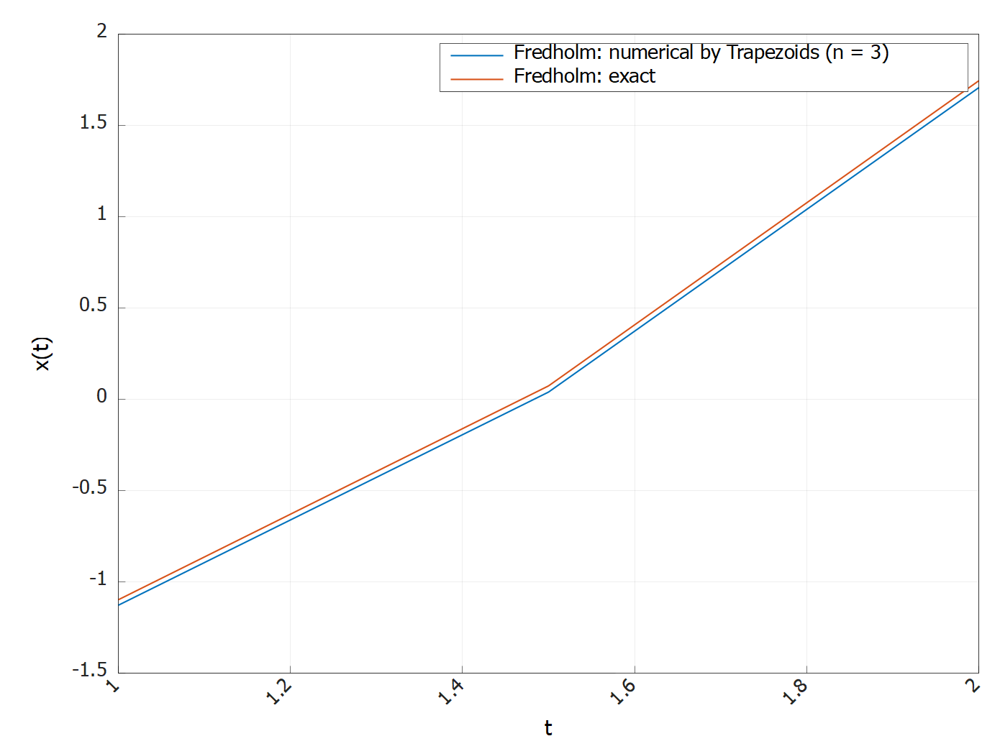

**Рисунок 1 - Решение уравнения Фредгольма методом трапеций на сетке с тремя узлами**

Численное решение заметно повторяет форму точного решения, но систематически немного занижено, что соответствует ожидаемой погрешности при очень грубой сетке из трёх узлов.

Построим также график зависимости $|x_{num} - x_{exact}|$ от времени $t$:


**Рисунок 2 - Зависимость ошибки решения уравнения Фредгольма методом трапеций на сетке с тремя узлами от времени**

График ошибки демонстрирует, что модуль ошибки остаётся небольшим (порядка $3 \cdot 10^{-2}$) и монотонно растёт по мере удаления от левой границы интервала. Такой характер указывает на доминирование дискретизационной ошибки, связанной с малым числом узлов сетки уравнения, при том что сама квадратурная формула трапеций отрабатывает стабильно и без осцилляций.

Сравним численно полученные значения с точным решением в узлах сетки:

**Таблица 1 - Сравнение точного и численного решения методом трапеций в 3 узлах сетки**

| t   | Численно    | Точно | Ошибка |
|:---:|:-----------:|:-----------:|:----------------:|
| 1.0 | -1.12890726 | -1.09895833 | 0.02994893       |
| 1.5 | 0.03906182  | 0.07291667  | 0.03385484       |
| 2.0 | 1.70703091  | 1.74479167  | 0.03776075       |

Численное решение методом трапеций на сетке из трёх узлов даёт значения, очень близкие к точному решению: относительная ошибка остаётся на уровне $3 \cdot 10^{-2}$ во всех узлах. Это показывает, что даже при грубой дискретизации метод корректно воспроизводит форму решения, но накопленная ошибка постепенно растёт от левой к правой границе из‑за ограниченного числа узлов сетки, а не из‑за нестабильности самого квадратурного алгоритма.

---

Теперь решим это же уравнение, но только на сетке с 10 узлами:

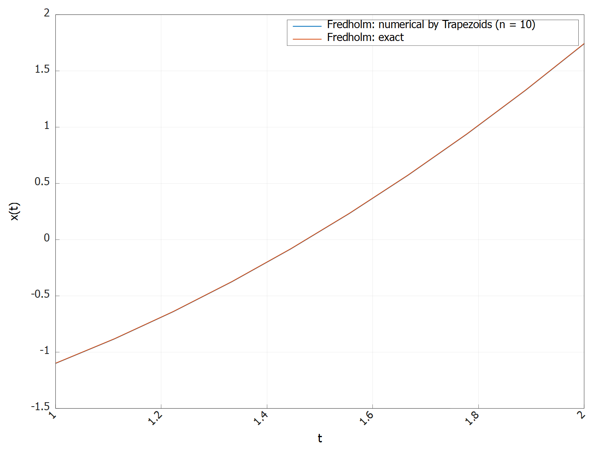

**Рисунок 3 - Решение уравнения Фредгольма методом трапеций на сетке с 10 узлами**

График решения показывает, что при числе узлов сетки $n = 10$ численное решение методом трапеций практически полностью совпадает с точным: две кривые визуально не различимы на всём интервале. Это означает, что при более тонкой дискретизации ошибка аппроксимации уравнения становится пренебрежимо малой относительно масштаба самой функции.

Посмотрим на график ошибки:

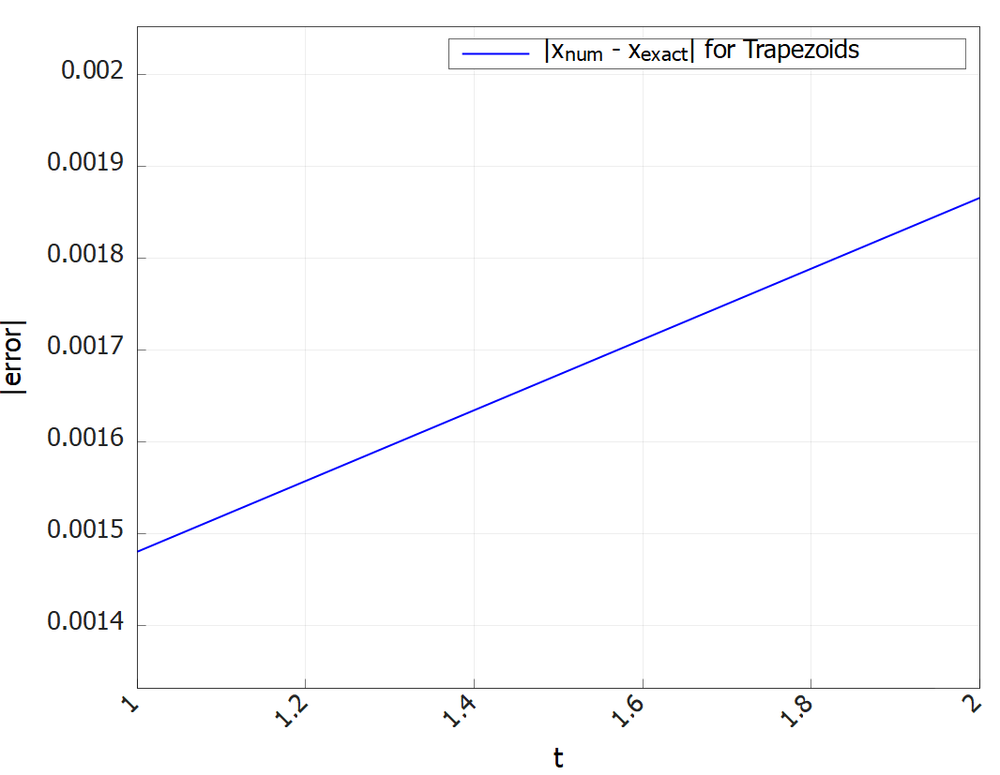

**Рисунок 4 - Зависимость ошибки решения уравнения Фредгольма методом трапеций на сетке с 10 узлами от времени**

График 4 показывает, что ошибка лежит на уровне порядка $10^{-3}$ и также плавно, почти линейно возрастает к правому краю интервала. По сравнению со случаем $n = 3$ погрешность уменьшилась примерно на порядок, что хорошо иллюстрирует улучшение точности при увеличении числа узлов сетки при неизменном квадратурном методе трапеций.

Снова сравним численно полученные значения с точным решением в узлах сетки:

**Таблица 2 - Сравнение точного и численного решения методом трапеций в 10 узлах сетки**

| t         | Численно     | Точно       | Ошибка    |
|:---------:|:------------:|:-----------:|:---------:|
| 1.00000000 | -1.10043871 | -1.09895833 | 0.00148038 |
| 1.11111111 | -0.88327473 | -0.88175154 | 0.00152318 |
| 1.22222222 | -0.64141938 | -0.63985340 | 0.00156599 |
| 1.33333333 | -0.37487268 | -0.37326389 | 0.00160879 |
| 1.44444444 | -0.08363462 | -0.08198302 | 0.00165160 |
| 1.55555556 | 0.23229480  | 0.23398920  | 0.00169440 |
| 1.66666667 | 0.57291557  | 0.57465278  | 0.00173721 |
| 1.77777778 | 0.93822771  | 0.94000772  | 0.00178001 |
| 1.88888889 | 1.32823120  | 1.33005401  | 0.00182282 |
| 2.00000000 | 1.74292605  | 1.74479167  | 0.00186562 |

При увеличении числа узлов сетки до десяти максимальная абсолютная ошибка во всех узлах примерно на порядок меньше, чем в случае трёх узлов. Это подтверждает, что основным источником погрешности является дискретизация уравнения по времени.

---

#### Решение методом Гаусса 🎯

Решим всё то же уравнение Фредгольма методом гаусса. Для трёх узлов на сетке, решая десяти-узловым методом Гаусса, получим:

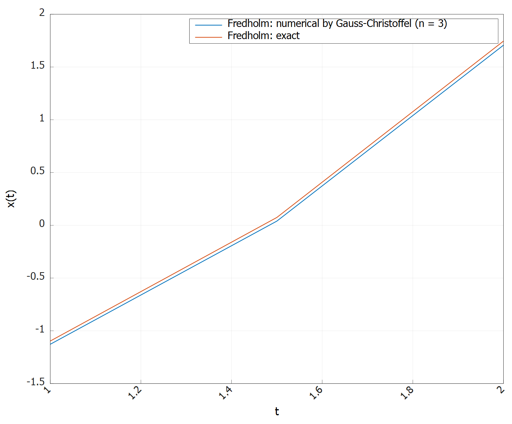

**Рисунок 5 - Решение уравнения Фредгольма методом Гаусса на сетке с тремя узлами**

График ошибки:

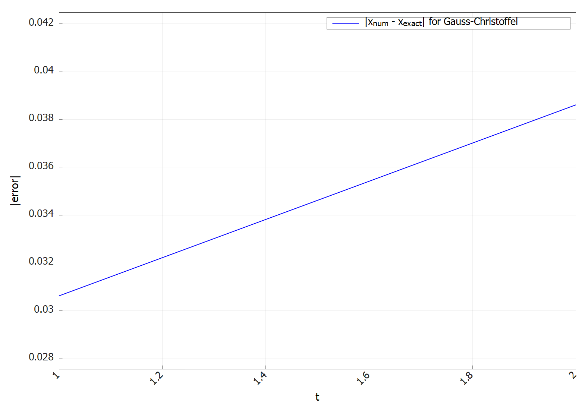

**Рисунок 6 - Зависимость ошибки решения уравнения Фредгольма методом Гаусса на сетке с тремя узлами от времени**

А также сравним численно полученные значения с точным решением в узлах сетки:

**Таблица 3 - Сравнение точного и численного решения методом Гаусса в 3 узлах сетки**

| t   | Численно    | Точно      | Ошибка    |
|:---:|:-----------:|:----------:|:---------:|
| 1.0 | -1.11638769 | -1.09895833 | 0.01742936 |
| 1.5 | 0.05321392  | 0.07291667  | 0.01970275 |
| 2.0 | 1.72281552  | 1.74479167  | 0.02197614 |

Решение уравнения Фредгольма методом Гаусса–Кристоффеля при трёх узлах сетки даёт график, очень похожий на результаты для трапеций: численное решение хорошо повторяет точное, но слегка занижено на всём интервале, особенно ближе к правой границе. График ошибки показывает ту же монотонно возрастающую зависимость с величиной порядка $3 \cdot 10^{-2}$ , как и для метода трапеций.

Различия между методами при таком малом числе узлов сетки минимальны, потому что доминирует именно погрешность дискретизации уравнения (коллокации и линейной интерполяции по трём точкам), а не ошибка собственно квадратурной формулы. То есть более высокий порядок точности гауссовой квадратуры почти не проявляется, пока сетка по времени настолько грубая; выигрыш от Гаусса по сравнению с трапециями станет заметен при увеличении числа узлов сетки и более сложных задачах, где интегральная аппроксимация начинает играть более существенную роль.

---

Решаем на сетке с 10 узлами:

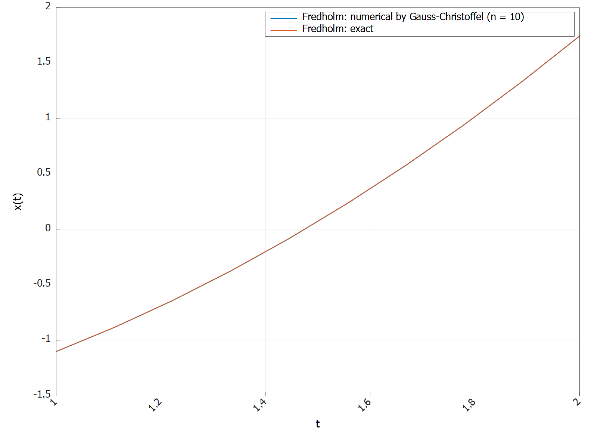

**Рисунок 7 - Решение уравнения Фредгольма методом Гаусса на сетке с 10 узлами**

График ошибки:

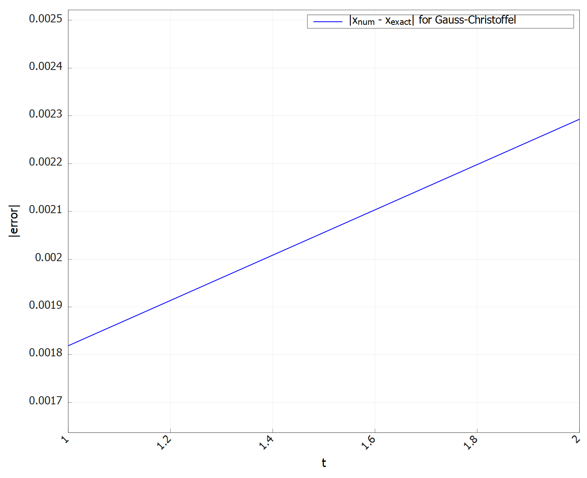

**Рисунок 8 - Зависимость ошибки решения уравнения Фредгольма методом Гаусса на сетке с 10 узлами от времени**

Приведем всё ту же таблицу сравнения численного и точного решения в узлах сетки:

**Таблица 4 - Сравнение точного и численного решения методом Гаусса в 10 узлах сетки**

| t         | Численно     | Точно       | Ошибка    |
|:---------:|:------------:|:-----------:|:---------:|
| 1.00000000 | -1.10001383 | -1.09895833 | 0.00105550 |
| 1.11111111 | -0.88283764 | -0.88175154 | 0.00108609 |
| 1.22222222 | -0.64097008 | -0.63985340 | 0.00111669 |
| 1.33333333 | -0.37441117 | -0.37326389 | 0.00114728 |
| 1.44444444 | -0.08316090 | -0.08198302 | 0.00117787 |
| 1.55555556 | 0.23278073  | 0.23398920  | 0.00120847 |
| 1.66666667 | 0.57341371  | 0.57465278  | 0.00123906 |
| 1.77777778 | 0.93873806  | 0.94000772  | 0.00126966 |
| 1.88888889 | 1.32875376  | 1.33005401  | 0.00130025 |
| 2.00000000 | 1.74346082  | 1.74479167  | 0.00133085 |

На графике решения при 10 узлах численное решение методом Гаусса–Кристоффеля практически полностью совпадает с точным: кривые визуально сливаются на всём интервале, а ошибка остаётся на уровне  $10^{-3}$ и монотонно растёт к правому краю.

Сравнение с таблицей и графиками для метода трапеций при том же числе узлов показывает, что погрешности обоих методов отличаются лишь в пределах нескольких $10^{-4}$: у трапеций максимум около $1.9 \cdot 10^{-3}$, у Гаусса - около $1.3 \cdot 10^{-3}$. Это подтверждает, что при такой сетке по времени основным источником ошибки остаётся дискретизация уравнения Фредгольма (линейная интерполяция и коллокация), а не квадратурная формула: более высокий порядок точности гауссовой квадратуры даёт лишь умеренное улучшение. Выигрыш от Гаусса по сравнению с методом трапеций станет более заметен при дальнейшем увеличении числа узлов сетки и для задач с более сложным ядром и решением, где ошибка интегрирования по s начинает играть доминирующую роль.

---

### Решение уравнения Вольтерры 🔁

Рассматривается следующее линейное интегральное уравнение Вольтерры:

$$
x(t) = \gamma \int_a^t Q(t,s)x(s)ds + f(t), \quad t \in [a,b]
$$

Здесь $Q(t,s)$ — ядро, $f(t)$ — заданная правая часть, $\gamma$ — параметр (в коде `factor`).

---

#### Сетка и аппроксимация решения

На отрезке $[a,b]$ строится равномерная сетка узлов:

$$
t_i = a + i h,\quad h = \frac{b-a}{n-1},\quad i = 0,\dots,n-1
$$

Величины $x_i \approx x(t_i)$ хранятся в векторе `x`, и для промежуточных значений $s$ используется линейная интерполяция по сетке:

$$
x(s) \approx \tilde x(s) = (1-\alpha) x_k + \alpha x_{k+1}, \quad
\alpha = \frac{s - t_k}{h}, \quad s \in [t_k,t_{k+1}]
$$

В коде это реализовано функцией `interpolate(s, x)`, которая по текущему массиву значений $x$ возвращает $\tilde x(s)$.

Таким образом, фактически, решение представляется в виде линейной комбинации кусочно-линейных базисных функций $\phi_k(s)$:

$$
x(s) \approx \sum_{k=0}^{n-1} x_k \phi_k(s), \qquad
\varphi_k(t_j) = \delta_{kj}
$$

---

#### Пошаговая схема по узлам

В узлах сетки уравнение записывается как:

$$
x(t_i) = f(t_i) + \gamma \int_a^{t_i} Q(t_i,s)x(s)ds, \quad i = 0,\dots,n-1
$$

С учётом аппроксимации $x(s) \approx \tilde x(s)$ получаем:

$$
x_i \approx f(t_i) + \gamma \int_a^{t_i} Q(t_i,s)\tilde x(s)ds
$$

Интеграл вычисляется численно выбранной квадратурной формулой (трапеции, Симпсон, Гаусс и т.д.):

```cpp
auto integrand = [&](double s) {
double xs = interpolate(s, x); // ≈ x(s)
return kernel(ti, s) * xs; // Q(t_i,s) * x(s)
};
auto res = integrator.integrate(integrand, a, ti, 0.0);
double integral_val = res ? res->integral : 0.0;

x[i] = rhs(ti) + factor * integral_val;
```

Формально это соответствует аппроксимации:

$$
\int_a^{t_i} Q(t_i,s)x(s)ds
\approx \int_a^{t_i} Q(t_i,s)\tilde x(s)ds
\approx \mathcal{K}\bigl[ Q(t_i,s)\tilde x(s)\bigr],
$$

где $\mathcal{K}$ обозначает выбранную квадратуру.

---

#### Рекуррентное построение решения

Так как интеграл берётся по $[a,t_i]$, значения $x_i$ можно находить последовательно слева направо:

$$
\begin{aligned}
x_0 &\approx f(t_0), \\
x_i &\approx f(t_i) + \gamma \mathcal{K}\bigl[ Q(t_i,s)\,\tilde x(s)\bigr], \quad i = 1,\dots,n-1.
\end{aligned}
$$

При вычислении $x_i$ используются только уже найденные значения $x_0,\dots,x_{i-1}$, которые участвуют в интерполяции $\tilde x(s)$ под знаком интеграла. Таким образом, реализуется пошаговый метод решения уравнения Вольтерры, основанный на разложении решения по кусочно-линейному базису и численном интегрировании по прошлой истории $x(s)$.

**Реализацию описанного можно найти по пути** `include/Labs/Special/Lab4/Tasks/IntegralEquationTask.h`

---

#### Решение методом сведения к ОДУ 🧮

Рассмотрим следующее уравнение Вольтерры:

$$
x(t) = 4 \int_0^t (s - t)x(s)ds + 3sin(t), \quad t \in [0,5]
$$

Данное уравнение сводится к ОДУ:

$$
x''(t) + 4x + 3sin(t) = 0
$$

Решаем соответствующее однородное уравнение:

$$
x'' + 4x = 0
$$

$$
\lambda^2 + 4 = 0
$$

$$
\lambda = \pm 2i
$$

$$
x_{одн} = С_1 cos(2t) + C_2 sin(2t)
$$

Ищем частное решение в виде:

$$
x_ч = Asin(t)
$$

Тогда

$$
-Asin(t) + 4Asin(t) = -3sin(t)
$$

Откуда $А = -1$, $x_ч = -sin(t)$.

Запишем начальные условия, чтобы найти константы $С_1$ и $С_2$:

$$
\begin{cases}
x(0) = 0 \\
x'(0) = 3
\end{cases}
$$

Тогда имеем:

$$
\begin{cases}
x(0) = С_1 = 0 \\
x'(0) = 2С_2 -1 = 3
\end{cases}
$$

Следовательно, решением нашего уравнения Вольтерры является:

$$
x(t) = 2sin(2t) - sin(t)
$$

---

#### Решение методом Симпсона 🎢

А теперь будем решать данное уравнение численно по описанному выше алгоритму методом Симпсона.

Для $\tau = 0.25$ имеем следующее решение:

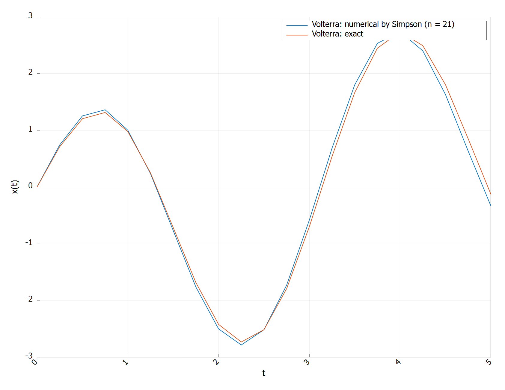

**Рисунок 9 - Решение уравнения Вольтерры методом Симпсона на сетке с $\tau = 0.25$**

Численное решение уравнения Вольтерры методом Симпсона при шаге $\tau = 0.25$ хорошо воспроизводит форму точного решения на всём интервале: максимум и минимум, а также фазы осцилляций совпадают, заметно лишь лёгкое смещение численной кривой относительно точной. Это означает, что выбранный шаг уже достаточно мал для качественной передачи динамики решения при использовании составной формулы Симпсона внутри интеграла.

График ошибки:

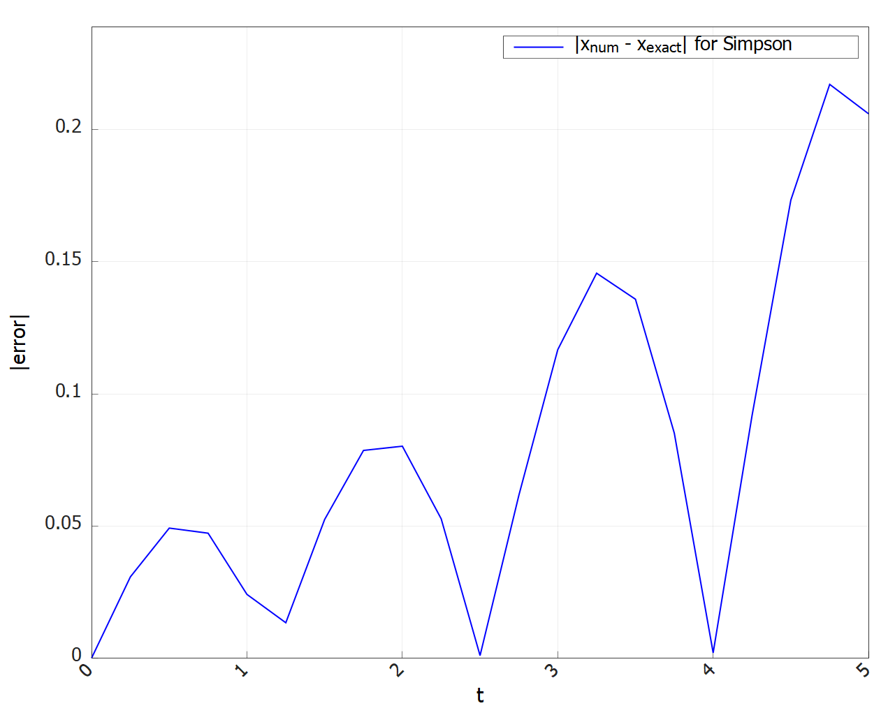

**Рисунок 10 - Зависимость ошибки решения уравнения Вольтерры методом Симпсона на сетке с $\tau = 0.25$ от времени**

График ошибки показывает, что модуль ошибки колеблется и к концу интервала достигает значений порядка $0.2$, причём пики ошибки приходятся на участки быстрого изменения решения. Такой характер указывает на накопление погрешности в пошаговой схеме Вольтерры: при каждом шаге используется уже приближённое $x(s)$ под знаком интеграла, поэтому даже при высокоточном методе Симпсона итоговая ошибка оказывается заметной, и для её снижения требуется дополнительное уменьшение шага $\tau$ или использование более гладкого представления решения между узлами.

---

Для чистоты эксперимента решим наше уравнение Вольтерры с весьма малым шагом $\tau = 0.025$:

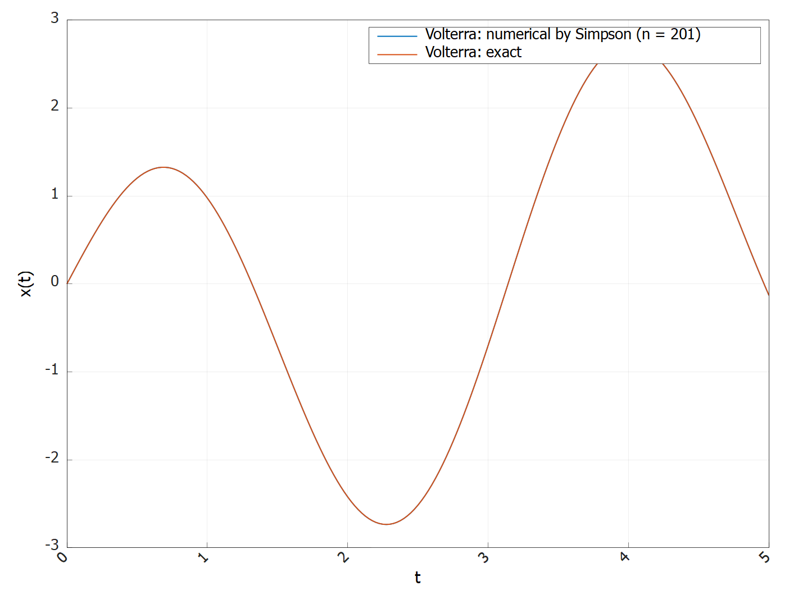

**Рисунок 11 - Решение уравнения Вольтерры методом Симпсона на сетке с $\tau = 0.025$**

А также построим график ошибки:

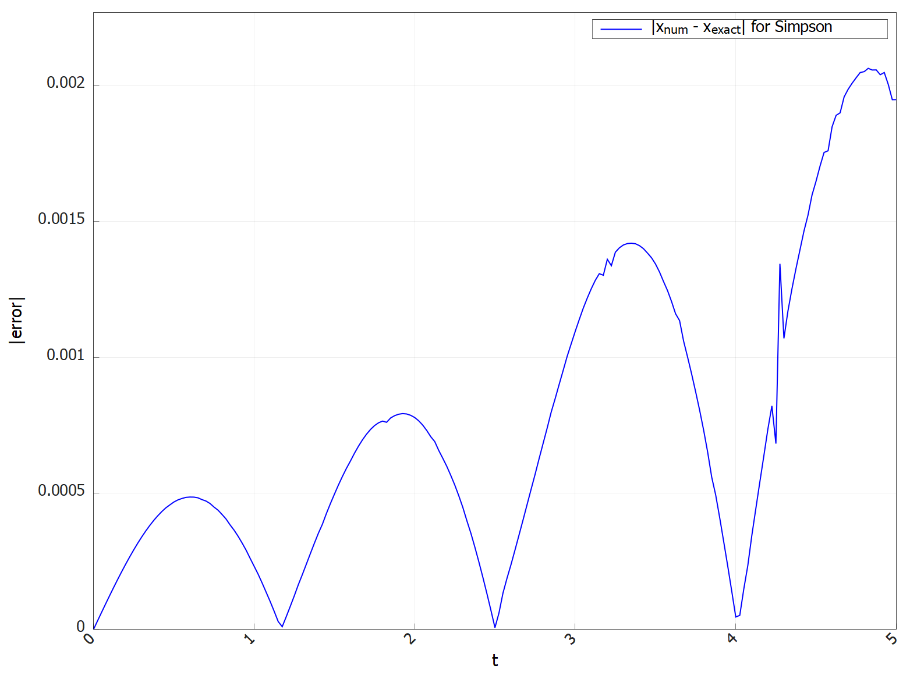

**Рисунок 12 - Зависимость ошибки решения уравнения Вольтерры методом Симпсона на сетке с $\tau = 0.025$ от времени**

При уменьшении шага $\tau = 0.25$ по времени в десять раз качество решения уравнения Вольтерры методом Симпсона заметно улучшается.
Для малого шага численное и точное решения практически неразличимы на всём интервале: кривые полностью сливаются, без видимых фазовых сдвигов и амплитудных искажений. График ошибки показывает, что её модуль теперь не превышает примерно $2 \cdot 10^{-3}$, причём основные пики ошибки приходятся на участки наиболее быстрого изменения решения, но их величина на порядок меньше, чем при шаге $\tau = 0.25$.

Сравнение с результатами для $\tau = 0.25$, где максимальная ошибка достигала значений порядка $2 \cdot 10^{-1}$, демонстрирует ожидаемое для метода Симпсона уменьшение погрешности при уменышении шага: более частая дискретизация по t уменьшает как ошибку квадратур под интегралом, так и накопление пошаговой ошибки.

---

## 4. Заключение и выводы 📝

В работе было реализовано и исследовано численное решение линейных интегральных уравнений Фредгольма и Вольтерры второго рода с использованием квадратурных методов трапеций, Симпсона и Гаусса–Кристоффеля. Для уравнения Фредгольма применялся коллокационный подход с разложением решения по кусочно-линейному базису на равномерной сетке и приведением задачи к системе линейных алгебраических уравнений, тогда как для уравнения Вольтерры использовалась пошаговая рекуррентная схема по узлам времени с численным вычислением интеграла на каждом шаге.

Проведённые расчёты показали ожидаемую с теоретической точки зрения зависимость точности от шага сетки: при переходе от трёх к десяти узлам для уравнения Фредгольма ошибка уменьшалась примерно на порядок, а для уравнения Вольтерры уменьшение шага $\tau$ в 10 раз приводило к резкому снижению максимальной ошибки и практически полному совпадению численного и точного решений. Сравнение квадратурных методов продемонстрировало, что при грубой сетке по t доминирует ошибка дискретизации самого интегрального уравнения: метод Гаусса даёт лишь умеренное преимущество над методом трапеций, а эффект более высокого порядка точности квадратуры проявляется только при достаточно мелкой сетке и более сложных задачах, когда вклад ошибки интегрирования по s становится существенным.

В целом, реализованный программный комплекс позволяет гибко комбинировать различные квадратурные схемы и типы интегральных уравнений, наглядно демонстрируя влияние шага разбиения и порядка метода на устойчивость и точность численного решения.
